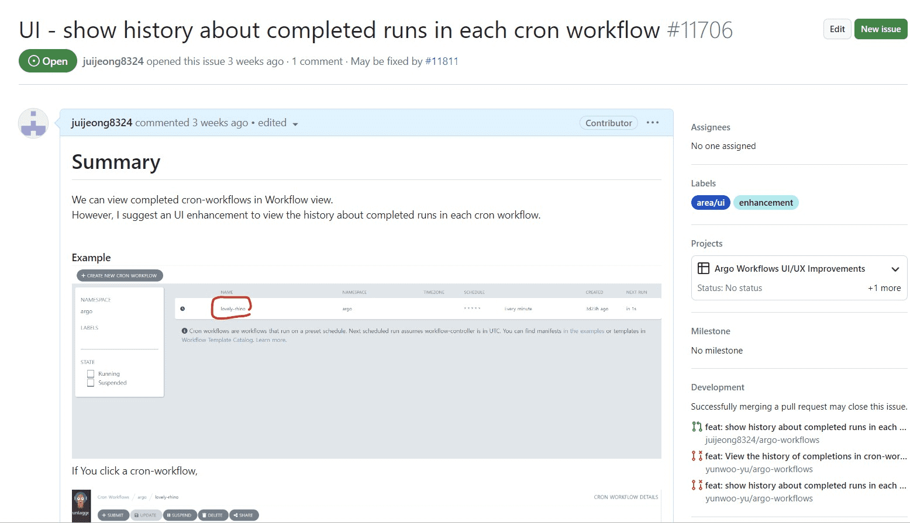

## ☑️ 팀 소개

ArgoWorkflows OSS 2023팀은 1명의 멘토와, 17명의 멘티의 구성으로 총 18명이 한 팀으로 활동하였습니다.

오픈소스에 대한 진입장벽을 느끼는 **주니어 개발자들과 선배 개발자가 함께 힘을 모아 컨트리뷰션**을 하는 멋진 행사인
[오픈소스 컨트리뷰션 아카데미](https://www.contribution.ac/2023-ossca)의 도움으로 팀이 구성되었으며, **2023년 07월 ~ 10월까지 약 4개월 간** 활동하였습니다.

Git 사용법이 익숙하지 않았던 걸음마 단계부터 시작해서, 어엿한 오픈소스 컨트리뷰터가 될 때까지 저희팀이 이룬 성과를 공유합니다.

## ☑️ ArgoWorkflows 소개


**Argo Workflows**는 컨테이너를 기반으로 한 워크플로우 엔진으로, 병렬 작업을 쿠버네티스에서 실행할 수 있는 오픈소스 프로젝트입니다.
각 워크플로우 단계가 컨테이너로 정의되며, 여러 단계의 워크플로우를 일련의 작업으로 모델링하거나, 작업 간의 종속성을 DAG (Directed Acyclic Graph)를 사용하여 실행할 수 있습니다.

즉, Argo Workflows를 사용하면 **간단한 워크플로 형태의 작업** 부터, **머신러닝** 또는 **데이터 처리를 위한 복잡한 작업 까지** **쿠버네티스**에서 더 빠르고 쉽게 수행할 수 있게 됩니다.


Argo Workflows는 **Cloud Native Computing Foundation** (CNCF)에서 **졸업에 성공한 프로젝트**입니다.

졸업 프로젝트가 되기 위해선 엄격한 표준을 충족하기 위해 CNCF가 실시하는 **모든 테스트를 통과**해야 합니다.
즉, 졸업 프로젝트로 인정 받았다는 것은 Argo가 명확한 거버넌스 및 커미터 프로세스, 건전한 성장, 보안 및 컴플라이언스 준수에 대한 **최고 수준을 충족**한다는 것을 의미합니다.
그 엄격한 기준으로 인해 CNCF에 등록된 프로젝트 중 졸업에 성공한 프로젝트는 **약 13%에 불과**합니다.

실제로 Argo 프로젝트가 졸업 프로젝트로 인정 받기까지 약 5년이라는 기간동안 **7000명이 넘는 컨트리뷰터**와 **11000개가 넘는 PR**, **37만이 넘는 컨트리뷰션**이 필요했습니다.

뿐만 아니라, Argo 프로젝트는 현재에도 **2300여개의 회사**들이 코드에 기여하고 있고 **8300여명이 코드**에 컨트리뷰트 하고 있는 **매우 활발하고 최신화된 오픈소스**입니다.

이로 인해 Argo Workflows는 클라우드 네이티브 커뮤니티에서 **가장 대표적인 워크플로우 엔진**으로 인정받고 있습니다.

**전 세계적으로 수 많은 기업들**이 **공식적으로** Argo Workflows를 도입해 사용하고 있습니다.
이는 Argo Workflows가 큰 규모의 기업에서도 실제 작업 부하의 문제를 해결 할 수 있다는 강력한 증거입니다.

Argo Workflows를 사용하는 대표적인 기업들은 다음과 같습니다.


… 외 200개가 넘는 **글로벌 기업**들

Argo Workflows와 비슷한 도구로는 Apache Airflow, Tekton, Prefect 등이 있습니다.

Argo Workflows는 Kubernetes-native 엔진으로, 컨테이너 기반 워크플로우를 쉽게 조정하고 자원을 관리할 수 있습니다.
이는 비슷한 도구인 Apache Airflow와 비교했을 때 주요한 차이점 중 하나로, Apache Airflow는 독립 실행 애플리케이션이며, Kubernetes의 기능을 본질적으로 활용하지 않습니다.
따라서 Airflow는 자원 관리와 확장성이 Argo Workflows보다 더 어려울 수 있습니다.

또한, Argo Workflows는 각 워크플로우 단계를 독립적인 컨테이너로 실행하기 때문에, 데이터 파이프라인 뿐만 아니라 CI/CD와 같은 다양한 작업을 수행할 수 있습니다.
이는 Docker와 Kubernetes의 강력함을 활용하여 가능한 것이며, 이를 통해 **제한 없이 어떤 것이든 실행**할 수 있습니다.


Argo Worflows 아키텍처의 간단한 다이어그램은 다음과 같습니다.
Argo Workflows는 크게 두가지 컴포넌트로 나뉘어지는데, Workflow Controller와 Argo Server 입니다.
전자는 워크플로가 실행되기 위해 필요한 모든 작업을 수행하고 후자는 Web Page나 Cli에서 정보를 확인할 수 있는 API를 제공합니다.

## ☑️ 주요 성과

### UI/UX 개선

Argo Workflows 프로젝트는 기여의 메인 키워드를 UI/UX개선으로 지정하고 따로 프로젝트 페이지를 운영하며 이슈들을 트레킹 할 정도로 해당 주제에 적극적인 기여를 진행하고 있습니다.


저희 팀도 이러한 프로젝트의 목표를 따라 많은 UI 개선들을 수행했습니다.

> 주요 개선 항목

- workflows 검색 기능
- cronworkflows의 요약 view 개선
- DataPciker의 개선
- workflows control패널의 sticky 옵션
- workflows 목록의 label 강조 효과
- 외 다양한 버그 개선


### 핵심 기능 개선

컨트리뷰션 경험이 쌓이기 시작하면서 프로젝트에 대한 멤버들의 이해도가 올라가고, 자신감이 붙으면서 UI/UX에 관한 개선 뿐 아니라, **워크플로우 엔진의 코어한 기능에 대한 기여**들도 점차 할 수 있게 었습니다.

[What’s new in Argo Workflows v3.5](https://blog.argoproj.io/whats-new-in-argo-workflows-v3-5-f260e8603ca6)

워크플로우 엔진의 핵심 로직은 **쿠버네티스의 CRD로 설치되어 쿠버네티스 클러스터의 동작과 성능에도 크게 영향을 주는 만큼 구현 수준이 높고**,
각종 테스트 및 메인테이너들과의 정책에 관한 논의에도 적극적으로 참여할 수 있어야 기여가 가능한 만큼 **컨트리뷰션 난이도도 굉장히 높은 기여**에 속합니다.

쉽지 않은 과정들이었지만, 저희 팀은 **Argo Workflows 3.5버전의 릴리즈에 핵심적인 기여**들을 해내는데 성공하며,
`Template Spec`, `Authentication`, `Controller` 등의 매우 중요한 기능에 대한 기여를 **Argo 공식 블로그에서 언급**되며 기록을 남기기도 하였습니다.


Argo Workflows의 3.5버전 릴리즈 이후에도, 계속하여 컨트리뷰터들의 `DX개선`을 위한 CI및 테스트 환경, Nix, `Controller`, `Template` 스펙의 새로운 피쳐 개발, Go Lang 버전 업데이트 등의 높은 난이도의 컨트리뷰션등을 이어나가고 있으며, 다음 릴리즈 배포에는 더욱 많은 기여로 Argo Workflows가 더욱 훌륭한 툴로 거듭나는데 의미있는 성과를 보태는 중입니다.

### 메인테이너 그룹과의 긴밀한 소통

저희 팀은 운이 매우 좋았습니다. Argo Workflows 프로젝트가 올해 5월에 Yuan Tang이라는 새로운 리더를 맞이하면서 프로젝트 전체의 컨트리뷰션 호흡이 매우 빨라졌다는 점입니다.

보통 이런 대형 프로젝트에서는 리뷰에 상당히 오랜 시간이 걸려서 많은 컨트리뷰션을 해내기 어렵다고 생각하고 시작했었는데,
능력있는 프로젝트 헤드와 그 팀원들 덕분에 이번 대회에 참가한 ArgoWorkflows 팀원들 모두 굉장히 많은 것들을 배우고 경험하며 짧은 시간 내에 많은 기여를 통해 성장할 수 있었습니다.


기여를 이어나가다 보니, 워크플로우 엔진의 핵심적인 기능들에 대한 기여에 가까워질 수록, PR 페이지를 넘어서 **CNCF슬랙을 통해 메인테이너 분들과 긴밀하게 소통**하고 의견을 나눌 수 있는 상황들도 생겨났습니다.

논의를 통해서 이슈를 해결하기 위해 프로젝트에서 로직을 처리하기 위한 정책을 결정하기도 하고, 연관된 다른 이슈를 할당받아 진행하는 경험을 하는 등, 오픈소스 프로젝트의 진정한 일원이 되어가는 소중한 경험을 해볼 수 있었습니다.

프로젝트 기간동안 저희 팀이 기여한 작업물들을 소개합니다.

## ☑️ 참가자 기여 내용 상세

### 0. 염근철

#### **🌿 개인 성과 보고**

<details>
<summary>접기/펼치기</summary>

- 크크루 삥뽕

</details>
- 이미지 첨부 예시

- 개인 보고서에 들어가는 이미지 반드시 커밋 전에 용량 줄일 것.
- 개인 보고서 이미지는 별도 폴더를 images 하위에 생성하여 만들기

- 개인 보고서 내용에 제목 쓰지 말것

#### **🌵 참가 후기**

ㄱㄴㄷㄹ

### 1. 강병선

#### **🌿 개인 성과 보고**

<details>
<summary>접기/펼치기</summary>

- **개인 성과**
  - `문서기여` `#11762` [Remove helm installation guide and Add helm documentation link](https://github.com/argoproj/argo-workflows/pull/11762#event-10327741834)
    - MinIO 설정을 위해 helm 설치를 해야하는데, mac에 관련된 설정만 나와 있어 helm 공식문서에 접근할 수 있도록 수정하였습니다.
  - `문서기여` `#11735` [Add installation option descrption](https://github.com/argoproj/argo-workflows/pull/11735#event-10365473861)
    - managed namespace 옵션에 대한 상세한 설명을 추가해보았습니다.
    - 여기서 Kubernetes의 [Documentation 컨벤션](https://kubernetes.io/docs/contribute/style/style-guide/#use-simple-and-direct-language)이 존재한다는 것을 메인테이너분께 배웠습니다.
- **컨트리뷰션 준비 과정 및 활동**
  - Github 기초 익히기
    - 멘토님께서 과제로 본인의 프로필을 업데이트 하는 과제를 주셨습니다. GPG와 DCO봇의 개념을 익혀보며 github에 더 친숙해지는 시간을 가졌습니다.
      
  - Docker 왕초보 특별반
    - Dockerfile을 사용해서 도커 이미지를 만드는 활동을 했습니다. 멘토님께서 정리하신 자료를 읽고 개념을 익혔습니다.
      추가적으로 이미지를 만들 때 실행 시 필요한 기능만 넣도록 [multi stage build](https://www.notion.so/Dockerfile-65f85f55b1b647ebb85617da9747db58?pvs=21)를 적용해보았습니다.
      
      
    - 실습 이후 멘토님께서 [Overlay FS](https://ykarma1996.tistory.com/192)에 대해 하나하나 보여주시면서 이미지가 어떻게 만들어지는지 보여주셨습니다. 이건 정말 알찼습니다..
  - 쿠버네티스 기초 공부
    - 컨트리뷰션 이전에 쿠버네티스의 기초를 공부하는 시간을 가졌습니다.
      - [개인 공부자료](https://www.notion.so/bf8924a756b34bacb82d7051a05f1168?pvs=21)
  - Argo workflows
    - template을 만들어보며 [스스로 공부하는 시간을 가졌습니다](https://www.notion.so/e4d8e9e18f154a2181135b3e1b6b2d45?v=599976df8f114b5bb48943bdeef08360&pvs=4).
    - 학준 멘티님이 [GCP에서 ArgoCD와 Argo Workflows를 활용해 배포하는 파이프라인](https://junkmm.tistory.com/28)을 알려주셨습니다.
  - OSS 모임 활동 참여
    - 멘토님과 멘티분들께서 다양한 주제로 발표하는 시간을 가졌습니다. 컨트리뷰션 이외에 실무에서 어떤 문제들을 고민하는지, 그리고 문제들을 어떻게 해결했는지 들을 수 있는 좋은 시간이었습니다
  - 해커톤 참여
    - 성락 멘티님이 많은 도움을 주셨습니다. 괜찮다고 생각하는 이슈들을 공유해주시고 항상 도전할 것을 권해주셨습니다.
      
    - `#11609` [Compile expr in config](https://github.com/argoproj/argo-workflows/issues/11609) 이슈를 추천해주셔서 도전해보았습니다.
    - [Golang을 스스로 공부해보고](https://www.notion.so/491f51f4142244ca875708c5556c58a2?pvs=21) Issue를 분석하는 시간을 가졌습니다.
    - golang에 좀 더 친숙해질 수 있는 시간이 되었습니다.

</details>

#### **🌵 참가 후기**

- **참가후기**
  - 주니어 개발자인 저에게 이 활동은 단순히 컨트리뷰션을 위한 것이 아니라 아니라 개발자들이 무엇을 고민하는지, 어떻게 성장하는지 확인할 수 있는 소중한 시간이었습니다.
  - 도움을 너무 많이 받아서 항상 감사합니다. 너무 좋은 분들 만나뵈서 행복한 시간이었습니다.
  - 컨테이너와 친해지는 첫 걸음을 뗀 것 같아 기쁩니다.
- **앞으로의 계획**
  - 개발에서 사용하는 모든 오픈소스에 관심을 가지고 기여할 수 있도록 하겠습니다.
  - Argo workflows를 실제 프로젝트에 적용해보고 더 기여할 방안들을 찾아가겠습니다!

### 2. 강시온

#### **🌿 개인 성과 보고**

<details>
<summary>접기/펼치기</summary>

- Issue 1개, PR 3개
- GitHub Actions log 가독성 향상을 위한 이름 수정
  - https://github.com/argoproj/argo-workflows/pull/11670
  - publish-release에서 진행하는 step중 Run actions/cache@v3를 총 세번 수행하는데 각자 하는 역할이 다른데 같은 이름으로 표기되어 있어 같은 작업이 세번 이루어지는 것처럼 느껴 질 수 있는 부분을 각자 역할에 맞는 이름으로 수정
- GitHub Actions 필요없는 캐시 로직 삭제
  - https://github.com/argoproj/argo-workflows/pull/11754
  - setup-go actions에서 cache option을 false로 주지않는 이상 default로 caching을 해주기때문에 중복되는 캐시때문에 발생하던 오류를 수정
- Deprecated 된 NodeJS 16 버전을 사용하는 checkout@v3를 모두 checkout@v4로 업그레이드
  - https://github.com/argoproj/argo-workflows/pull/11782
  - NodeJS 가 곧 보안지원이 종료되므로 최신버전을 사용하는 actions을 사용하도록 수정

</details>

#### **🌵 참가 후기**

작년의 경험이 너무좋아 올해도 참가하게 되었는데 올해는 작년과 다른 느낌으로 또 너무 좋은 경험을 했습니다.
다들 열정적인 팀원들과 활발한 프로젝트 덕분에 텐션이 떨어지지 않고 프로젝트에 관심을 가질 수 있었던것 같고, 해당 프로젝트 뿐만 아니라 관련된 이야기 까지 나눌 수 있는 동료가 생긴것 같아 너무 행복합니다.

### 3. 권영길

#### **🌿 개인 성과 보고**

<details>
<summary>접기/펼치기</summary>

ㄱㄴㄷㄹ

</details>

#### **🌵 참가 후기**

ㄱㄴㄷㄹ

### 4. 김수빈

#### **🌿 개인 성과 보고**

<details>
<summary>접기/펼치기</summary>

- **개인 성과**
  - `이슈` 1개, `PR` 1개 기여
- **컨트리뷰션 준비 과정**
  - YouTube에 업로드 된 OSSCA 기본 교육을 확인했습니다. Git, Vim 등 기존에도 많이 사용해보고 개념도 알고 있는 내용이었지만, 평소에 사용하면서 모르고 있었거나, 대충 사용하던 부분들도 많이 알고 이해할 수 있었습니다.
  - `ArgoWorkflows-OSS/ArgoWorkflows-OSS` 저장소에서 Git 환경 설정 및 Issue와 PR을 연결하고 클로즈하는 예제를 진행했습니다. Argo Workflows는 PR 생성 시에 모든 커밋이 gpg private key로 서명되어 있어야 하고, sign-off 되어 있어야 합니다. 그렇지 않은 경우 GitHub CI에서 failure 하게 됩니다. Argo Workflows에 실제로 기여하기 전, 미리 로컬 Git 환경을 설정하고 모의로 PR을 생성하는 데 큰 도움이 되었습니다.
    - https://github.com/ArgoWorkflows-OSS/ArgoWorkflows-OSS/pull/38
  - Argo Workflows 개발 환경을 설정했습니다. 처음에는 devcontainer를 이용해 설정했고, 이후에 Nix를 이용했습니다. Argo Workflows는 개발 환경에서 React UI, Argo Server, MySQL 등 여러 컴포넌트가 함께 필요해 개발 환경을 구성하기 어려운 편인데, 여러 주차에 걸쳐 개발 환경을 완전히 구성할 수 있었습니다.
- **컨트리뷰션 진행 내용**
  - `버그수정` Nix go build 수정
    - https://github.com/argoproj/argo-workflows/pull/11635
    - 기존 코드 베이스는 Go 1.20을 사용하고 있었으나, Nix 빌드 파일에서는 Go 1.19를 사용하는 문제가 있었습니다. 기존에는 빌드가 문제 없이 되었었지만, Go 1.20에 새로 추가된 문법을 사용하기 시작하면서 Nix 빌드에 문제가 발생했습니다.
    - `_module.args` 를 이용해 Go 1.20을 기본으로 사용하도록 수정하고, Nix 빌드를 수정했습니다.
  - `기능개선` Nix go vendor hash 자동 갱신
    - https://github.com/argoproj/argo-workflows/issues/11691
    - 컨트리뷰션을 준비하는 과정에서 개발 환경을 설정할 때 알게 된 이슈입니다. Nix는 재현 가능한 빌드를 추구하는데, GitHub의 Dependabot이 자동으로 Go module 버전을 올려줄 때 Nix의 의존성 hash 값은 함께 변경하지 않는 문제가 있습니다.
    - 이로 인해 종종 개발 환경을 설정할 때 개발자들이 직접 수동으로 Nix의 go vendor hash를 계산해 갱신해야 하는 상태인데, 이를 개선하기 위해 해결 가능한 방법들을 찾아보고 있습니다.
    - 해결 방법을 기여자들과 함께 찾기 위해, 기존 PR과 Comment들의 내용을 모아 Issue를 생성했습니다.
    - 기존 다른 오픈소스 프로젝트들에서도 해결하지 않고 개발자들이 수동으로 반영하고 있는 상태여서, Argo Workflows에서 기여한 이후에는 다른 프로젝트들에도 기여할 수 있을 것 같습니다.
  - `기능개선` `CHANGELOG.md` 스크립트 개선
    - https://github.com/argoproj/argo-workflows/pull/11733
    - Markdownlint는 프로젝트 내 문서들을 일관된 형식으로 작성될 수 있도록 강제하고, 문서를 더 읽고 수정하기 쉽게 만들어주는 도구입니다.
    - 기존에 Markdownlint를 사용해 프로젝트 Markdown 문서에 대한 린터 설정을 구성했었는데, 스크립트를 이용해 자동으로 생성되는 `CHANGELOG.md` 파일은 린터 룰에 맞지 않아 이를 개선했습니다.
    - 변경된 스크립트를 통해 새로 생성된 `CHANGELOG.md` 변경 사항은 이 PR에 담겨 있습니다. → https://github.com/argoproj/argo-workflows/pull/11773
  - `기능개선` 문서 스타일 개선
    - https://github.com/argoproj/argo-workflows/pull/11787
    - Markdownlint를 따르지 않는 일부 문서들의 스타일을 개선했고, 자동으로 생성되는 문서들에 대해서는 이후 PR에서 수정하기로 공유했습니다.

</details>

#### **🌵 참가 후기**

- **프로그램 참가 후기**
  - 혼자서 기여하려고 했다면 불가능했을 것 같은데, 멘토 님과 다른 멘티 분들과 함께 모여서 공부하고 기여하면서 저도 기여를 준비하고 기여할 수 있었던 것 같습니다.
  - Argo Project 생태계와 커뮤니티에 대해 이해하고, Argo Workflows 프로젝트에 대해 전보다 훨씬 깊게 이해하게 되어 좋았습니다.
- **향후 기여 계획**
  - 현재 생성한 Issue에서 기여자들과 해결 방법에 대해 논의하고, 이를 구현할 예정입니다.
  - 이후에 Nix 개발 환경을 개선하고, devcontainer로 구성된 개발 환경을 점진적으로 Nix로 이전하는 작업을 진행할 예정입니다.
  - Nix와 관련한 문서가 빈약해, 문서도 개선할 예정입니다.

### 5. 김학준

#### **🌿 개인 성과 보고**

<details>
<summary>접기/펼치기</summary>

ㄱㄴㄷㄹ

</details>

#### **🌵 참가 후기**

ㄱㄴㄷㄹ

### 6. 박진수

#### **🌿 개인 성과 보고**

<details>
<summary>접기/펼치기</summary>

ㄱㄴㄷㄹ

</details>

#### **🌵 참가 후기**

ㄱㄴㄷㄹ

### 7. 서청운

#### **🌿 개인 성과 보고**

<details>
<summary>접기/펼치기</summary>

ㄱㄴㄷㄹ

</details>

#### **🌵 참가 후기**

ㄱㄴㄷㄹ

### 8. 송혜민

#### **🌿 개인 성과 보고**

<details>
<summary>접기/펼치기</summary>

---

> ** 컨트리뷰션 활동 **

---

** Mutex check happens after memoization cache check and lock info missing from UI `버그수정` **

[Issue #11219](https://github.com/argoproj/argo-workflows/issues/11219)
[PR #11456 - Merge 완료/3.4.10 릴리즈 포함](https://github.com/argoproj/argo-workflows/pull/11456)

Argo Workflow 의 Synchronization 및 Cache 기능을 동시에 사용할 수 있도록 수정할 수 있었습니다.

해당 버그는 Argo Workflow 에서 Synchronization 및 Memoize 키워드를 같이 사용할 시 정상적으로 동작하지 않는 현상이었습니다.

기대 동작은 Mutex Synchronization 이 동작한 이후 캐시가 동작하는 것이지만, Synchronization 가 동작한 뒤 캐시가 작동하지 않고 있었습니다.

예를 들어 아래와 같이 `job-1` 과 `job-2` 가 있을 시 `job-1` 이 Synchronization 효과로 인해 먼저 동작을 하고 캐시를 쓰고 완료가 되면, `job-2` 는 ** 동일한 캐시로 인해서 동작하지 않고 Pass 해야 합니다.**


저는 이 과정을 Synchronization 과 Cache 의 순서를 조정하는 것으로 올바르게 수정할 수 있었습니다.

어렵지는 않은 수정이었지만, 복잡한 파일 중 하나인 `operation.go` 를 수정했기에 많은 리뷰와 함께 Argo Workflow 의 다양한 기능들을 살펴볼 수 있었던 PR 이라 생각합니다.

---

** Parent level memoization is broken `버그수정` **

[Issue #11612](https://github.com/argoproj/argo-workflows/issues/11612)
[PR #11623 - Merge 완료/3.4.11 릴리즈 포함](https://github.com/argoproj/argo-workflows/pull/11623)

위 수정으로 발생한 새로운 버그 사항으로, Argo Workflow 의 Template 레벨이 아닌 아래 Child 구성 요소에서 Memo 기능을 사용 시 무한 Pending 이 걸리는 버그가 제보되었습니다.


이전 PR 에서 테스트를 추가했으나 확인하지 못한 Case 가 존재했다는 것을 인지하고, 오류 발생 원인을 분석해서 다시 핫픽스를 반영할 수 있었습니다. 이 예외 사항을 추후에도 발견하기 위한 테스트를 4개 포함하여 PR 을 진행했습니다.

---

** UI: workflowDrawer's information link is not correctly working `버그수정` **

[Issue #11494](https://github.com/argoproj/argo-workflows/issues/11494)
[PR #11495 - Merge 완료/3.4.10 릴리즈 포함](https://github.com/argoproj/argo-workflows/pull/11495)

Argo Workflow 대시보드에서 워크플로우를 펼쳤을 시, Information 아이콘의 링크가 망가진 사항을 수정했습니다.


`<a>` 태그 중첩으로 인한 잘못된 이벤트 전파를 방지하는 코드를 추가해 제대로 클릭이 동작하게 만든 내용입니다.
해당 코드 수정으로 다시 아이콘 클릭 시 올바른 문서로 이동하도록 만들 수 있었습니다.

---

** Search by name for WorkflowTemplates in UI `기능개선` **

[Issue #11004](https://github.com/argoproj/argo-workflows/issues/11004)
[PR #11684 - Merge 완료/3.4.10 릴리즈 포함](https://github.com/argoproj/argo-workflows/pull/11684)

다른 2명의 참가자 분들과 공동으로 개발하여 PR 을 진행한 내용입니다.
Argo Workflow 에는 이름의 패턴을 통해 각 템플릿을 기능하는 유용한 기능이 빠져 있었습니다.


이 기능을 추가로 제공하여 사용자가 더 이상 Yaml 의 라벨 뿐만이 아닌 이름으로도 Template 을 검색하도록 개발했습니다.
`특히 정확한 이름이 아닌 LIKE 검색이라는 것이 앞으로도 유용할 것 같습니다.`
이후에도 다른 페이지에 대해서 비슷한 수정을 통해 검색과 페이지네이션 기능을 확장할 예정이라 더욱 의미있는 PR 이었던 것 같습니다.

---

** Add more readable Argo CLI installation guide into github documentation `문서기여` **

[Issue #11750](https://github.com/argoproj/argo-workflows/issues/11750)
[PR #11751 - Merge 완료](https://github.com/argoproj/argo-workflows/pull/11751)

Argo Workflows 에서 사용하는 커맨드라인 인터페이스인 Argo CLI 에 대한 문서 기여입니다.


현재 Argo CLI github 문서에는 인스톨에 대한 과정이 빠져 있어서, 첫 사용자가 Argo CLI 를 설치할 방법을 찾기가 어려웠습니다.
기존에는 Release Note 로 직접 찾아 들어가거나 Quick Start 페이지로 반드시 들어가야 했는데, Argo CLI 페이지에 기존 Usage 이외에 Installation 항목을 추가하여 사용자 편의성을 높이도록 수정했습니다.

---

** Workflow templating is skipped when whitespace is added to template parameters `버그수정` **

[Issue #11767](https://github.com/argoproj/argo-workflows/issues/11767)
[PR #11781 - Merge 완료](https://github.com/argoproj/argo-workflows/pull/11781)

Argo Workflow 에서 workflow template 작성 시 들어가는 `{{parameter}}` 형태의 placeholder 가 `{{ parameter }}` 와 같이 앞 뒤로 공백이 있을 경우 유효성 검사가 되지 않는 현상이었습니다.
내부 유효성 검사 코드에서 parameter 에 대해서 앞, 뒤의 공백을 자르는 trim 을 하지 않고 있는 것이 원인으로, 이 부분에 trim 을 추가하여 공백을 제거해 해결했습니다.
이 기여로 인해 기존 placeholder 내용이 유효성 검사를 무시해버리는 현상도 바로 잡을 수 있었습니다.

---

> ** 모임 개발 활동 **

---

** Argo Workflow OSS 공통 Repo 에 PR 올려보기 **

[PR #22 - Merge 완료](https://github.com/ArgoWorkflows-OSS/argoworkflows-oss.github.io/pull/22)

Argo Workflow PR 전 여러 사람이 기여하기 위한 사전 연습을 진행했습니다. 새로운 문서 및 기존 문서를 다른 참가자들과 동시에 수정하여 올려서 Git 커맨드 및 Rebase 의 소중함에 대해서 배울 수 있었습니다.

---

** Dockerfile 로 웹서버 만들어보기 **

[PR #6 - Merge 완료](https://github.com/ArgoWorkflows-OSS/container-playground/pull/6)

로컬 8080 서버로 통신하여 localhost:8080 으로 접근 가능한 Dockerfile 을 하나 작성하고 서버를 띄우는 연습이었습니다.
간단한게 Flask 로 파이썬 서버를 작성하고 Dockerfile 내 환경 설정, 서버 구동, 포트 연결을 통해서 Docker 커맨드로 외부에서도 서버에 접속 가능하도록 만들었습니다.

---

</details>

#### **🌵 참가 후기**

- 참가후기
  - 이전에도 오픈소스 컨트리뷰션 아카데미를 참여했었지만, 이번 아카데미의 프로그램과 멤버, 내용 모두가 특히 만족스러웠습니다.
  - 단기간에 소스 코드를 파악하고 기여를 시작하는 것이 쉽지 않은데, 작은 내용이나마 기여를 시작할 수 있었다는 것이 놀라운 경험이었습니다.
  - 멘토님의 집중적인 케어와 다른 참가자 분들의 열정이 정말 큰 도움이 되었다는 것을 깊게 느낄 수 있었습니다.
  - 혼자 시작했다면 금방 포기하고 잊어버렸을 내용이 다른 사람과 함께 진행하는 것만으로도 이렇게 달라질 수 있다는 것이 대단한 경험이었습니다.
- 앞으로의 계획
  - 앞으로도 Argo Workflow 에 대한 컨트리뷰션을 이어나갈 생각이며, 다른 오픈소스 기여를 시작할 수도 있을 것 같습니다.
  - 특히, 이제는 관심 있는 오픈소스에 대해 접근해서 시작하는 방법을 배웠기 때문에 열정만 있다면 조금 더 수월하게 진행할 수 있을 것 같습니다.
  - 다른 사람에게도 오픈 소스 기여에 대한 재미를 적극 전파하며, 자신 있게 추천할 예정입니다.

### 9. 안다혜

#### **🌿 개인 성과 보고**

<details>
<summary>접기/펼치기</summary>

`문서 수정` 공식 문서의 [running-locally](https://argoproj.github.io/argo-workflows/running-locally/) 부분이 Dev-container와 Makefile을 처음 사용하는 사람들에게 직관적이지 않고, 깨진 링크들이 있어 pr [#11405](https://github.com/argoproj/argo-workflows/pull/11405)를 올리고 공식 문서를 수정하는 데 기여하였습니다.

`이슈 기여` `미완성` 이지만 Argo-workflows 의 워크플로우나, 워크플로우 내의 Pod 내에서 Secret 정보가 echo 등의 명령어로 노출될 수 있는 이슈 [#8685](https://github.com/argoproj/argo-workflows/issues/8685) 가 있어 이를 해결해보고자 했습니다.

4일 동안 하루에 3시간 정도, 총 12시간 정도를 이 이슈에 투자했으나 아직 해결하진 못하였습니다. ([중간 커밋](https://github.com/argoproj/argo-workflows/commit/35866a599de80c02a950c52e800e69fc894d5b80))

- 총 11개 파일에 걸쳐 Argo-workflows 실행 시 주입할 수 있는 환경변수인 `ARGO_HIDE_SECRETS` 을 추가하고 기본적으로 해당 옵션이 `true` 로 작동하게 하였습니다.
  - 위 환경변수를 command line에서 입력받거나, Argo-workflows 를 실행할 당시에 설정으로 추가할 수 있도록 하였습니다.
  - 만약 `ARGO_HIDE_SECRETS=false` 로 설정할 경우, "You are running with logging include secrets. Be careful." 라는 로그가 찍히도록 하였습니다.
  - workflow, pod의 로그에서 Secret에 해당하는 정보가 포함될 경우, SecretValue를 마스킹 할 수 있도록 코드를 수정하였습니다.
    - 테스트 코드를 작성하여 위 기능이 목적한 대로 동작하는지 검증하였습니다.
    - 하지만 위 기능이 목적한 대로 작동하지 않았기에, 로그가 찍히는 과정을 탐색하기 시작하였습니다. Go 언어에서 사용하는 [logrus](https://github.com/sirupsen/logrus) 라이브러리는 [io](https://pkg.go.dev/io) 패키지의 io.Writer 를 사용한다는 것을 알게 되었습니다.

`과제 수행` Argo-workflows 팀은 멘토님이 OSS-Argo-workflows 레포지토리를 생성하고 여러 과제를 내주셨습니다.

- 실제 Argo-workflows 레포에서 pr을 올릴 때 지켜야 하는 원칙 (presigned commit, gpg check) 을 지키며 pr을 올리고, git conflict 를 해결하는 방법을 과제를 통해 배워나갔습니다.
- 실제 Argo-workflows 레포에서 pr을 올리기 위해, 코드를 수정한 후 Argo-workflows가 제대로 작동하는지 확인하려면 local 환경에서 Dev Container로 Argo-workflows를 동작시켜야 합니다. 저희 팀은 이 과정을 직접 수행해보는 과제를 받았고, 그 과정에서 수행에 어려움을 겪는 멤버들을 서로 도와주었습니다. 저는 블로그 글에 해당 방법을 수행하는 법을 정리하여 팀원들에게 공유하였습니다. [blog](https://aimb.tistory.com/317)

</details>

#### **🌵 참가 후기**

오픈소스 컨트리뷰톤에 참여하면서 멋진 멘토님과 팀원들을 만났습니다. 저희는 매주 오프라인으로 만나며 그간 기여했던 이슈에 대해 공유하고, 업무적으로 도움이 되는 발표들을 매주 돌아가면서 진행하였습니다. 또한 막바지에는 ‘이슈 해커톤’을 만들어, 조를 나누어 이슈를 집중적으로 해결하는 자리를 만들었습니다. 그 결과 Argo-workflows 팀 자체에서 4건이 넘는 pr이 머지되었으며, 저도 한 이슈를 잡고 집중적으로 시간을 내 오픈소스를 깊숙히 파볼 수 있었습니다.

Go 언어로 개발을 해보는 커리어를 염두에 두고 있었기 때문에, 프로덕션 레벨의 Go 코드를 보고 수정해보는 경험을 해볼 수 있어 정말 값진 경험이었습니다. 이렇게 열심히 사시는 분들과 같은 집단에 속할 수 있을까, 생각해보게 될 정도입니다. Masters가 끝나더라도 저는 위에서 해결하려던 이슈를 끝까지 파볼 작정이며, 개발 pr을 하나 더 올려보고자 합니다.

그리고 기회가 된다면 2024년 오픈소스 컨트리뷰톤에도 참가해보고 싶습니다.

좋은 기회와 장을 마련해주셔서 감사합니다.

### 10. 안지완

#### **🌿 개인 성과 보고**

<details>
<summary>접기/펼치기</summary>

---

**1. 오픈소스 첫 기여**

처음으로 ArgoWorkflows에 문서를 통한 기여를 했습니다. 공식 사이트에 이미지인지 비디오인지 혼동을 줄 여지가 있는 부분을 고쳐, 유저들이 확실히 동영상임을 인지하도록 수정했습니다.
[docs: modify demo image in intermediate-inputs.md #11755](https://github.com/argoproj/argo-workflows/pull/11755)

---

**2. 다른 멤버의 활동을 보며 오픈소스 기여법 터득**

이번 오픈소스 컨트리뷰선 아카데미를 통해 오픈소스 기여를 하는 방법과 이슈를 찾는 요령에 대해서 알게 되었습니다. 요약하면 다음과 같습니다.

- 주요 로직이 아닌 아주 자잘한 버그 이슈, 또는 UI 부분에서도 생각보다 이슈가 엄청 많다.
- 해당 오픈소스의 전문적인 지식, 또는 다른 분야 (ex. 프로트) 종사자여도, 충분히 해당 오픈소스에 기여할 수 있는 이슈들이 많다. (ex. UI 이슈)
- 기여를 하고 싶을 때는, 해당 이슈에 먼저 직접 이 이슈를 해결하고 싶다는 코멘트를 단 후, 작업을 시작한다.
- 이 부분이 좀 신기했는데, Argo Workflow의 경우는 기여를 할 때 담당자가 배정된다는 점이 좀 신기했다. 아마 모르는 점? 또는 생소한 부분이 느껴질 때 담당자를 배정하는 것 같다.
- 다양한 사람들이 많다. 정말 까칠하게 딱 한 줄 적으시는 분도 있고, 굉장히 친절하게 코멘트를 달아주시는 분도 있다.

다른 회원분들의 이슈 해커톤을 보며 이슈에 직접 기여하는 방법을 알게 되었습니다. 특히 다른 회원분의 이슈 중 “Pagination” 이슈를 매우 흥미롭게 봤습니다. 제가 argo workflow를 사용할 때는 눈치를 채지 못했는데, 페이지네이션이 일관성이 없다는 걸 캐치하시고 이슈를 만들어 기여를 하시는 것에서, 저렇게 자칫 지나쳐 갈 수도 있는 곳에도 충분히 기여가 가능하구나 라는 걸 깨달았습니다.

---

**3. 개발 컨테이너 구축**

개인적으로 활동을 한 건 devcontainer를 직접 띄워 개발 환경을 세팅했습니다. 사실, 그 과정에서 무수한 오류가 발생했는데, 다른 분들께서 직접 도와주시고 골머리를 앓아가며 마침내 해결한 것을 보고, 뭔가 실무에서도 버그가 발생하면 다른 개발자분들이 오셔서 같이 머리를 쥐어짜내실 것 같은 모습이 상상이 갔습니다.

멘토님께서 의존성 문제 해결 및 후에 다른 사람이 제 프로젝트에 이슈를 만들때, 동일한 환경에서 작업하는 것을 보장하기 위해 개발 컨테이너를 사용한다는 것을 알게 되고, 현재 제가 진행하고 있는 다른 프로젝트 (디스코드 봇 관련 프로젝트) 에서도 개발 컨테이너를 활용하여 개발을 해야될 것 같다고 생각했습니다.

중간 보고서 이후에는 조금 마음가짐을 바꿔 위축감을 느끼는 것 보다는, 다른 현직자 분들이 실무에서는 어떤 식으로 서비스를 운영하시는지 그런 것들을 엿듣는 기회를 잡고자 했습니다. 실제로 멘티분들께서 다양한 주제로 발표를 하셨으며 회사 내에서 이루어지는 부하테스트, ebpf에 대한 설명 등 흥미로운 주제들을 들을 수 있었습니다. 학교를 다니면서 듣기 힘든 아주 귀중한 발표였던 것 같습니다.

---

**4. GPG Sign을 이용한 Verified Commit 방법 숙달 및 팀 깃허브 소개글 업로드**

그동안은 별도의 GPG Key없이 커밋을 해왔는데, 멤버 소개글을 업로드 하는 과정에서 DCO봇과 GPG 확인해서 계속 막혀, Verified 커밋을 생성하는 방법을 터득하고 팀 깃허브 레포에 소개글을 업로드했습니다. 그 과정에서 커밋을 할 때마다 자꾸 멈춰 애를 먹는 도중 같은 팀원의 도움을 받아 해결했습니다.

[docs: 안지완 프로필 업데이트](https://github.com/ArgoWorkflows-OSS/argoworkflows-oss.github.io/pull/49)

</details>

#### **🌵 참가 후기**

사실, 중간보고서 쓰기 전까지 제 수준에 비해 이 활동이 너무 수준이 높고 다른 분들이 너무 잘하셔서 스스로 위축된 느낌이 있었으나, 멘토님께서 개별적으로 상담해주시고 잘 격려해주신 덕에 그 이후로 정기모임에 더 열심히 참여하고자 했습니다.

Argo Workflow에서 수많은 이슈를 보며, 만만한 것이 있으면 한번 기여를 해볼까 하며 찾아봤는데, 너무 복잡하고 특히나 Go 언어를 잘 모르는 터라 손을 댈 수가 없었습니다. 대신, 직접 기여는 몰라도 다른 분들의 기여를 보며 오픈소스라는 세계에 입문하게 된 것 같았습니다.

가장 기억에 남은 다른 분의 기여는 “페이지네이션”이었습니다. Argo Workflow의 어떤 부분은 페이지네이션이 되어있고, 어떤 부분은 되어있지 않으며, 또 어떤 부분은 제목은 나와 있지 않은, 한마디로 UI 내의 일관성 깨짐 문제를 발견하셨고, 이를 해결하고자 이슈 해커톤에서 팀원을 구해 기여하시는 모습이 인상깊었습니다.

뭔가 제가 기여할 부분을 찾을 때는 로직 관련 이슈를 찾으려 했으나, 너무 어렵고 이게 대체 어떻게 돌아가는지 파악이 안됐는데, 저렇게 기여를 할 수 있구나…라는 생각이 들어 생각보다 기여에 그렇게 큰 겁을 먹지 않아도 된다는 생각이 들었습니다.

멘토님을 포함한 다른 모든 분이 현직자이시며 정말 실력이 대단하신 만큼, 저도 모임에 가며 많은 것을 알아갔습니다. 워크플로우가 실무 내에서는 어떻게 쓰이고 있는지, 특히 제가 요즘 공부하고 있는, 정말 만능처럼 보이는 Airflow가 왜 실무 내에서는 그닥 그렇게 많이 쓰이고 있지는 않은지에 대한 이유 등 이론과 실무의 차이들을 볼 수 있었습니다.

솔직히 오픈소스 컨트리뷰션에 참가한 만큼, 저도 이슈에 하나 정도는 기여하고 싶은 욕심이 있습니다. 남은 기간이 별로 안남은 만큼, 활동이 끝나기 전까지 아주 자잘한 이슈 하나 정도라도 기여하는 것이 우선 제 계획이며, 이제 개강이 기다리고 있는데, 개강을 해도 정기모임에 나가서 배울 수 있는 것은 최대한 배우는 시간을 가지고 싶습니다.

### 11. 유윤우

#### **🌿 개인 성과 보고**

<details>
<summary>접기/펼치기</summary>

**1. 왕초보반 dockerfile 만들어보기**


- 나만의 웹 서비스를 만들고 도커파일을 통해 이미지를 빌드하고 컨테이너를 실행해보는 실습 진행
- 각자 원하는 프레임워크와 언어를 통해 서비스를 구축, 저는 Nest.js를 사용했습니다.

**2. Nest.js 프레임워크 공부**

- [Nest.js 학습한 레포지토리](https://github.com/yunwoo-yu/nest-board-app)
- 프론트 엔드밖에 몰랐기에 간단한 API 서비스를 만들기 위해 빠르게 학습

**3. dockerfile 생성 후 PR**


- 도커파일을 생성하여 image를 빌드해 서비스 정상작동까지 확인하고 PR을 올렸지만 github action의 빌드 테스트 실패
- --production 옵션을 제거하면 테스트에 통과하지만 image 최적화가 되지 않는 문제가 발생. 멘토님께 조언 요청


- 멘토님의 피드백을 기반으로 문제해결 시작

**4. 트러블 슈팅**


- dokerfile로 이미지 생성시에 크기를 줄이기 위해 node_modules를 production 환경만 설치하려고 했지만 github action을 통과하지 못함
- 수많은 삽질끝에 nest-cli라는 모듈이 nest build시에 필요한데 devdependency안에 들어가 있던걸 변경하고 나니 해결됐다. (멘토님이 힌트를 주셨지만 못알아듣고 삽질한건 비밀)
- 로컬에서 빌드가 문제없이 되어서 더 헷갈렸는데 이유는 내 맥북에 글로벌로 nest-cli가 설치되어 있었다..

**5. 오픈소스 컨트리뷰터 활동**
**[UI: The position sticky on the workflow toolbar is not working]**

- workflows-list의 checkbox 선택 시 나오는 toolbar 위치가 상단에 고정 되어 있지 않던 버그를 해결했다.
- [이슈 내용 보러가기](https://github.com/argoproj/argo-workflows/issues/11442)
- [PR 내용 보러가기](https://github.com/argoproj/argo-workflows/pull/11444)

[before]


- 체크박스를 선택하고 스크롤 시 상단 툴바가 보이지 않는다.
- 기존에 있는 `position : sticky`가 적용되지 않는 문제를 `position : fixed`로 변경해 해결했다.

[after]


- 체크박스 선택 후 스크롤 시에 상단에 툴바를 고정하여 별도의 스크롤 없이 바로 해당 리스트에 대한 이벤트를 실행할 수 있다.

**[UI - show history about completed runs in each cron workflow]**

- 의정님이 찾은 좋은 개선 사항을 함께 진행 `cron-workflows-detail` 컴포넌트에서 해당 워크플로우의 히스토리를 볼 수 있게 리스트를 추가하는 이슈
- [이슈 내용 보러가기](https://github.com/argoproj/argo-workflows/issues/11706)
- [PR 내용 보러가기](https://github.com/argoproj/argo-workflows/pull/11811)

[before]


- 기존 `cron-workflows-detail` 페이지에는 아무것도 없었지만

[after]


- 해당하는 `cron-workflows`에 히스토리 `workflows`와 히스토리가 없을 경우에 예시도 추가해줬다.
- 해당 PR은 아직 확인중인 상태

</details>

#### **🌵 참가 후기**

너무 좋은 경험이였습니다.

아쉽게 취업을 하게되면서 바빠지고 서버와 데브옵스쪽 지식이 부족해 많은 컨트리뷰터 활동이나 오프라인 모임에 참여하지 못한 아쉬움도 많이 남았습니다.

그래도 포기하지않고 프론트엔드 쪽으로 더 많은 컨트리뷰터도 진행해보고 서버 쪽 공부도 진행해서 argoWorkflow에도 더 많은 기여를 해보도록 노력해보겠습니다!

좋은 활동 만들어 주셔서 감사하고 왕초보여도 하나씩 단계를 밟아가며 성장할 수 있게 도와주신 멘토님 리드멘티 님들 감사합니다 👍

### 12. 이병곤

#### **🌿 개인 성과 보고**

<details>
<summary>접기/펼치기</summary>

- 발대식 참여
- K8s 학습
  - Operator 개념 학습
  - Helm 학습
  - CNI 개념 학습
  - Service Mesh 개념 학습
- Argo Workflows 학습
  - 기본적인 사용법 학습
    - https://argoproj.github.io/argo-workflows/workflow-concepts/
    - https://www.youtube.com/watch?v=kxl6wYd5i2g
  - 주변 기술 학습
    - DevContainer 학습
    - Nix 학습
    - https://nixos.org/manual/nixos/stable/
    - MinIO 학습
    - KeyCloak 학습
- Argo Workflows 컨트리뷰션 `버그수정`

  - DevContainer 오작동 관련 이슈작성 https://github.com/argoproj/argo-workflows/issues/11439
    - 컨테이너 재시작 시 /etc/hosts 엔트리 지워지는 문제
  - DevContainer 오작동 해결 PR 작성 및 머지 완료 https://github.com/argoproj/argo-workflows/pull/11440
    - devcontainer.json의 runArgs에 —add-host 옵션 추가하여 해결

- Argo Workflows 주변 기술 학습
  - 학습한 내용 토대로 NixOS 설치 및 사용
  - Argo CD, Argo Events, Argo Rollout 에 대해 조사
  - Keycloak 학습
    - Argo Workflows에서는 Keycloak 연동을 지원하고 있음, 이에 궁금증이 생겨 Keycloak에 대해 조사
    - OAuth2와 OIDC 차이점에 대해 학습
    - Keycloak 개념에 대해 학습
      - Role
      - Ream
      - Client
    - Keycloak 설정 방법에 대해 학습
    - Keycloak API 및 연동 방법에 대해 학습
    - Keycloak 공식 문서 학습
      - https://www.keycloak.org/docs/latest/securing_apps/index.html
      - https://www.keycloak.org/docs-api/22.0.1/rest-api/index.html
    - Keycloak 직접 설치 및 사용 실습

</details>

#### **🌵 참가 후기**

이번 컨트리뷰션 아카데미를 통해 오픈소스에 기여하는 것 뿐만 아니라 새로운 기술에 대해 학습하게 되는 동기부여가 되서 좋았습니다.
직장 일이 바쁜 와중에 참가해서 쉽지는 않았지만 꼭 올해 컨트리뷰션에서만 Argo Workflows에 대해 기여하는 것이 아니라 향후 컨트리뷰션에서도 몇년간 기여해보는 것을 목표로 길게 보고 있습니다.
앞으로의 계획은 Argo Workflows뿐만 아니라 다른 Argo Projects를 직접 구축해보고 제 개인 토이 프로젝트에도 적용해보는 것이 목표이고 K8s에 대해서도 더 많은 공부를 하는 것이 계획입니다.

### 13. 이의주

#### **🌿 개인 성과 보고**

<details>
<summary>접기/펼치기</summary>
**1. Git 사용법 & Commit & PR 규칙 숙지**

    - 컨트리 뷰션을 하기 위해 엄격한 Commit 과 Pull Request를 보내기 위한 기초적인 Git 사용법 숙지 및 Mission 수행
    - 공식 Argo Workflow 프로젝트에서도 컨트리뷰션 하고 싶은 Issue에 대해 **Issue Template** 를 이용하고 PR 을 날리는 방식을 사용하고 있어 도움이 되었고 Issue Template 의 존재도 알게된 계기가 되었음.
    - 향후 컨트리뷰션 부분에 꼭 필요한 요소들을 간접적으로 체험할 수 있는 기회
        - [PR 의 네이밍 컨벤션](https://flank.github.io/flank/pr_titles/)
        - [DCO 봇 Check](https://github.com/apps/dco)
        - [GPG Commit](https://www.44bits.io/ko/post/add-signing-key-to-git-commit-by-gpg)
        - [Commit Message 컨벤션](https://www.conventionalcommits.org/en/v1.0.0/)
        - [이슈와 PR을 연결](https://docs.github.com/ko/issues/tracking-your-work-with-issues/linking-a-pull-request-to-an-issue#linking-a-pull-request-to-an-issue-using-a-keyword)
     - Issue 생성 - 멤버 프로필 업데이트 - PR - Review - Merge 의 과정

         

{/* eslint-disable max-len */}
**2. 왕초보 특별반 참여 (Mentor 가 생성한 초보자들을 위한 과정)**

    - [왕초보 특별반 미션을 위한 Repo(container-playground)](https://github.com/ArgoWorkflows-OSS/container-playground)
    - Docker 혹은 Kubernetes 에 익숙하지 않은 인원 혹은 처음인 인원에 도움을 주는데 목적
        
    - 멘토가 제시한 과제를 수행하면서 Docker Image 최적화의 필요성에 대해 학습
        - From 절 부터 Layer(층)별로 어떤 패키지, Static file 들을 쌓아가는 과정이기 때문에 Docker 이미지가 무거워져 성능 향상에 악영향을 미칠 수 있기 때문에 최적화는 필수임을 깨달음.

    - Mission

        ```
       ❗️목표❗️

        나만의 웹서비스를 제작하고, 컨테이너화 할 수 있는 도커파일을 작성해 봅니다.

        과제 통과를 위해서 반드시 아래 사항을 준수해 주세요.

        • 디렉터리 및 파일 배치
            • 나만의 서비스를 반드시 본인 github 계정 디렉터리를 생성하고, 그 아래 작성해주세요.
            • 본인 디렉터리의 최상단에는 반드시 `Dockerfile` 이 위치해야 합니다.(이 조건을 달성하지 못하면 CI가 실패합니다.)
            • 본인 디렉터리 아래에 한해서, `Dockerfile`의 위치를 제외한 나머지 파일들은 자유롭게 작성해도 됩니다.
            • 단, 본인 디렉터리 최상단에서 `docker build -t [이미지명] .` 명령을 수행 했을때 성공적으로 이미지가 빌드 되어야 합니다.
        • 빌드 된 이미지의 동작
            • 나만의 웹서비스는 반드시 8080포트에서 동작해야 합니다.
            • 빌드 된 이미지는 별도의 파라미터 없이 `docker run -d -p [포워딩 포트번호]:8080 [이미지명]` 으로 실행 했을 때 문제 없이 서비스 되도록 만들어야 합니다.
        • 웹서비스 개발언어 및 서비스 구조
            • 본인이 선호하는 어떤 언어, 어떤 프레임워크를 활용해도 상관 없습니다.
            • UI, 디자인이 존재하지 않는 단순 api서비스를 제작해도 상관 없습니다.
            • 단, 필수 api를 두개 만들어야 합니다. (응답값은 신경쓰지 않습니다.)
                1. /api/v1/[본인 github계정]
                2. /healthcheck
        • (Optional) 도커 이미지 최적화를 하면 더 좋습니다. ([참고](https://thearchivelog.dev/article/optimize-docker-image/))
        • [키워드를 활용한 PR과 이슈 연결 방법](https://docs.github.com/ko/issues/tracking-your-work-with-issues/linking-a-pull-request-to-an-issue#linking-a-pull-request-to-an-issue-using-a-keyword)을 참고하여 이슈와 PR을 연결해주세요. (수동연결 x)

       ❗️ 참고사항❗️

        •도커의 개념과 Dockerfile을 작성하기 위해 아래 문서를 참고 하면 좋아요.

            • [Dockerfile 작성 공식 문서](https://docs.docker.com/engine/reference/builder/)
            • [왕초보를 위한 도커 사용법](https://mysetting.io/slides/xxj85vnvey) (Docker Toolbox관련 내용은 deprecate된 내용)

        PR을 올리고 머지하기 위해 아래 사항들을 참고하면 좋아요.

            • Repo에 브랜치등을 생성하거나 Push할 수 있는 권한이 없으므로 fork 후 작업해야 해요.
            • [PR의 네이밍 컨벤션](https://flank.github.io/flank/pr_titles/)을 참고해주세요.
            • [DCO](https://github.com/apps/dco) 봇의 체크를 통과하기 위한 조건을 참고하여 커밋해주세요.
            • [GPG](https://www.44bits.io/ko/post/add-signing-key-to-git-commit-by-gpg)를 이용해 커밋하는 방법을 이해하여 서명된 커밋을 작성해주세요.
            • [커밋 메시지 컨벤션](https://www.conventionalcommits.org/en/v1.0.0/)도 적용할 수 있으면 좋아요. 꼭 따르지 않더라도, 너무 의미없는 커밋 메시지는 지양해주세요.(Optional)```

    - 기존에 Python 기반의 Django 프레임워크를 다뤄본 경험이 있어 Django REST API를 생성하는 Docker FIle을 작성.
    - PR을 날렸지만, **보안이슈** 혹은 **불필요한 패키지 import 구문** 의 오류를 지적받음.

        
        

    - Django 프로젝트의 **[settings.py](http://settings.py)** 코드에서는 **SECRET_KEY 가 노출** 된다는 것을 처음 알았으며 어떻게 이러한 보안 이슈를 해결할 수 있을까에 대해 고민해보는 시간을 가질 수 있었음.
        - Secret key 가 담긴 .json 파일을 생성하고 [settings.py](http://settings.py) 에서 json 파일을 참조하는 방향으로 진행하였다.
        - secret.json 파일은 Commit 에 올리지 못하므로 **.gitignore** 를 통해 json 파일을 무시하는 방법을 알게되었으며, dbsqlite3 같은 어떤 명령어 수행 후에 생성되는 불필요한 파일들도 무시할 수 있었음.
        - 로컬에서 개발한 결과물을 Git 프로젝트에 올리기 위해서는 여러 고려사항이 필요하다는 것을 깨달은 경험이었음.
    - 몇가지 Review를 통과하고 PR이 **Merge** 될 수 있었음.

{/* eslint-enable max-len */}

**3. Argo Workflow Contributor**

    - Argo Workflow 를 이것저것 살펴보던 도중, **Argo Workflow - Contact - Help** 필드에서 **Deprecated** 된 Argo Workflow Slack 채널을 보게되었음.
    사소한 **UI Issue** 라고 생각했지만, UI가 어떤 언어로 보여주며, 어떤 방식으로 개발되었는지 확인할 수 있는 기회라고 생각하여 Issue 를 올리고 PR을 제출.

        

    - 생성한 **Issue**

        **[UI: non-existent Slack Workspace link on help page Issue](https://github.com/argoproj/argo-workflows/issues/11615)**

        
        - 이슈를 생성하니 Argo 프로젝트의 Maintainer 분이 금방 코멘트를 남겨주셨음.

        - 임의로 CNCF Argo Channel 링크로 Fix 하려 하였으나, 메인테이너분이 다른 링크로 Update 해달라는 코멘트를 받음.

    - 생성한 **PR**

        **[fix: deprecated Link(Help-Contact) Issue](https://github.com/argoproj/argo-workflows/pull/11627)**

        
        - Argo Workflow 는 React 기반으로 UI가 구성되어 있었고, 컴포넌트별로 디렉토리가 정렬되어 있어 쉽게 코드를 분석할 수 있었음.
        - Issue 가 있던 [Code 부분](https://github.com/argoproj/argo-workflows/blob/e46202a4c00f5c685a02eca9392ddfc1305ac9a0/ui/src/app/help/components/help.tsx#L28C12-L28C12)


    - 실수로 Commit 중에 Signed-off 옵션을 생략해서 DCO 봇 TEST에 통과 못했지만, GIt 에서 이전 커밋을 되돌리거나(**Rebase**),
    여러 불필요한 커밋을 하나로 합치는(**Squash**) 기능을 알게되었고 이전 커밋을 돌려 `git commit -S -s -m "Commit Message"` 커밋하였음.
        - ‘**LGTM**’ 코멘트가 무슨뜻인가 찾아보았는데 구글에서는 LGTM이라는 태그를 달아 의사를 표현하는데 **Looks Good To Me**. 즉, 좋아 보인다는 뜻이라고 하여 뿌듯한 경험이었음.
        - 버그를 찾아내거나 UI를 수정하는 등의 과정도 중요하지만, 가장 중요한 것은 Argo Workflow 생태계가 정한 규칙대로 컨트리뷰션을 수행하는 과정도 중요하다고 생각한다.

**4. Argo Workflow Hackerton 참여 (Argo workflow - OSSCA 팀내에서 개최한 해커톤)**

    - **Pull Request(Merged) :** **[feat: Search by name for WorkflowTemplates in UI](https://github.com/argoproj/argo-workflows/pull/11684)**
    - **Issue :** **[Search by name for WorkflowTemplates in UI](https://github.com/argoproj/argo-workflows/issues/11004)**
    - 이슈 해커톤 활동 기간
        - 1차 해커톤 (해커톤 C조) : 23.08.16 - 23.08.20
        - 2차 해커톤 (해커톤 C조) : 23.08.20 - 23.08.27
        
        

    - 이슈 내용
        - 클러스터에 많은 수의 템플릿이 있는 경우 이름으로 검색하는 것이 좋지만, 검색기능이 없어 모든 템플릿을 스크롤하는 것은 항상 불편하다는 이슈
        - Argo Workflow UI 에서 워크플로우 템플릿의 결과를 이름별로 필터링하는 기능이 필요하다고 생각되어서 조끼리 회의한 결과로 이슈를 채택.


    -  역할
        - Front-End 담당
            - Argo workflow Template UI 의 검색 필드(Bar) 생성
            - .get 로직을 분석하여 Name Pattern(Like 검색)을 어디로 넘겨주는지 분석
            - workflow-template 컴포넌트 디렉토리의 workflow-template-filter.tsx, workflow-template-list.tsx 수정

    - 회의 내용
        - 회의는 Slack 해커톤 채널을 통해 조끼리 매일 의견과 정보를 공유
        - 1차 논의 내용
        ```
        1. name 검색 기능 (backend)

            • WorkflowTemplate 페이지
            • name 검색 추가(LIKE 검색)
            • ClusterWorkflowTemplate 페이지
            • name 검색 추가(LIKE 검색)
            • CronWorkflow 페이지
            • name 검색 추가(LIKE 검색)


        2. name 검색 기능 (frontend)

            • WorkflowTemplate 페이지
            • name 검색 ui 추가
            • ClusterWorkflowTemplate 페이지
            • 검색 사이드 바 추가 (name, label)
            • CronWorkflow 페이지
            • name 검색 ui 추가

        3. 페이지네이션 (frontend)

            • WorkflowTemplate 페이지
            • name 기준 pagination
            • ClusterWorkflowTemplate 페이지
            • pagination 추가
            • CronWorkflow 페이지
            • pagination 추가

        4. 테스트 코드 작성

            - name 검색 (LIKE 검색)
            - 어떤 테스트 코드 작성해야하는지 더 분석 필요
        ```

        - 2차 논의 내용
            - 1차 오프라인 회의

                

        ```
        1. 공동 커밋 방법

            • https://github.com/ArgoWorkflows-OSS/argo-workflows 레파지토리를 로컬에 클론받는다.
            • 해당 레파지토리에 우리 팀이 작업할 브랜치를 생성한다. (`master` vs `release-3.4.10`)
            • 해당 레파지토리의 해당 브랜치에서 각자 담당한 기능을 작업한다. (PR올리기 위한 커밋 규칙을 잘 지켜서 커밋한다.)
            • 모두의 작업이 완료되면 3명중 1명이 PR 템플릿에 맞게 PR을 날리기
            • 3명 모두가 컨트리뷰터가 될 수 있음

        2. 해커톤이고 정해진 기간이 있기 때문에 일단 workflow-template, cluster-workflow, cron-workflow 중 먼저 메인이라고 생각되는 workflow-template name filter 를 먼저 구현해보고 PR을 날려 메인테이너가 Merge 해주면 다음으로 넘어가기로 결정

            • 파트별 임무

            • 백엔드

                • workflow_template_server.go
                    • 이름 필터링 및 페이지네이션 재계산

            • 프론트 :

                • workfflow-template-filter.tsx
                    • Name 검색 UI 추가
                    • Name 인자 수신 및 필터링
                • workflow-template-list.tsx
                    • Name state 추가
                    • userEffect list 에 name 전달
                • workflow-template.tsx, Utils.tsx
                    • Name 인자 전달
        ```
       - 3차 논의 내용
         - 2차 오프라인 회의

            

         ```
            1. 오프라인 미팅 회의 내용

                • namespace 없는 경우도 필터 시 포함해야 할 것 같다는 의견. (namespace 없애자고 말 할 근거 부족 - 타 사이트(쿠버네티스 대시보드, 오픈시프트, 아르고씨디 등)들도 namespace 없는 경우 제공)
                • continue에서 사용하고 있는 로직을 가져와 적용가능한지와 커스텀한 결과에서도 continue를 그대로 유지할 수 있는지에 대한 생각
                • 수요일 밤까지 continue 로직 분석 후, continue를 사용하여 페이지네이션이 불가능 하다고 결론이 날 경우 이슈 코멘트에 질문 업로드
                • 프론트단 페이지네이션(데이터 리로드 안됨, argocd에서 사용중인 방식) vs 서버단 페이지네이션(매번 전체 리스트 조회 후 페이지네이션, 부하 괜찮을지)
                • 서버사이드 캐싱 구현할 경우 저장할 곳이 있는지


            2. 페이지 넘길때마다 매번 네임스페이스, 라벨만 적용해서 k8s 전체검색 하는걸로 결정

            3. offset 기반 페이지네이션 방법**에서 로직 추가로 구현
                • 안됐던 부분
                    • next page 버튼 클릭 후 필터링 검색했을 경우, 있는 검색 결과더라도 아무 데이터도 나오지 않는다.
                    • next page 버튼 클릭 후 페이지네이션 갯수 늘리면, 검색결과가 제대로 보이지 않는다.
                • 변경된 부분
                    • continue 값을 서버에서 갱신해주다보니, 페이지 갯수를 늘리거나/필터링을 걸었을 때 서버에 이미 세팅된 continue값을 기준으로 페이지네이션을 해서 문제 존재,
                      continue 값을 프론트에서 넘겨주도록 변경하는 방식을 채택(페이지 갯수 늘리거나/필터링을 걸었을 때 continue를 다시 0으로 세팅)


            4. 페이지네이션 테스트
                • workflow_template_server_test.go 통과
                • (workflow template 14개 등록)
                • UI workflow template 첫 페이지 정상
                • workflow template 페이지 limit 5, 10, 50 일 때 정상
                • workflow template 페이지 1 페이지에서 workflow template 추가 후 2페이지 이동
                • workflow template 페이지 1 페이지에서 workflow template 삭제 후 2페이지 이동
                • 위 내용을 `name pattern` 필터링 검색으로 테스트
                • name pattern 없이 검색 후 name pattern 추가하여 재검색
                • name pattern 포함 검색 후 name pattern 삭제 후 재검색

            5. PR 생성
         ```
        - Like 필터(Name Pattern) 구현
            - 예) sp로 시작하는 workflow-template 검색가능

                

       - 결과

               
            - 구현은 성공이였으며, 이후에는 이전에 논의했던 cluster-template, cron-template 컴포넌트들을 수정할 예정

**5. 컨트리뷰션 활동 외 학습**

    - Google Kubernetes Study Jam 교육 수료
    - **[Badge](https://www.cloudskillsboost.google/public_profiles/7f855d64-3f2e-432a-9763-fde644b6af4b)**
    - Architecting with Google Kubernetes Engine: Foundations(Earned 7월 18, 2023 EDT)
    - Architecting with Google Kubernetes Engine: Workloads(Earned 7월 26, 2023 EDT)
    - Architecting with Google Kubernetes Engine: Production(Earned 8월 4, 2023 EDT)
    - 정리한 내용은 개인 블로그(velog)에 기록
        **[euijoo's Velog GCP Series](https://velog.io/@euijoo3233/series/GCP)**

</details>

#### **🌵 참가 후기**

- **참가후기**

  - 아카데미 이전에는 Argo CD에 대한 지식만 가졌지만, 이후에는 Argo Workflow 프로젝트에 대해 조사하고 분석하며 강력한 기능들을 어떻게 활용하면 좋을지 생각해볼 수 있는 레벨까지 도달할 수 있었음.
  - 처음 컨트리뷰션을 진행하면서 이슈를 생성하고 메인테이너들과 소통하며 부탁받은 사항에 대해 수정하고 PR을 생성하는 방식으로 진행하니 금방 코멘트가 달렸고 Merge 되는 성과를 달성.
  - 사소한 이슈일 수도 있지만, 기여하고자 하는 부분에대해 전체적인 분석이 필요하다고 느낀 경험이었음.
  - 이 뿐만이 아니라, 팀 내에서 자체적으로 이슈 해커톤을 진행하면서 UI 즉, 프론트 부분만이 아니라 백엔드 부분의 로직을 분석하며 Argo workflow가 내부에서 어떻게 상호작용하는지 분석할 수 있는 기회였음.
  - 우리조는 몸체가 큰 이슈여서 이에 맞춰 온라인 뿐만 아니라 오프라인 회의도 병행하며 진행한 결과 목표에 도달할 수 있었고, 두명의 인원은 현업에 종사하는 분들이여서 어려운 부분에 대해서는 친절히 설명해주셔서 유익한 경험이었음.
  - 계속해서 해커톤 팀원 혹은 전체 팀원들과 함께 소통하고 싶은 소망이 있음.

- **앞으로의 계획**

  - 아직 OSSCA 기간이 끝나지 않았기 때문에 지속적으로 이슈를 탐색(Cluster-workflow-template, Cron-workflow 등)하거나, Argo Workflow 문서의 오타나 번역 오류를 발견하고 지속적으로 PR을 제출할 생각임
  - 또한, OSSCA 기간이 끝난 이후에는 지금까지 정리해왔던 내용을 포트폴리오화 할 예정.
  - 토이프로젝트로 현재 진행중인 Argo Workflow를 활용한Data ETL 작업을 완료해볼 예정임.
  - 만약, 취업이 된다면 Argo Workflow의 많은 기능들을 현업에 도입하여 많은 인사이트를 창출하고 싶은 소망이 있음.

### 14. 전의정

#### **🌿 개인 성과 보고**

<details>
<summary>접기/펼치기</summary>

**✅ Contribution 관련 블로그 기록**

[시리즈 | 2023 OSSCA - ddubi.log](https://velog.io/@juijeong8324/series/2023-OSSCA)

<br />
<br />

**✅ 다양한 과제 수행**

1. **Github에서 issue/commit/PR 미션 수행**

   **[과제 요약]**

   

   - 멤버 프로필 업데이트 이슈를 선택하고 해당 repo를 나의 repo에 fork한 후 나의 repo에서 `users.md` 와 `[이름].md`를 `docs/user`아래에 추가한다. 그 후 이슈를 연결해서 PR을 올리고 commit 하는 과제

   **[과제 결과]**

   [docs : 전의정 프로필 업데이트 by juijeong8324 · Pull Request #19 · ArgoWorkflows-OSS/ArgoWorkflows-OSS](https://github.com/ArgoWorkflows-OSS/ArgoWorkflows-OSS/pull/19)

   [Github에서 issue/commit/PR](https://velog.io/@juijeong8324/OSSCA-2023-2)

<br />

1. **Running Locally**

   **[과제 요약]**

   - Argo Workflows를 local 환경에서 실행시키는 과제
   - Windows 환경에서 wsl2를 설치한 후 devcontainer cli를 이용하여 argo workflows 실행

   **[과제 결과]**

   [Argo Workflows 로컬에서 실행하기](https://velog.io/@juijeong8324/OSSCA-2023-3)

   [Argo Workflows 로컬에서 실행하기 - 재도전](https://velog.io/@juijeong8324/OSSCA-2023-4)

   [Argo Workflows 로컬에서 실행하기 - 파이널](https://velog.io/@juijeong8324/OSSCA-2023-5)

   [Argo Workflows 로컬에서 실행하기 - 최종 정리](https://velog.io/@juijeong8324/OSSCA-2023-6)

<br />

3. **왕초보 특별반 - 나만의 서비스 컨테이너 이미지 제작**

   

   **[과제 요약]**

   - 왕초보 특별반은 Argo-worfklows 팀 내에서 컨테이너, 쿠버네티스, argo에 대해 잘 모르고 있는 뉴비들(It's me...)을 위한 특별반이다.
   - 나만의 웹서비스를 제작하고 이를 컨테이너화 할 수 있는 Dockerfile을 작성하는 과제
   - Dockerfile, docker, image, container와 관련된 개념을 이해하고 있어야 함
   - 본인은 node.js, express 환경에서 웹서버 구축 후 dockerfile 작성

   **[과제 결과]**

   [과제 관련 코드](https://github.com/ArgoWorkflows-OSS/container-playground/tree/main/juijeong8324)

   [왕초보 특별반 - 1. 나만의 서비스 컨테이너 이미지 제작](https://velog.io/@juijeong8324/OSSCA-2023-7)

   [[Docker] Dockerfile 기본 명령어에 대해 알아보자](https://velog.io/@juijeong8324/Docker-dockerfile)

<br />
<br />

**✅ 오프라인 참석**
| 날짜 | 활동요약 |
| :--- | :--- |
| 2023.07.15 | - 자기소개 <br /> - (세미나) Argo workflows에 대한 소개 및 멘토님의 적용 사례 |
|2023.07.30|- 금주의 이슈 탐색 공유 <br /> - 본인은 로컬 실행 문제 해결 중임을 언급 <br /> - (세미나) 혜민님의 WebRtc, 수녕님의 keyclock과 argo worfklows 연동|
|2023.08.13|- 왕초보 특별반 과제 피드백 받음 <br /> - 금주의 이슈 탐색 공유 <br /> - (세미나)멘토님의 컨테이너 역사와 원리 특강|
|2023.08.20|- 금주의 이슈 탐색 공유 <br /> - 본인은 Issue #11131에 대해 공유 <br /> - (세미나) 다혜님의 ‘개발자가 스스로 부하테스트 할 수 있는 플랫폼 구축기 & K6 부하테스트 PoC’|

<br />
<br />

**✅ Issue 탐색 및 Issue 생성**

- [**Issue #11131**](https://github.com/argoproj/argo-workflows/issues/11131) `버그수정`

  **[이슈 요약]**

  workflow input parameter 안의 `"`가 escape 되지 않아 `workflow.parameter.json`으로 참조할 때 에러 발생

  **[결과]**

  Argo workflows 상의 문제가 아닌 파이썬 환경의 문제이기 때문에 해당 이슈는 기각

  [Blog : Argo Workflows - Issue #11131](https://velog.io/@juijeong8324/Argo-Issue11131)

<br />

- [**Issue #11706**](https://github.com/argoproj/argo-workflows/issues/11706) `UI 개선`

  **[이슈 요약]**

  
  cron workflow 탭에서 각 workflow의 history를 확인할 수 있는 UI를 추가했으면 좋겠다는 이슈

  [Blog : Argo Workflows - Issue #11706 (인생 처음으로 올린 감격적인 나의 소중한 Issue)](https://velog.io/@juijeong8324/OSSCA-2023-11)

  **[결과]**

  [PR #11811](https://github.com/argoproj/argo-workflows/pull/11811) Closes

<br />
<br />

**✅ PR open & merge**

- [**PR #11732**](https://github.com/argoproj/argo-workflows/pull/11732) `문서기여` `PR Merge`

  **[PR 요약]**

  Argo Workflows 공식문서에서 **Artifact Visualization**에 존재하는 이미지가 유뷰트 영상 링크임을 잘 보여줄 수 있게 이미지를 수정하는 PR

  

  **[결과]**

  [Argo Workflows - PR #11732 docs: Add description about img in artifact-visualization.md](https://velog.io/@juijeong8324/OSSCA-2023-13)

  
  위와 같이 이미지 가운데에 유튜브 재생 버튼을 추가한 이미지로 대체

  
  merge 완료

<br />

- [**PR #11811**](https://github.com/argoproj/argo-workflows/pull/11811) `UI개선` `PR Open`

  **[PR 요약]**

  [Issue #11706](https://github.com/argoproj/argo-workflows/issues/11706) 을 해결하고자 한 PR

  
  cron workflows page에서 특정 cron-workflow를 클릭했을 때 실행된 cron-workflow를 확인할 수 있게 수정

  
  실행된 cron-workflow를 찾을 수 없는 경우 위와 같은 안내 사항을 표시

  **[결과]**

  Merge 완료

</details>

#### **🌵 참가 후기**

- **후기**

  - 사실 DevOps, 인프라 분야가 크게 와 닿지 않고 많이 생소한 분야였는데 Argo Workflows 프로젝트를 통해서 해당 분야에 대해 이전보다 좀 더 친숙해진 느낌을 받습니다.
  - Docker, Container 등의 개념들을 이론적으로만 접하다가 직접 실습을 통해 익히고, 또 해당 개념들 이외에 새롭게 알게 된 것들(wsl의 존재..!)이 생기고 본인이 스스로 잘 모르고 지나쳤던 개념들(리눅스의 접근 권한, 네트워크 )도 다시 돌아보게 된 계기가 되었습니다.
  - 또한 처음으로 이슈를 생성해보는 성장을 하게 되었습니다. 이슈를 작성하는데 막연한 두려움을 갖고 있었는데 직접 작성하면서 해당 두려움을 부수게 되었습니다.
  - 그리고 기여를 할 수 있는 여러 방법이 있는데 내가 기여할 수 있는 부분을 하나씩 시도하는 것이 중요하다고 느꼈습니다. 처음에는 개인적인 욕심+해결하면서 배운다는 생각으로 인해 내가 잘 공감하지 못하는 이슈들 위주로 찾았는데, 이슈의 난이도와 상관없이 내가 직접 공감하는 이슈를 해결하면서 해당 레포에 대해 이해해야 함을 많이 깨달았던 시간이었습니다.
  - 앞으로도 오픈소스 기여하는데에 즐길 수 있겠다는 기대를 갖게 됩니다!

- **계획**

```
- 1단계
: Argo Workflows에 대해서 적응하고 직접 알아가는 시간 / 간단한 기여
: Repo의 TODO를 통해 문서 기여
: UI 위주 개선

- 2단계
: template,backend 위주 기여

- 3단계
: 해결 하면 좋은 이슈 작성 후 기여
```

오픈소스 컨트리뷰션이 끝나도 멘토님께서도 정기적으로 모임을 계속 유지할 계획이시고 스스로도 이번 학기에는 Argo Workflows 레포에 적어도 한 달에 1개의 이슈라도 기여하겠다는 목표를 갖고 있습니다.

### 15. 정성락

#### **🌿 개인 성과 보고**

<details>
<summary>접기/펼치기</summary>

ㄱㄴㄷㄹ

</details>

#### **🌵 참가 후기**

ㄱㄴㄷㄹ

### 16. 채문영

#### **🌿 개인 성과 보고**

<details>
<summary>접기/펼치기</summary>

**다양한 과제 수행**

- Github Issue/Commit/PR 미션 수행
  - 대형 오픈소스에 컨트리뷰트하기 위한 깃허브 사용 방법 숙지
  - https://github.com/ArgoWorkflows-OSS/argoworkflows-oss.github.io/issues/43
  - https://github.com/ArgoWorkflows-OSS/argoworkflows-oss.github.io/pull/44
- Argo Workflow Running Locally
  - Argo Workflow를 Local 환경에서 실행시키는 과제
  - Argo Workflow의 구조, DevContainer, 컨테이너 기반 애플리케이션, Makefile 구조 이해
- 나만의 서비스 컨테이너 이미지 제작
  - Docker File 명령어, 레이어 구조, 최적화, 캐싱 등 성능 개선
  - https://github.com/ArgoWorkflows-OSS/container-playground/pull/16
  - https://github.com/ArgoWorkflows-OSS/container-playground/pull/23

**이슈 분석**

- 매트릭 이슈 분석
  - Github Reaction이 많은 이슈로 많은 사용자들이 개선을 필요로 하는 이슈 분석
    - 매트릭 Label의 추가하여, 모니터링 편의성 증대
  - 이슈 분석 결과, 해당 내용을 개발했을 때 또 다른 문제를 야기할 수 있다는 것을 발견
    - 매트릭 Label을 추가할 경우, 많은 양의 메트릭이 수집되어 기존 사용자들에게 많은 양의 메트릭 트래픽이 유입되어 성능 문제가 생길 수 있다.
  - 우회하여 해결할 수 있는 방법을 제시하고 소통함
    - 커스텀 매트릭을 활용할 경우 이슈에서 요구했던 모니터링이 가능함을 확인하여, 우회하여 해결할 수 있는 방법 제시
    - https://github.com/argoproj/argo-workflows/issues/9849#issuecomment-1685227337
- 추후 개선을 위해 남겨놓은 주석에 모호한 부분이 있어 문의
  - https://github.com/argoproj/argo-workflows/pull/8486#discussion_r1306700745
- 이슈 해커톤으로 이슈 분석

**컨트리뷰트**

- (리팩토링) 잘못된 함수 이름, 변수명 등 수정
  - 다른 개발자에게 혼란을 야기할 수 있는 부분을 수정했음
  - https://github.com/argoproj/argo-workflows/pull/11604
  - [https://github.com/argoproj/argo-workflows/pull/11633](https://github.com/argoproj/argo-workflows/pull/11633#event-10138490619)
  - https://github.com/argoproj/argo-workflows/pull/11687

</details>

#### **🌵 참가 후기**

대형 오픈소스 커뮤니티에 기여하고 싶었으나, 막막함이 컸다. 이번 아카데미를 통해 직접 기여할 수 있어 좋았다. 기여 경험이 많은 멘티님이 기여할 수 있도록 단계별로 안내해주고,
도전할 수 있게끔 유도해주어서 가능했다. 다른 개발자와 기술 세미나를 하고 기술 교류를 하며, 상호 성장할 수 있었다. ArgoWorkflow는 큰 규모의 프로젝트이기 때문에 혼자 분석하면
어려운 부분이 많은데, 다른 개발자와 의견을 나누어 좀 더 빠르게 문제를 해결할 수 있었다. ArgoWorkflow 프로젝트를 어느 정도 이해했고, 작은 컨트리뷰트 경험을 통해 자신감이
생겼기 때문에 다음 기여는 더 쉽게 할 수 있으리라 기대된다. 이번 프로그램이 끝난 후에도 ArgoWorkflow에 관심이 많은 다른 멘티들과 서로 협업하며 더 큰 규모의 기여를 할 계획이다.

### 17. 최수녕

#### **🌿 개인 성과 보고**

<details>
<summary>접기/펼치기</summary>

**1. Cron workflow can not apply volumeClaimTemplates config from argo controller config map (workflowDefaults)**

[Issue #11344](https://github.com/argoproj/argo-workflows/issues/11344)
[PR #11662](https://github.com/argoproj/argo-workflows/pull/11662)

> 이슈 분석

이 이슈를 이해하기 위해서는 먼저 [Default Workflows](https://argoproj.github.io/argo-workflows/default-workflow-specs)가 무엇인지를 알아야 했습니다.

`argo workflows controller configmap`에 `workflowDefaults` 라는 필드는 넣어 워크플로에 대한 기본값을 설정할 수 있으며, 워크플로에 이미 해당 필드값이 있을 경우에는 워크플로 값이 우선된다는 것을 알게되었습니다.

예를 들어 `configmap`을 다음과 같이 설정한 뒤에 `Workflows`를 생성하면

```yaml
# This file describes the config settings available in the workflow controller configmap
apiVersion: v1
kind: ConfigMap
metadata:
  name: workflow-controller-configmap
data:
  # Default values that will apply to all Workflows from this controller, unless overridden on the Workflow-level
  workflowDefaults: |
    metadata:
      annotations:
        argo: workflows
      labels:
        foo: bar
    spec:
      ttlStrategy:
        secondsAfterSuccess: 5
      parallelism: 3
```

자동으로 `workflowDefaults` 필드에 설정해준 대로 Workflows가 아래와 같이 생성됩니다.

```yaml
apiVersion: argoproj.io/v1alpha1
kind: Workflow
metadata:
  generateName: gc-ttl-
  annotations:
    argo: workflows
  labels:
    foo: bar
spec:
  ttlStrategy:
    secondsAfterSuccess: 5 # Time to live after workflow is successful
  parallelism: 3
```

해당 이슈는 `workflowDefaults`에 `volumeClaimTemplates` 값을 넣으면, `CronWorflows/Workflows` 생성 시 에러가 발생한다는 이슈였습니다.

`does not contain declared merge key: name` 라는 에러메세지가 발생하는 것을 확인했습니다.

코드를 확인해보니 `StrategicMergePatch` 함수에서 에러가 발생했고 이는 쿠버네티스의 `patch` 전략과 관계가 있었습니다.

```go
VolumeClaimTemplates []apiv1.PersistentVolumeClaim `json:"volumeClaimTemplates,omitempty" patchStrategy:"merge" patchMergeKey:"name" protobuf:"bytes,6,opt,name=volumeClaimTemplates"`
```

`Workflows`에서 정의되어있는 타입인 `VolumeClaimTemplates`는 `patchMergeKey`로 name을 사용하도록 정의되어있었습니다.

그러나 아래 `PersistentVolumeClaim`타입을 확인해보면 `name`은 존재하지 않습니다. 즉, 구조체에 정의되어있지 않은 값을 `patchMergeKey`로 정의해두어서 발생하는 문제였습니다.

```go
type PersistentVolumeClaim struct {
	metav1.TypeMeta `json:",inline"`
	// Standard object's metadata.
	// More info: https://git.k8s.io/community/contributors/devel/sig-architecture/api-conventions.md#metadata
	// +optional
	metav1.ObjectMeta `json:"metadata,omitempty" protobuf:"bytes,1,opt,name=metadata"`

	// spec defines the desired characteristics of a volume requested by a pod author.
	// More info: https://kubernetes.io/docs/concepts/storage/persistent-volumes#persistentvolumeclaims
	// +optional
	Spec PersistentVolumeClaimSpec `json:"spec,omitempty" protobuf:"bytes,2,opt,name=spec"`

	// status represents the current information/status of a persistent volume claim.
	// Read-only.
	// More info: https://kubernetes.io/docs/concepts/storage/persistent-volumes#persistentvolumeclaims
	// +optional
	Status PersistentVolumeClaimStatus `json:"status,omitempty" protobuf:"bytes,3,opt,name=status"`
}
```

> 이슈 해결

`VolumeClaimTemplates`에서 `patchMergeKey`를 제거하도록 해당 이슈를 수정하였습니다.

그러나 `VolumeClaimTemplates`에 `patchMergeKey`가 붙은 이유는 Volume과 같은 컨벤션을 사용하고 있어서 였습니다.

해당 이슈는 이처럼 정책과 관련되어있기 때문에 더 많은 의논이 필요한 상황입니다.

ArgoWorkflows 프로젝트에 처음으로 올린 PR이었고 꽤나 많은 사람들이 불편해하고 있는 이슈의 원인을 찾아낼 수 있어서 기뻤습니다.

**2. Search by name for WorkflowTemplates in UI**

[Issue #11004](https://github.com/argoproj/argo-workflows/issues/11004)
[PR #11684](https://github.com/argoproj/argo-workflows/pull/11684)

> 이슈 분석

이번 이슈는 3명으로 팀을 짜서 작업을 진행했습니다.


`WorkflowTemplates`는 '이름'을 기준으로 검색하는 기능이 존재하지 않아 특정 `WorkflowTemplates`을 찾기 위해서는 `label`을 기준으로만 찾을 수 있었습니다.

그래서 많은 사용자들은 불편함을 느끼고 있었으며 '이름'을 기준으로 찾을 수 있는 기능을 제공해줬으면 좋겠다는 '기능 개선' 관련 이슈였습니다.

> 이슈 해결


쿠버네티스 API를 통해 조회된 `WorkflowTemplates`의 결과를 '이름'을 기준으로 필터링하는 로직을 추가적으로 넣어 해당 기능을 구현하였습니다.

그러나 한가지 이슈가 존재했습니다.

기존 페이지네이션은 쿠버네티스 자체 continue 값을 이용해 구현되어있어서 쿠버네티스 결과를 이처럼 커스텀하게 조작할 경우 쿠버네티스 페이지네이션을 사용할 수 없었습니다.

이를 어떻게 해결해야 할까 고민이 많았지만 쿠버네티스의 `resourceVersion`을 이용하여 커서 페이지네이션을 하도록 구현하는 로직을 적용함으로써 해당 문제를 해결하였습니다.

혼자가 아니라 여럿이 의논하며 할 수 있어서 너무 재미있었습니다.

또한 ArgoWorkflows 프로젝트에 정말 필요한 기능을 제공했다고 생각하여 기분이 좋았습니다.

**3. A problem that is not initialized when changing the number of page limits**

[Issue #11702](https://github.com/argoproj/argo-workflows/issues/11702)
[PR #11703](https://github.com/argoproj/argo-workflows/pull/11703)

> 이슈 분석

`Search by name for WorkflowTemplates in UI` 이슈를 해결하면서 새로운 페이지네이션 버그를 발견하였습니다.

페이지 갯수를 변경할 때 페이지네이션을 위해 사용하는 `continue` 값을 UI에서 초기화 시켜주지 않아서 데이터가 제대로 보이지 않는 문제였습니다.

> 이슈 해결

UI 코드에서 페이지 갯수 변경이 감지될 때 `offset`을 초기화 하도록 간단하게 로직을 수정하여 문제를 해결할 수 있었습니다.

단 한줄의 코드 수정이었으나 이 한 줄로 인해 꽤나 불편함을 주었던 문제를 해결할 수 있었습니다.

**4. Pagination may not work correctly for archived workflows**

> 이슈 분석

[Issue #11715](https://github.com/argoproj/argo-workflows/issues/11715)
[PR #11761](https://github.com/argoproj/argo-workflows/pull/11761)

Maintainer @terrytangyuan 님께서 직접 Slack으로 연락을 주신 이슈입니다.


좋아하는 연예인에게 연락받은 기분이라 너무 기분이 좋아서 날아갈 뻔 했습니다. 기쁘고 들뜨는 마음을 누르고 이슈를 분석해보았습니다.

`Workflows`와 `ArchivedWorkflows`가 이전에는 다른 페이지로 분리되어있었지만 `master` 버전부터 `Workflows`와 `ArchivedWorkflows`를 하나의 페이지로 합치고 `ArchivedWorkflows`가 존재한다면 같이 보여주도록 로직이 수정되었습니다.

그러나 `Workflows`와 `ArchivedWorkflows`가 하나로 합쳐지면서 페이지네이션에서 문제가 발생했습니다.

두 개의 리소스는 서로 전혀 다른 페이지네이션을 사용하도 있었습니다. `Workflows`는 쿠버네티스 자체 페이지네이션인 `continue`값을 사용하고 있었고, `ArchivedWorkflows`는 자체적으로 데이터베이스를 사용하기 때문에 데이터베이스를 이용하여 `offset` 방식으로 페이지네이션을 하고 있었습니다.

그러나 `ArchivedWorkflows`에 `Workflows`에서 사용하는 `continue`값을 그대로 전달하면서 `ArchivedWorkflows`가 아예 조회되지 않는 문제가 발생했습니다.

> 이슈 해결

`Search by name for WorkflowTemplates in UI` 이슈를 해결하면서 구현했던 페이지네이션 로직을 참고하여 해당 이슈를 해결할 수 있었습니다.

두 리소스는 다른 방법의 페이지네이션을 사용할 수 밖에 없기 때문에 두 개의 리소스를 합치기 전에 페이지네이션을 사용하는 것이 아닌, 일단 전체 리소스를 조회하여 두 리소스를 합친 후에 마지막으로 페이지네이션 로직을 적용하는 방법을 사용하였습니다.

`ArchivedWorkflows`가 조회되지 않는 문제를 해결할 수 있었으나 페이지를 변경할 때마다 전체 리스트를 가져와 합치기까지 하는 것이 성능상 걱정이 되는 부분이라 성능 테스트를 할 수 있는 방법을 고민해볼 생각입니다.

성능테스트를 해본 뒤 아니다싶으면 프론트에서 페이지네이션을 하는 방식으로 변경해볼 생각입니다.

크리티컬한 이슈를 해결할 수 있어서 너무 좋았고 ArgoWorkflows 프로젝트에 컨트리뷰터로써 제대로 기여를 하고 있다는 생각이 들어 뿌듯하고 재밌었습니다.

**5. Relocation of Commit Guidelines Information in the Documentation**

[Issue #11700](https://github.com/argoproj/argo-workflows/issues/11700)
[PR #11701](https://github.com/argoproj/argo-workflows/pull/11701)

> 이슈 분석

ArgoWorkflows 프로젝트에는 컨트리뷰션을 시도하는 개발자들을 위한 리드미 문서가 있습니다.

하지만 그곳에는 커밋에 관한 가이드라인이 따로 언급되어있지 않습니다.

GeunSam2 멘토님께서 본인이 처음 기여를 시도하려고 했을 때 커밋에 대한 가이드라인을 찾는데 너무 오래 걸려서 불편했다고 말해주셨습니다.

> 이슈 해결


이 불편사항을 들은 후 컨트리뷰션 리드미에 커밋에 대한 가이드라인의 링크를 걸어주도록 수정함으로써 ArgoWorkflows에 기여하고자 하는 개발자들이 편하게 기여할 수 있도록 하였습니다.

이 PR에서는 메인테이너가 코드 제안을 해주었는데 코드 제안 기능을 처음 접해보아서 흥미롭고 재밌었습니다.

</details>

#### **🌵 참가 후기**

이번년도에 가장 잘 한 일이 무엇인지 묻는다면, 아무 망설임도 없이 ArgoWorkflows 프로젝트 컨트리뷰션 활동에 참여한 것이라고 이야기 할 것입니다.

같은 분야에 있는 다양한 개발자들을 만나서 서로 공감대를 형성하며 이야기하는 것이 너무 좋았고 다양한 회사에 대한 이야기를 듣는것이 참 재밌었습니다.

매주 모임마다 그저 모각코를 하는 것이 아니라 멘티들과 멘토님이 매번 좋은 세미나를 진행해주셔서 매주 일요일이 참 즐겁고 시간이 빨리갔습니다.

또한 너무 능력있는 멘토님을 만나 평소에 주니어 개발자로서 고민되었던 부분, 앞으로의 방향성, 개발자로서 잘 공부하는 방법에 대한 조언들을 들을 수 있어서 행복했습니다.

평소 컨트리뷰션에 도전해보고싶었지만, 이런 큰 프로젝트에 어떻게 기여를 하나 두려워서 시도하지 않았던 부분들을 이렇게 좋은 멘티들과 멘토님과 같이 부딪혀보니 두려움이 사라졌습니다.

많은 PR을 올려보면서 메인테이너들과 소통하는 것도 너무 재미있었고 실제 나의 코드가 반영되는 것을 지켜보는게 정말 뿌듯했습니다.

이번 경험으로 인해 ArgoWorkflows 뿐만 아니라 다른 프로젝트에도 충분히 기여할 수 있겠다는 자신감이 생겼습니다.

이 기간이 끝난다고 컨트리뷰션을 멈출 생각은 없습니다. 앞으로도 ArgoWorkflows를 꾸준히 보면서 기여하고 싶은 부분에 기여할 생각입니다. 또한 ArgoWorkflows 뿐만 아니라 회사에서 사용하는 Kubernetes나 Argo CD 프로젝트에도 기여해보고 싶어서 도전해볼 생각입니다.
