## ☑️ Meet Our Team

The ArgoWorkflows OSS 2023 team consisted of one mentor and 17 mentees, for a total of 18 people working as a team.

The team was organized with the help of the [Open Source Contribution Academy](https://www.contribution.ac/2023-ossca),
an awesome event that **brings together junior and senior developers** who may feel intimidated by open source to contribute,
and was active for about **4 months from July to October 2023.**

Starting from our humble beginnings with Git to becoming accomplished open source contributors.

Here's a look at what our team accomplished.

## ☑️ What is ArgoWorkflows


Argo Workflows is a container-based workflow engine, an open source project that allows you to run parallel jobs on Kubernetes.
Each workflow step is defined as a container, and multi-step workflows can be modeled as a series of tasks, or dependencies between tasks can be executed using a Directed Acyclic Graph (DAG).

In short, Argo Workflows makes it faster and easier to perform tasks in the form of simple workflows, as well as complex tasks for machine learning or data processing, on Kubernetes.


Argo Workflows is a graduated project of the Cloud Native Computing Foundation (CNCF).

To become a graduated project, you must pass all of the tests that the CNCF conducts to meet their rigorous standards.
This means that being recognized as a graduated project means that Argo meets the highest standards for clear governance and committer processes, healthy growth, and security and compliance adherence.
Because of the rigorous standards, only about 13% of projects registered with the CNCF succeed in graduating.

In fact, it took the Argo project over 7000 contributors, over 11,000 PRs, and over 370,000 contributions over a period of about 5 years to be recognized as a graduating project.

Not only that, but the Argo project is still a very active and up-to-date open source project with over 2300 companies contributing to the code and over 8300 people contributing to the code.

This makes Argo Workflows the most recognized workflow engine in the cloud native community.

Many organizations around the world have officially adopted and use Argo Workflows. This is a strong proof that Argo Workflows can solve the problems of real workloads even in the largest enterprises.

Some of the leading companies using Argo Workflows include.


... and over 200 other global companies

Some alternative tools to Argo Workflows include Apache Airflow, Tekton, and Prefect.

Argo Workflows is a Kubernetes-native engine that makes it easy to orchestrate container-based workflows and manage resources.
This is one of the key differences compared to similar tool Apache Airflow, which is a standalone application and does not inherently utilize the capabilities of Kubernetes.
As a result, resource management and scalability can be more challenging with Airflow than with Argo Workflows.

Also, because Argo Workflows runs each workflow step as an independent container, it can perform a variety of tasks, such as CI/CD as well as data pipelines.
This is possible by leveraging the power of Docker and Kubernetes, which allows you to run anything without restrictions.

## ☑️ Key Accomplishments

### UI/UX improvements

The Argo Workflows project is actively contributing to the topic, with UI/UX improvements as the main keyword for contributions, a separate project page, and issue tracking.


Our team has also made many UI improvements along the lines of these project goals.

> Key improvements

- Workflows search functionality
- Improvements to the summary view of cronworkflows
- Improvements to DataPciker
- Sticky option in workflows control panel
- label highlighting in workflows list
- Various other bug fixes

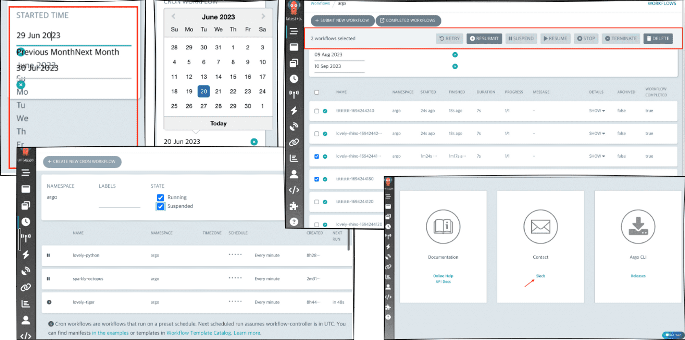

### Improving core functionality

As members began to gain experience contributing, their understanding of the project grew, and as they gained confidence,
they were increasingly able to contribute not only to UI/UX improvements, but also to the core functionality of the workflow engine.

[What’s new in Argo Workflows v3.5](https://blog.argoproj.io/whats-new-in-argo-workflows-v3-5-f260e8603ca6)

The core logic of the workflow engine is installed as a CRD in Kubernetes and has a significant impact on the behavior and performance of a Kubernetes cluster,
making it a very high level contribution that requires a high level of implementation and active participation in testing and policy discussions with maintainers.

Despite the challenges, our team was able to make key contributions to the Argo Workflows 3.5 release,
and our contributions to very important features such as Template Spec, Authentication, and Controller were mentioned on the Argo official blog.


After the release of Argo Workflows 3.5, contributors continue to contribute to the CI and test environments for DX improvements, new features in the Nix, Controller, and Template specifications,
and more challenging contributions such as updating the Go Lang version, and they are making meaningful contributions to the next release to make Argo Workflows an even better tool.

### Close communication with the maintainer group

Our team was very fortunate that the Argo Workflows project got a new leader in May of this year, Yuan Tang, and the breath of contributions across the project really accelerated.

Normally, in a large project like this, it would take quite a long time for reviews to take place, making it difficult to get a lot of contributions,
but thanks to the talented project head and his team, all of the ArgoWorkflows team members who participated in this competition learned a lot, experienced a lot,
and grew through a lot of contributions in a short time.


As I've gotten closer to contributing to the core features of the workflow engine, there have been situations where I've been able to communicate and interact with maintainers on CNCF Slack beyond the PR page.

Through these discussions, I've been able to determine policies for handling logic in the project to resolve issues,
and have been assigned other related issues to work on, giving me valuable experience in being a true part of an open source project.

Here are some of the contributions my team made during the project.

## ☑️ Detail of Contributions

### 1. 강병선

#### **🌿 Personal Activity Report**

<details>
<summary>Collapse/Expand</summary>

abcd

</details>

#### **🌵 Participation Review**

abcd

### 2. 강시온

#### **🌿 Personal Activity Report**

<details>
<summary>Collapse/Expand</summary>

abcd

</details>

#### **🌵 Participation Review**

abcd

### 3. 권영길

#### **🌿 Personal Activity Report**

<details>
<summary>Collapse/Expand</summary>

[Project Contributions]

1. 'Bug modification' Argo Workflow Datpicker improvement _(completed)_

Improve the ui of datepick, one of the filter functions of the workflow list page


Issue Link

[UI: Datepicker Style Malfunction Issue · Issue #11476 · argoproj/argo-workflows](https://github.com/argoproj/argo-workflows/issues/11476)

PR Link

[fix: Datepicker Style Malfunction Issue. Fixes #11476 by zel0rd · Pull Request #11480 · argoproj/argo-workflows](https://github.com/argoproj/argo-workflows/pull/11480)

2. 'Bug modification' _Cronworkflow's State filter initial value setting (completed)_

Fixed a bug where the status filter in the cronworkflow is rendered regardless of the initial value

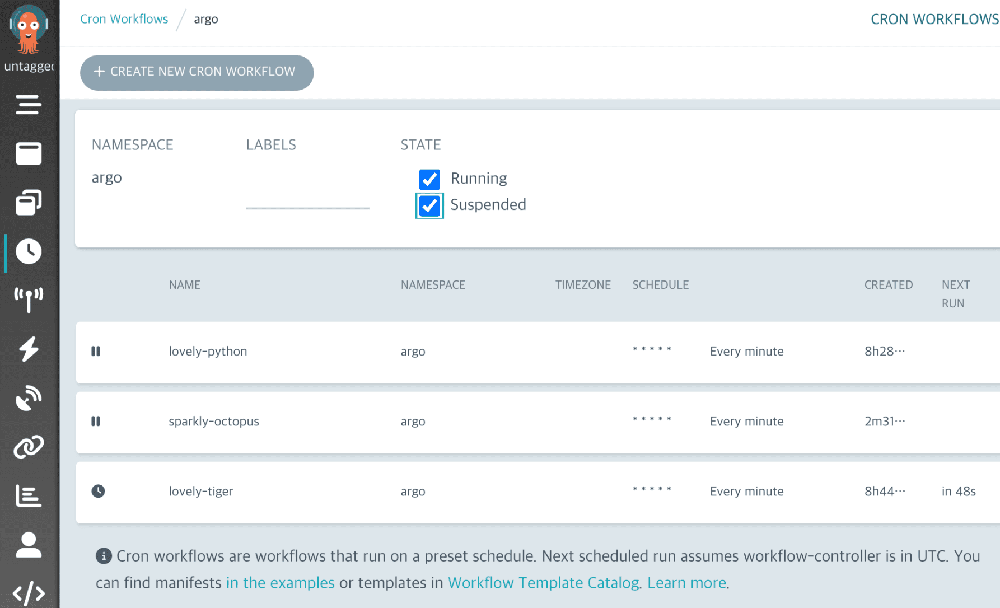

Issue Link

[ui: Cron workflow initial filter value · Issue #11685 · argoproj/argo-workflows](https://github.com/argoproj/argo-workflows/issues/11685)

PR Link

https://github.com/argoproj/argo-workflows/pull/11686

3. 'Fix the bug' _Remove webpack-related alerts from the initial page (in progress)_

To remove web pack monitoring that occurs when loading argo workflow ui

Currently testing the dependence and functionality of the associated libraries


4. 'Improvement' _Improvement of login page (in progress)_

Issues that improve the existing login page in Argo Workflow in the same form as the Argo CD

We will analyze the login capabilities provided by current workflow and apply new designs and designs afterwards

Issue Link

[Similar login page to Argo CD · Issue #10816 · argoproj/argo-workflows](https://github.com/argoproj/argo-workflows/issues/10816)

**[Project Activity History]**

**7.8 Opening Ceremony (Project Introduction and Self-Introduction)**

- Opening ceremony
  
- Time for self-introduction using nicknames
- A rough introduction to the project
- a majority vote for the rules of gathering activity
  - The next meeting activity will be held from 1 p.m. on Saturday (07/15) unlike the regular schedule, depending on the majority vote of the participants at the opening ceremony. The planned activity topic is:
  - Time to review or talk about \*common activities\*\* for the next week
  - Time to communicate about topics of interest
  - You can also set up the development environment according to your progress. (Optional)
  - (Common activities will be organized and shared within tomorrow's work hours.)

**7.15 First Meeting (Introduction to Development Environment Settings and Workflow Features)**

- Open Up to the First Meeting
- Development Environment Settings (dev-container)
- Playground Mission (DCO Bot Check Passed, Commit Using GPG, Commit Message Convention)
  - I created a playground before I immediately challenged a real open-source project. The first goal is to do issues/PR/commitments, etc., from an outsider's perspective on the project in this Playground.
    It's simple, but there may be unexpected gateways for the first time, so please focus. If we resolve the first issue early, we will give you additional instructions. Haha
  - 저장소: https://github.com/ArgoWorkflows-OSS/ArgoWorkflows-OSS
  - Objective: Select member profile update issue in issue template and generate first PR according to issue content.

**7.23 Second meeting (share issues of interest)**

- Gathering at Seongsu to conduct the second meeting (provided by Musinsa-Andahye Mentee)
- Introduce issues of interest, share issues with each other
  

**8.6 Fourth meeting**

Presentation activities

- argo event와 workflow, cd연동
- eBpf


**8.13 Fifth Meeting**

Presentation activities

- webRTC


**8.20 6th Meeting**

presentation activityEast

- Platform builder & K6 load test PoC for developers to load test themselves


**[Project Activities]**

1. **[Learning to contribute]**
   1. Kubernetes Architecture Lecture - [YouTube link](https://www.youtube.com/watch?v=Iue9TC13vPQ)
   2. Kubernetes Resources Lecture - [YouTube link](https://www.youtube.com/watch?v=6n5obRKsCRQ&list=PLApuRlvrZKohaBHvXAOhUD-RxD0uQ3z0c)
   3. Go Playground - https://go.dev/play/
2. **Learnings and impressions**
   1. I realized that domain knowledge in the field is important to contribute to the project.
      I wanted to simply contribute to web services, but it was not easy to set up the environment due to lack of knowledge about Kubernetes.
   2. I learned that big open source projects use things like DCO/GPG, and I was able to learn how open source projects are managed and operated.
3. **Issues and PR details**

</details>

#### **🌵 Participation Review**

For me, the idea of contributing to open source brings up a lot of mixed feelings.
Contributing to open source with other developers and experiencing the sharing and collaborative culture of open source is a great joy and reward for developers.
However, the uncertainty and fear that I had experienced when contributing several times before was a big barrier that made me hesitate to try again.
When I decided to participate for the third time, I said to myself, "Excuses like "I'm a student, I don't know enough, I'm busy preparing for a job, etc." don't work anymore. I must succeed this time'.
I can still remember the promise I made to myself when I started, which made it all the more overwhelming and exciting.
When I was applying for projects, I had to decide whether I wanted to work on something I knew or something new. I applied for a project related to devops, a field I hadn't been exposed to before, in order to educate myself and work harder.
It didn't take long for me to regret this decision. There was a lot to learn before I could even contribute, and a lot of time was wasted in building the basic environment of the project. However, when the development environment was built with other team members,
sharing each other's difficulties every day and actively trying to help each other, it was an exciting time.
Errors and bugs that occurred in my work always made me sensitive and annoyed, but in the academy, it was like a mission that I could do, and the process was fun like a game.
Now that I'm writing this recap, I'm very proud of my contributions and I'm grateful to my colleagues and mentors who helped me along the way.
In the future, I will think about how I can apply the argo-workflow project to my work and actively contribute to the issues that arise. I would also like to contribute to new projects if there are other good projects.
Thank you.

### 4. 김수빈

#### **🌿 Personal Activity Report**

<details>
<summary>Collapse/Expand</summary>

abcd

</details>

#### **🌵 Participation Review**

abcd

### 5. 김학준

#### **🌿 Personal Activity Report**

<details>
<summary>Collapse/Expand</summary>

`refactory`

**fix: Upgrade Go to v1.21 Fixes #11556**[**Merged]\*\*

- Argo Workflows are developed in Go language.
- An issue was issued to upgrade Go Version from 1.20 → 1.21, so we decided to resolve it.
- During the ‘Issue Hackathon’ period, we presented the issue and worked with the same team members to resolve the issue and conduct PR.
- As a result, it was a glorious time to have my first PR and my first contributor badge.

[fix: Upgrade Go to v1.21 Fixes #11556 by junkmm · Pull Request #11601 · argoproj/argo-workflows(opens in a new tab)](https://github.com/argoproj/argo-workflows/pull/11601)

`presentation`

- During the Challenges period, we had time to present at an offline meeting the results of CI/CD implementation using Argo Projects.
- It was a useful time to organize my thoughts during the presentation, talk with each other, and understand DevOps and the Argo Project ecosystem.
  

`Issue Hackathon`

- An ‘Issue Hackathon’ was held under the leadership of a mentor with the opinion of Da-hye A to reduce entry barriers and motivate contribution activities.
- Under the leadership of our mentor, we became a team with Seongrak, Moonyoung, and Byeongseon.
- During this period, I achieved the resolution of the go 1.20 → 1.21 upgrade issue that I suggested.
- We attempted to resolve the issue of adding Prometheus Metric values built into Argo Workflows, but were discontinued due to the high level of difficulty. However, through this process,
  I had a great experience breaking down my stereotype that Prometheus requires a separate exporter to be installed and expanding my horizons.
  [plan to add workflow labels to the metric? · Issue #9849 · argoproj/argo-workflows(opens in a new tab)](https://github.com/argoproj/argo-workflows/issues/9849)
- We are trying to resolve the following issue: [Compile `expr` in config · Issue #11609 · argoproj/argo-workflows](https://github.com/argoproj/argo-workflows/issues/11609)

`Beginner’s Special Class - Container Playground`

- Argo Workflows is an open source that runs in the Kubernetes native environment.
- The mentor opened the Kubernetes Study, saying that knowledge of Kubernetes would be helpful in approaching our project.
- The first mission was to create a Web Container that satisfied the conditions presented.
  
- It made me reflect on how I usually write Dockerfiles thoughtlessly, and it was a good time to learn about the relationship between multi-staging, build speed, and how to write Dockerfiles.

</details>

#### **🌵 Participation Review**

`Participation review`

First of all, I am very satisfied. I don't think it can be compared to the person I am today, who didn't know much about the open source ecosystem in the early days of contribution. The reason I'm so satisfied First, we are smart team members.
Every week, there were many presentations on various topics, technologies used by people in the workplace, technologies of interest, etc. It was a premium lecture that could not be heard anywhere else, and it was a very helpful time. Second, we have reliable team members.
As someone with little development experience, I was a little scared of this contribution period. However, thanks to many people, including our leader mentee, Seongrak, who actively provided information when they posted questions on Slack, I was able to smoothly overcome the problems I experienced.
Third, it is a comfortable meeting space and reliable support. We met every Sunday at the open-up space in Seocho. It was really clean, probably because it was a new building, and the coffee and snacks in the bathroom were just brilliant. Also,
it was nice to be able to eat really delicious lamb skewers during the mid-day company dinner.

`Future plans`

Through this year's contribution activities, I was able to clearly understand the open source ecosystem. The only thing I regret is that it was scary in the beginning? It's about being active passively and my cute little coding skills that I couldn't help but be passive about.
Because the period of contribution activities was truly valuable, I would like to make up for my shortcomings and participate next year as well.

### 6. 박진수

#### **🌿 Personal Activity Report**

<details>
<summary>Collapse/Expand</summary>

Improvements
**A new feature to support Secrets as a type of parameters ([link](https://github.com/argoproj/argo-workflows/pull/11446))**


The original Argo Workflow allowed you to define arguments directly when passing them to the WorkflowTemplate, or you could set it to reference a ConfigMap. However, unlike other tools that support the common kubernetes ecosystem, the ability to reference Secrets was not supported.

We started getting feature requests https://github.com/argoproj/argo-workflows/issues/5506에서 for this, and we've implemented it and created a Draft PR.

This feature was not easy to develop, especially since it required redefining things like the CustomResourceDefinition interface in Kubernetes, and figuring out the entire lifecycle of how a workflow is created, injected with sidecars, and created as a Pod.

However, as we implemented the feature, we were able to gain a deeper understanding of how workflows are eventually transformed into pods and containers, and the logic behind how workflows templatize context and arguments internally.

Create Issue` **Incorrect creator labels on a resubmitted Workflow ([link](https://github.com/argoproj/argo-workflows/issues/11414))**


Argo Workflow has a feature called Resubmit that recreates and runs a Workflow based on the same template. In the case of a resubmitted Workflow, the k8s object label related to the user who created the Workflow was not set based on the resubmitted user, but was set to the existing incorrect value.

As a result, if the user who ran a workflow was different from the user who resubmitted the workflow, the workflow created by the resubmission would have an incorrect workflow creation user-related k8s object label.

We raised an issue about this.

Bugfix: **fix: Apply the creator labels about the user who resubmitted a Workflow ([link](https://github.com/argoproj/argo-workflows/pull/11415))**


We created a Pull Request to resolve the issue (bug) we created earlier.

We fixed the bug by labeling the correct Workflow constructor k8s object based on the resubmitted user information only, without considering the information of the existing Workflow executor when resubmitting.

As an example of the change, we showed how a Workflow executed by a user named foo would be resubmitted by a user named bar, and how the creator-related label would be different if it was resubmitted by an unauthenticated user.

We also found that there were a lot of other code that was impacted, so we wrote test code to make it more stable.

Improvements

**feature: Propagate creator labels of a CronWorkflow to the Workflow to be scheduled ([link](https://github.com/argoproj/argo-workflows/pull/11407))**


If the CronWorkflow was created by a logged-in user, the CronWorkflow will be labeled with a k8s object for the constructor. However, there was an issue that the k8s object label would not be attached to Workflows that are created periodically based on the settings of CronWorkflow.

Therefore, we have improved Workflows created with CronWorkflow to propagate CronWorfklow's constructor label.

Issue.

**Insufficient logging in /oauth2/callback handler when using SSO Authentication ([link](https://github.com/argoproj/argo-workflows/issues/11369))**


We tried to activate the Authentication with Single Sign On (SSO) feature in Argo Workflows using the Identity Provider open source product called Keycloak, but we experienced a significant delay in the activation process due to the lack of logs.
Therefore, we opened an issue on the topic of enhancing the logging of the feature activation operation.

Feature.

**feature: Improve logging in the oauth2 callback handler ([link](https://github.com/argoproj/argo-workflows/pull/11370))**

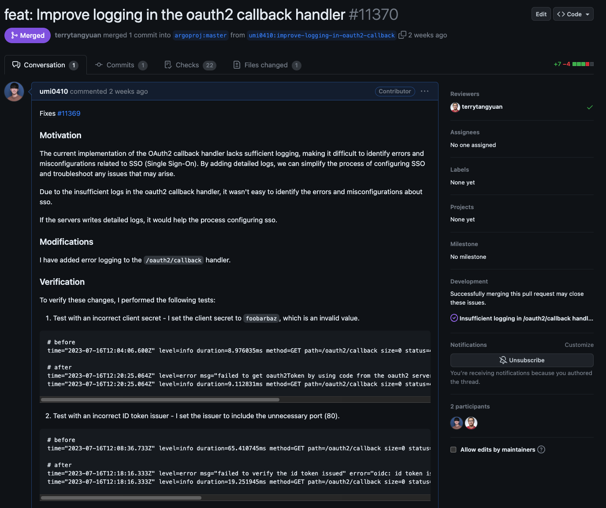

This is the pull request that resolved the issue mentioned above ([block link](https://www.notion.so/82d2ee40c48e482a8db93123a7b38407?pvs=21)). We improved the feature to output error logs for each error case that occurs while using OAuth2 Protocol for SSO.

Also, to make it easier for reviewers to review the pull request, we've added code verification to make the pull request more convincing.

Study`

**docs: Add a user named Park Jinsoo ([link](https://github.com/ArgoWorkflows-OSS/ArgoWorkflows-OSS/pull/51))**


At the beginning of the event, we practiced creating a pull request by adding an introduction about myself to the member profile of a repository that my mentor created for us to get acquainted with GitHub.

</details>

#### **🌵 Participation Review**

It was a great opportunity for me to become a contributor to a well-known open source project after having been a user of many open source projects for my work and hobbies.

With the help of my mentor, I was able to get started in open source contributing with Argo Workflow, overcome my fear of live video meetings between contributors, and develop the habit of reading code written by others.

I'm now very interested in Argo Workflow, as well as other cloud-native, open source favorites like Argo Rollouts and Istio, and I've been communicating with contributors frequently via Slack.

Before I started contributing to open source, I'm sure I would have been reluctant to do so. But now I don't feel intimidated by this communication at all, and in the future I hope to contribute as much to Argo Rollouts and Istio as I did to Argo Workflow!

I would like to thank the organizers and mentors for all their hard work over the years. Thank you.

### 7. 서청운

#### **🌿 Personal Activity Report**

<details>
<summary>Collapse/Expand</summary>

abcd

</details>

#### **🌵 Participation Review**

abcd

### 8. 송혜민

#### **🌿 Personal Activity Report**

<details>
<summary>Collapse/Expand</summary>

---

> ** Contribution Activities **

---

** Mutex check happens after memoization cache check and lock info missing from UI `Bug Fix` **

[Issue #11219](https://github.com/argoproj/argo-workflows/issues/11219)  
[PR #11456 - Merged/Included in 3.4.10 release](https://github.com/argoproj/argo-workflows/pull/11456)

I managed to modify Argo Workflow to simultaneously utilize the Synchronization and Cache functionalities.

This bug manifested when using both the Synchronization and Memoize keywords in Argo Workflow, causing it not to operate correctly.

The expected behavior was for the Mutex Synchronization to function first followed by the cache, however, after Synchronization occurred, the cache failed to operate.

For instance, when there are `job-1` and `job-2`, if `job-1` operates first due to Mutex Synchronization and writes to the cache, `job-2` ** should pass without operating, courtesy of the shared cache.**


I was able to fix this by adjusting the sequence of Synchronization and Cache.

While the fix was not complicated, modifying the `operation.go`, one of the intricate files, allowed me to explore various features of Argo Workflow with many reviews.

---

** Parent level memoization is broken `Bug Fix` **

[Issue #11612](https://github.com/argoproj/argo-workflows/issues/11612)  
[PR #11623 - Merged/Included in 3.4.11 release](https://github.com/argoproj/argo-workflows/pull/11623)

A new bug arose from the above fix. When using the Memo function in child components rather than at the Template level in Argo Workflow, a bug was reported that caused infinite pending.


I realized that there were unaddressed cases in the tests added in the previous PR. After identifying the cause of the error, I quickly patched it. I included four tests in the PR to detect such exceptions in the future.

---

** UI: workflowDrawer's information link is not correctly working `Bug Fix` **

[Issue #11494](https://github.com/argoproj/argo-workflows/issues/11494)  
[PR #11495 - Merged/Included in 3.4.10 release](https://github.com/argoproj/argo-workflows/pull/11495)

I fixed an issue where the Information icon link was broken when expanding a workflow on the Argo Workflow dashboard.

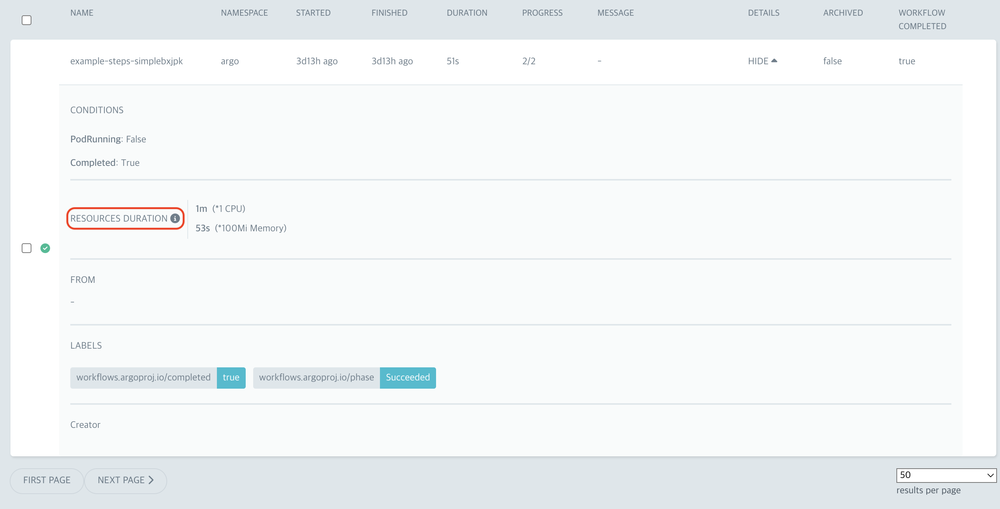

I introduced code to prevent incorrect event propagation caused by nested `<a>` tags. This correction ensured that clicking on the icon now directs users to the correct documentation.

---

** Search by name for WorkflowTemplates in UI `Feature Enhancement` **

[Issue #11004](https://github.com/argoproj/argo-workflows/issues/11004)  
[PR #11684 - Merged/Included in 3.4.10 release](https://github.com/argoproj/argo-workflows/pull/11684)

This was a collaborative effort with two other contributors.

A helpful feature that allows templates in Argo Workflow to function through name patterns was missing.

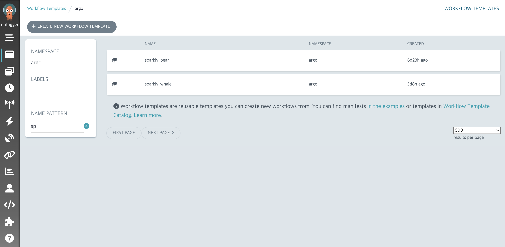

We developed an additional feature that lets users search for templates not just by Yaml labels, but also by names.
`The LIKE search, not just precise naming, will prove useful in the future.` Plans are underway to extend this search and pagination functionality to other pages, making this a particularly meaningful PR.

---

** Add more readable Argo CLI installation guide into github documentation `Documentation Contribution` **

[Issue #11750](https://github.com/argoproj/argo-workflows/issues/11750)  
[PR #11751 - Merged](https://github.com/argoproj/argo-workflows/pull/11751)

This contribution pertains to the documentation of the Argo CLI, the command-line interface used with Argo Workflows.


The current Argo CLI GitHub documentation lacked installation procedures, making it challenging for first-time users to determine how to install the Argo CLI. Initially, users had to directly navigate to the Release Note or the Quick Start page.  
By adding an Installation section to the Argo CLI page alongside the existing Usage details, I aimed to enhance user convenience.

---

** Workflow templating is skipped when whitespace is added to template parameters `Bug Fix` **

[Issue #11767](https://github.com/argoproj/argo-workflows/issues/11767)  
[PR #11781 - Merged](https://github.com/argoproj/argo-workflows/pull/11781)

In Argo Workflow, when authoring a workflow template, the placeholder in the form `{{parameter}}` did not undergo validation when spaces were added, such as `{{ parameter }}`.  
The root cause was the internal validation code not trimming spaces before and after the parameter. By adding the trim function to remove spaces, I resolved this issue. This contribution also rectified other placeholder content that previously bypassed validation.

---

> ** Development Activities **

---

** Contributing to the Argo Workflow OSS Common Repo **

[PR #22 - Merged](https://github.com/ArgoWorkflows-OSS/argoworkflows-oss.github.io/pull/22)

I undertook a preliminary exercise for multiple people to contribute to the Argo Workflow. We simultaneously modified new and existing documents with other participants, learning the importance of Git commands and the process of rebasing.

---

** Creating a Web Server with Dockerfile **

[PR #6 - Merged](https://github.com/ArgoWorkflows-OSS/container-playground/pull/6)

This exercise was about creating a Dockerfile that communicates with a local 8080 server and makes it accessible via localhost:8080.  
We simply crafted a Python server using Flask, and through the Dockerfile, we set up the environment, initiated the server, and connected the port, making the server accessible externally via Docker commands.

---

</details>

#### **🌵 Participation Review**

- Post-Participation Review
  - While I had participated in the open-source contribution academy before, I was especially satisfied with the program, members, and content of this academy.
  - It's not easy to understand the source code and start contributing in a short time, but it was an astonishing experience to be able to start contributing, even if it was a minor contribution.
  - I deeply felt that the concentrated care from the mentor and the passion of other participants were genuinely helpful.
  - Starting alone, I might have quickly given up and forgotten the content, but the experience was so different when progressing with others.
- Future Plans
  - I plan to continue contributing to Argo Workflow and may even start contributing to other open-source projects.
  - Especially now that I have learned how to approach and start with an open source I am interested in, I believe it will be a bit smoother as long as I have the passion.
  - I will actively promote the fun of contributing to open source to others and confidently recommend it.

### 9. 안다혜

#### **🌿 Personal Activity Report**

<details>
<summary>Collapse/Expand</summary>

abcd

</details>

#### **🌵 Participation Review**

abcd

### 10. 안지완

#### **🌿 Personal Activity Report**

<details>
<summary>Collapse/Expand</summary>

abcd

</details>

#### **🌵 Participation Review**

abcd

### 11. 유윤우

#### **🌿 Personal Activity Report**

<details>
<summary>Collapse/Expand</summary>

**1. Create a beginner's dockerfile**


- Create your own web service, build an image via dockerfile, and run a container.
- Build your service using a framework and language of your choice, I used Nest.js.

**2. Learn the Nest.js framework**

- [Nest.js Learning Repository](https://github.com/yunwoo-yu/nest-board-app)
- Since I only knew the front end, I quickly learned to create a simple API service using the

**3. PR after creating the dockerfile**
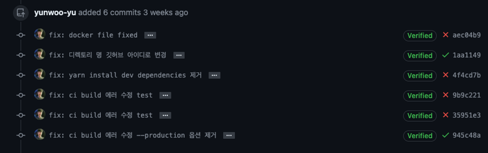

- I created a docker file to build the image, verified that the service is working, and raised a PR, but the build test of the github action fails.
- Remove the --production option and it passes the test, but the image is not optimised. Ask your mentor for advice


- Start troubleshooting based on your mentor's feedback

**4. Trouble Shooting**
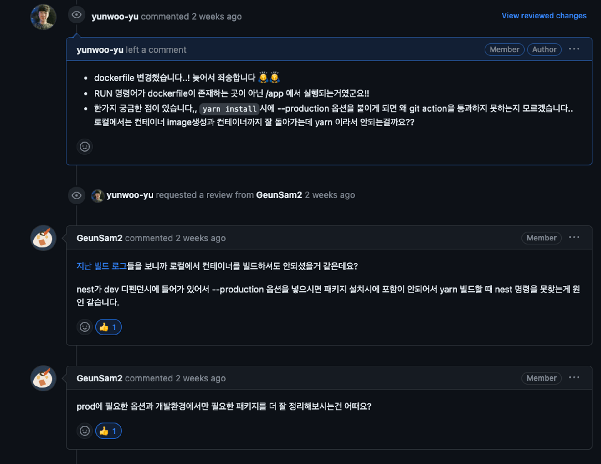
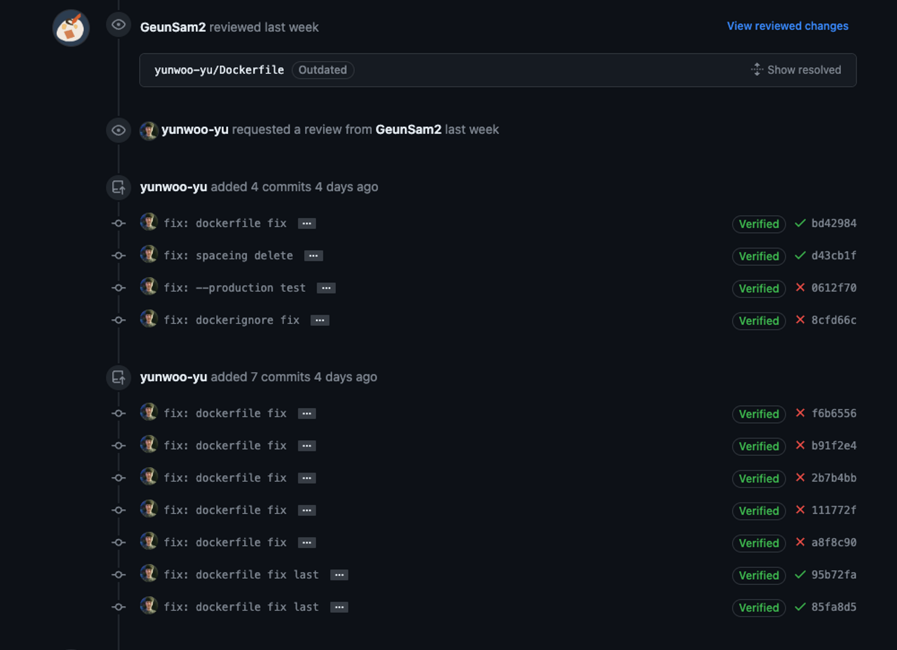

- I tried to install node_modules for production only to reduce the size when creating images with dokerfile, but it didn't pass the github action.
- After a lot of shovelling, I realised that a module called nest-cli is required for nest build, but it was in the devdependency, so I changed it and it worked. (My mentor gave me a hint, but I didn't understand and shovelled it in)
- The reason I was confused was that I had nest-cli installed globally on my MacBook.

**5. Open source contributor activity**
**[UI: The position sticky on the workflow toolbar is not working]**

- Fixed a bug where the position of the toolbar when selecting a checkbox in the workflows-list was not fixed at the top.
- [Read the issue](https://github.com/argoproj/argo-workflows/issues/11442)
- [Read the PR](https://github.com/argoproj/argo-workflows/pull/11444)

[before]


- The top toolbar was not visible when checkboxes were selected and scrolling.
- Fixed an issue with the existing `position : sticky` not being applied by changing it to `position : fixed`.

[after]
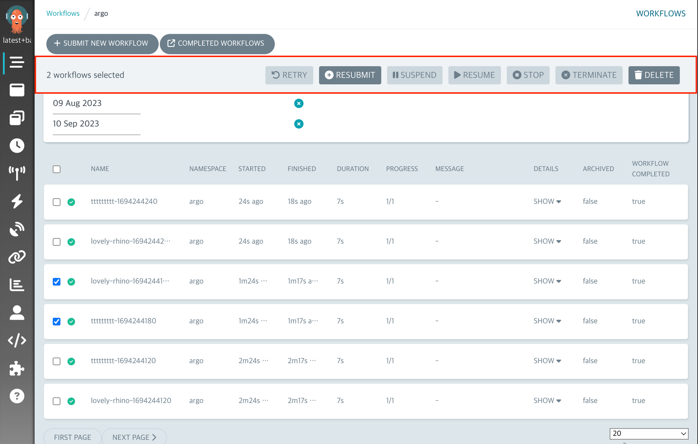

- After checking a checkbox, you can pin the toolbar to the top of the scroll to fire events for that list without having to scroll further.

**[UI - show history about completed runs in each cron workflow]**

- Work with a good improvement found by a Uijeong Issue to add a list to the `cron-workflows-detail` component to view the history of a given workflow.
- [Read the issue](https://github.com/argoproj/argo-workflows/issues/11706)
- [Read the PR](https://github.com/argoproj/argo-workflows/pull/11811)

[before]
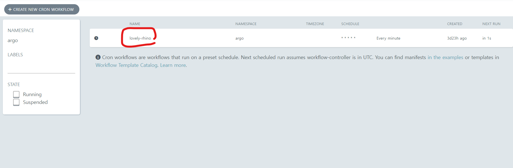

- There was nothing on the existing `cron-workflows-detail` page, but the

[after]

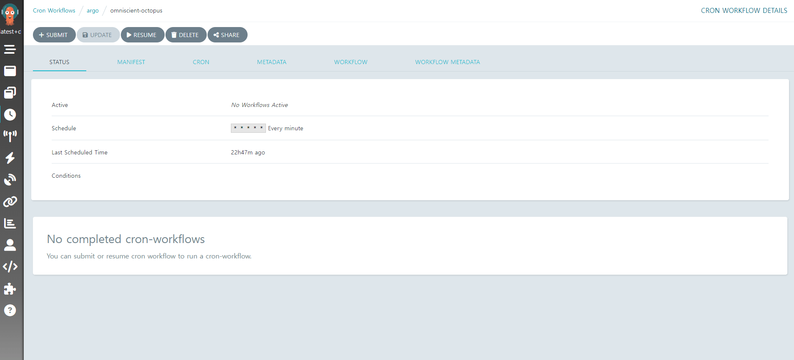

- Added a history `workflows` to the corresponding `cron-workflows` and an example of when there is no history.
- This PR is still under verification

</details>

#### **🌵 Participation Review**

It was a great experience.

Unfortunately, when I got a job, I became busy and lacked knowledge of server and DevOps, so I didn't participate in many contributor activities or offline gatherings.

However, I will not give up and try to contribute more to argoWorkflow by doing more front-end contributions and studying server side as well!

Thank you for making such a good activity and thank you to the mentors and mentees for helping me grow step by step even though I'm a beginner 👍

### 12. 이병곤

#### **🌿 Personal Activity Report**

<details>
<summary>Collapse/Expand</summary>

abcd

</details>

#### **🌵 Participation Review**

abcd

### 13. 이의주

#### **🌿 Personal Activity Report**

<details>
<summary>Collapse/Expand</summary>

abcd

</details>

#### **🌵 Participation Review**

abcd

### 14. 전의정

#### **🌿 Personal Activity Report**

<details>
<summary>Collapse/Expand</summary>

abcd

</details>

#### **🌵 Participation Review**

abcd

### 15. 정성락

#### **🌿 Personal Activity Report**

<details>
<summary>Collapse/Expand</summary>

abcd

</details>

#### **🌵 Participation Review**

abcd

### 16. 채문영

#### **🌿 Personal Activity Report**

<details>
<summary>Collapse/Expand</summary>

abcd

</details>

#### **🌵 Participation Review**

abcd

### 17. 최수녕

#### **🌿 Personal Activity Report**

<details>
<summary>Collapse/Expand</summary>

**1. Cron workflow can not apply volumeClaimTemplates config from argo controller config map (workflowDefaults)**

[Issue #11344](https://github.com/argoproj/argo-workflows/issues/11344)  
[PR #11662](https://github.com/argoproj/argo-workflows/pull/11662)

> Issue Analysis

To understand this issue, I first needed to grasp what [Default Workflows](https://argoproj.github.io/argo-workflows/default-workflow-specs) are.

I learned that the `workflowDefaults` field in the `argo workflows controller configmap` allows you to set default values for workflows. Additionally, I discovered that if a workflow already has values for this field, those values take precedence.

For example, after configuring the `configmap` as follows, when you create a Workflow,

```yaml
# This file describes the config settings available in the workflow controller configmap
apiVersion: v1
kind: ConfigMap
metadata:
  name: workflow-controller-configmap
data:
  # Default values that will apply to all Workflows from this controller, unless overridden on the Workflow-level
  workflowDefaults: |
    metadata:
      annotations:
        argo: workflows
      labels:
        foo: bar
    spec:
      ttlStrategy:
        secondsAfterSuccess: 5
      parallelism: 3
```

it will be automatically created with the values set in the `workflowDefaults` field, like this:

```yaml
apiVersion: argoproj.io/v1alpha1
kind: Workflow
metadata:
  generateName: gc-ttl-
  annotations:
    argo: workflows
  labels:
    foo: bar
spec:
  ttlStrategy:
    secondsAfterSuccess: 5 # Time to live after workflow is successful
  parallelism: 3
```

The issue was related to an error occurring when adding the `volumeClaimTemplates` value to `workflowDefaults`, causing errors when creating `CronWorkflows` or `Workflows`.

The error message indicated, `does not contain declared merge key: name.`

Upon checking the code, it was found that the error occurred in the `StrategicMergePatch` function, which is related to Kubernetes' `patch` strategy.

```go
VolumeClaimTemplates []apiv1.PersistentVolumeClaim `json:"volumeClaimTemplates,omitempty" patchStrategy:"merge" patchMergeKey:"name" protobuf:"bytes,6,opt,name=volumeClaimTemplates"`
```

The issue arose from the fact that the `VolumeClaimTemplates` type defined in `Workflows` used name as the `patchMergeKey`.

However, upon inspecting the `PersistentVolumeClaim` type below, it was found that `name` was not present. In other words, the problem occurred because a value was defined as the `patchMergeKey` that was not part of the structure.

```go
type PersistentVolumeClaim struct {
	metav1.TypeMeta `json:",inline"`
	// Standard object's metadata.
	// More info: https://git.k8s.io/community/contributors/devel/sig-architecture/api-conventions.md#metadata
	// +optional
	metav1.ObjectMeta `json:"metadata,omitempty" protobuf:"bytes,1,opt,name=metadata"`

	// spec defines the desired characteristics of a volume requested by a pod author.
	// More info: https://kubernetes.io/docs/concepts/storage/persistent-volumes#persistentvolumeclaims
	// +optional
	Spec PersistentVolumeClaimSpec `json:"spec,omitempty" protobuf:"bytes,2,opt,name=spec"`

	// status represents the current information/status of a persistent volume claim.
	// Read-only.
	// More info: https://kubernetes.io/docs/concepts/storage/persistent-volumes#persistentvolumeclaims
	// +optional
	Status PersistentVolumeClaimStatus `json:"status,omitempty" protobuf:"bytes,3,opt,name=status"`
}
```

> Issue Resolution

I removed the `patchMergeKey` from `VolumeClaimTemplates`.

However, the reason `patchMergeKey` was added to `VolumeClaimTemplates` was to maintain consistency with conventions used for `Volumes`.

Since this issue is related to policies, it indeed requires further discussion.

This was my first PR to the ArgoWorkflows project, and it's great that i was able to identify the cause of an issue that was causing inconvenience for many people.

**2. Search by name for WorkflowTemplates in UI**

[Issue #11004](https://github.com/argoproj/argo-workflows/issues/11004)  
[PR #11684](https://github.com/argoproj/argo-workflows/pull/11684)

> Issue Analysis

This issue was worked on by a team of three people.


`WorkflowTemplates` do not have a search function based on 'name', so to find a specific `WorkflowTemplates`, you could only search based on `label`.

So, many users were feeling inconvenienced, and it was an issue related to 'feature improvement' that they would like to provide a function to search based on 'name'.

> Issue Resolution


We added additional logic to filter the results of WorkflowTemplates retrieved through the Kubernetes API based on their 'name', successfully implementing this feature.

However, there was one issue.

Existing pagination was implemented using Kubernetes' own `continue` value, so if Kubernetes results were custom manipulated like this, Kubernetes pagination could not be used.

We had a lot of concerns about how to solve this, but We solved the problem by applying logic to implement cursor pagination using Kubernetes' `resourceVersion`.

It was so fun to be able to discuss it with others instead of alone.

I also felt good about providing some really needed functionality to the ArgoWorkflows project.

**3. A problem that is not initialized when changing the number of page limits**

[Issue #11702](https://github.com/argoproj/argo-workflows/issues/11702)  
[PR #11703](https://github.com/argoproj/argo-workflows/pull/11703)

> Issue Analysis

While resolving the `Search by name for WorkflowTemplates in UI` issue, i discovered a new pagination bug.

When changing the number of pages, the `continue` value used for pagination was not initialized in the UI, so the data was not displayed properly.

> Issue Resolution

I was able to solve the problem by simply modifying the logic to initialize `offset` when a change in page number is detected in the UI code.

It was only a one-line code change, but this one line solved a problem that was quite inconvenient.

**4. Pagination may not work correctly for archived workflows**

> Issue Analysis

[Issue #11715](https://github.com/argoproj/argo-workflows/issues/11715)  
[PR #11761](https://github.com/argoproj/argo-workflows/pull/11761)

This issue was directly communicated to us by Maintainer @terrytangyuan through Slack.


It felt like I was contacted by my favorite celebrity and I was so happy that I almost flew away. I suppressed my happy and excited heart and analyzed the issue.

`Workflows` and `ArchivedWorkflows` were previously separated into different pages, but starting from the `master` version, `Workflows` and `ArchivedWorkflows` are combined into one page, and the logic has been modified to show `ArchivedWorkflows` together if they exist.

However, when `Workflows` and `ArchivedWorkflows` were merged into one, a problem occurred with pagination.

The two resources also used completely different pagination. `Workflows` was using the `continue` value, which is Kubernetes' own pagination, and `ArchivedWorkflows` used its own database, so it was using the database to perform pagination using the `offset` method.

However, while passing the `continue` value used in `Workflows` to `ArchivedWorkflows` as is, a problem occurred where `ArchivedWorkflows` was not searched at all.

> Issue Resolution

I was able to resolve the issue by referring to the pagination logic that was implemented while resolving the `Search by name for WorkflowTemplates in UI` issue.

Since the two resources have no choice but to use different methods of pagination, rather than using pagination before merging the two resources, use a method of first searching the entire resource and merging the two resources and finally applying the pagination logic. I did it.

I was able to solve the problem of `ArchivedWorkflows` not being searched, but fetching and merging the entire list every time the page is changed is a performance concern, so i'm thinking about a way to test performance.

I plan to switch to front-end pagination if performance testing indicates that it's not working well.

It was great to be able to solve a critical issue, and I felt proud and fun because I felt like I was contributing properly to the ArgoWorkflows project as a contributor.

**5. Relocation of Commit Guidelines Information in the Documentation**

[Issue #11700](https://github.com/argoproj/argo-workflows/issues/11700)  
[PR #11701](https://github.com/argoproj/argo-workflows/pull/11701)

> Issue Analysis

The ArgoWorkflows project has a README document for developers attempting to contribute.

However, it does not mention specific guidelines for commits.

@GeunSam2 mentor mentioned that it was inconvenient when initially attempted to contribute and had difficulty finding commit guidelines.

> Issue Resolution


Upon hearing this feedback, I made a modification to the contribution README by adding a link to commit guidelines.

This change aims to make it easier for developers who want to contribute to ArgoWorkflows.

In this PR, a maintainer provided a code suggestion, which was intriguing and enjoyable for me as I was encountering the code suggestion feature for the first time.

</details>

#### **🌵 Participation Review**

If someone were to ask me what I did best this year, I would confidently say that it was my participation in the ArgoWorkflows project contribution activities.

Meeting various developers in the same field, forming a sense of empathy, and engaging in discussions with them was truly enjoyable. Hearing stories about different companies was also quite interesting.

During our weekly meetings, it wasn't just about working together; our mentors always conducted insightful seminars. Sundays became genuinely enjoyable, and time flew by.

Meeting such capable mentors was a delight. I received advice on the concerns I had as a junior developer, my future direction, and how to study effectively as a developer, which made me happy.

I always wanted to try contributing, but I was afraid to tackle such a big project. However, facing these challenges with such great mentees and mentors made my fears disappear.

Submitting numerous PRs and communicating with maintainers was also a lot of fun, and it was really satisfying to see my code being incorporated.

Thanks to this experience, I gained the confidence to contribute not only to ArgoWorkflows but also to other projects.

I have no intention of stopping my contributions after this period ends. I plan to continue contributing to ArgoWorkflows while looking for opportunities to contribute to Kubernetes and Argo CD projects used by my company.
