## ☑️ Meet Our Team

The ArgoWorkflows OSS 2023 team consisted of one mentor and 17 mentees, for a total of 18 people working as a team.

The team was organized with the help of the [Open Source Contribution Academy](https://www.contribution.ac/2023-ossca),
an awesome event that **brings together junior and senior developers** who may feel intimidated by open source to contribute,
and was active for about **4 months from July to October 2023.**

Starting from our humble beginnings with Git to becoming accomplished open source contributors.

Here's a look at what our team accomplished.

## ☑️ What is ArgoWorkflows


Argo Workflows is a container-based workflow engine, an open source project that allows you to run parallel jobs on Kubernetes.
Each workflow step is defined as a container, and multi-step workflows can be modeled as a series of tasks, or dependencies between tasks can be executed using a Directed Acyclic Graph (DAG).

In short, Argo Workflows makes it faster and easier to perform tasks in the form of simple workflows, as well as complex tasks for machine learning or data processing, on Kubernetes.


Argo Workflows is a graduated project of the Cloud Native Computing Foundation (CNCF).

To become a graduated project, you must pass all of the tests that the CNCF conducts to meet their rigorous standards.
This means that being recognized as a graduated project means that Argo meets the highest standards for clear governance and committer processes, healthy growth, and security and compliance adherence.
Because of the rigorous standards, only about 13% of projects registered with the CNCF succeed in graduating.

In fact, it took the Argo project over 7000 contributors, over 11,000 PRs, and over 370,000 contributions over a period of about 5 years to be recognized as a graduating project.

Not only that, but the Argo project is still a very active and up-to-date open source project with over 2300 companies contributing to the code and over 8300 people contributing to the code.

This makes Argo Workflows the most recognized workflow engine in the cloud native community.

Many organizations around the world have officially adopted and use Argo Workflows. This is a strong proof that Argo Workflows can solve the problems of real workloads even in the largest enterprises.

Some of the leading companies using Argo Workflows include.


... and over 200 other global companies

Some alternative tools to Argo Workflows include Apache Airflow, Tekton, and Prefect.

Argo Workflows is a Kubernetes-native engine that makes it easy to orchestrate container-based workflows and manage resources.
This is one of the key differences compared to similar tool Apache Airflow, which is a standalone application and does not inherently utilize the capabilities of Kubernetes.
As a result, resource management and scalability can be more challenging with Airflow than with Argo Workflows.

Also, because Argo Workflows runs each workflow step as an independent container, it can perform a variety of tasks, such as CI/CD as well as data pipelines.
This is possible by leveraging the power of Docker and Kubernetes, which allows you to run anything without restrictions.

## ☑️ Key Accomplishments

### UI/UX improvements

The Argo Workflows project is actively contributing to the topic, with UI/UX improvements as the main keyword for contributions, a separate project page, and issue tracking.


Our team has also made many UI improvements along the lines of these project goals.

> Key improvements

- Workflows search functionality
- Improvements to the summary view of cronworkflows
- Improvements to DataPciker
- Sticky option in workflows control panel
- label highlighting in workflows list
- Various other bug fixes


### Improving core functionality

As members began to gain experience contributing, their understanding of the project grew, and as they gained confidence,
they were increasingly able to contribute not only to UI/UX improvements, but also to the core functionality of the workflow engine.

[What’s new in Argo Workflows v3.5](https://blog.argoproj.io/whats-new-in-argo-workflows-v3-5-f260e8603ca6)

The core logic of the workflow engine is installed as a CRD in Kubernetes and has a significant impact on the behavior and performance of a Kubernetes cluster,
making it a very high level contribution that requires a high level of implementation and active participation in testing and policy discussions with maintainers.

Despite the challenges, our team was able to make key contributions to the Argo Workflows 3.5 release,
and our contributions to very important features such as Template Spec, Authentication, and Controller were mentioned on the Argo official blog.


After the release of Argo Workflows 3.5, contributors continue to contribute to the CI and test environments for DX improvements, new features in the Nix, Controller, and Template specifications,
and more challenging contributions such as updating the Go Lang version, and they are making meaningful contributions to the next release to make Argo Workflows an even better tool.

### Close communication with the maintainer group

Our team was very fortunate that the Argo Workflows project got a new leader in May of this year, Yuan Tang, and the breath of contributions across the project really accelerated.

Normally, in a large project like this, it would take quite a long time for reviews to take place, making it difficult to get a lot of contributions,
but thanks to the talented project head and his team, all of the ArgoWorkflows team members who participated in this competition learned a lot, experienced a lot,
and grew through a lot of contributions in a short time.


As I've gotten closer to contributing to the core features of the workflow engine, there have been situations where I've been able to communicate and interact with maintainers on CNCF Slack beyond the PR page.

Through these discussions, I've been able to determine policies for handling logic in the project to resolve issues,
and have been assigned other related issues to work on, giving me valuable experience in being a true part of an open source project.

Here are some of the contributions my team made during the project.

## ☑️ Detail of Contributions

### 1. 강병선

#### **🌿 Personal Activity Report**

<details>
<summary>Collapse/Expand</summary>

- **Personal achievements**

  - `Documentation contribution` `#11762` [Remove helm installation guide and Add helm documentation link](https://github.com/argoproj/argo-workflows/pull/11762#event-10327741834)
    - We need to install helm for MinIO configuration, but the helm installation guide only shows the configuration related to mac, so we fixed it to access the helm official documentation.
  - `Documentation contribution` `#11735` [Add installation option description](https://github.com/argoproj/argo-workflows/pull/11735#event-10365473861)
    - We added a detailed description of the managed namespace option.
    - I learned from a maintainer that there is a [Documentation convention](https://kubernetes.io/docs/contribute/style/style-guide/#use-simple-and-direct-language) for Kubernetes here.
  - Contribution Preparation Courses and Activities

    - Learn the basics of Github
      - My mentor gave me an assignment to update my profile. I familiarized myself with the concepts of GPG and DCObot to become more familiar with github.
        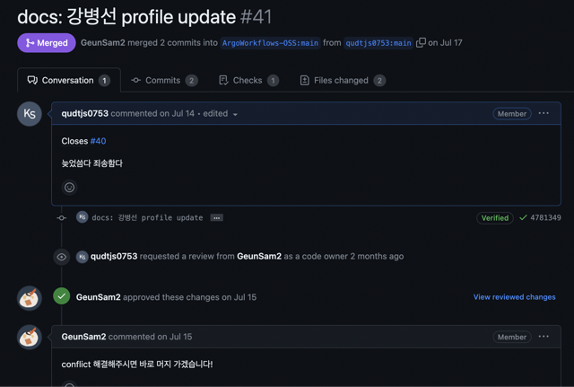
    - Docker Beginner Special Class
      - We had an activity to create a docker image using Dockerfile. I learned the concepts by reading the materials organized by my mentor.
        In addition, when creating the image, I tried to apply [multi stage build](https://www.notion.so/Dockerfile-65f85f55b1b647ebb85617da9747db58?pvs=21) to include only the features needed for execution.
        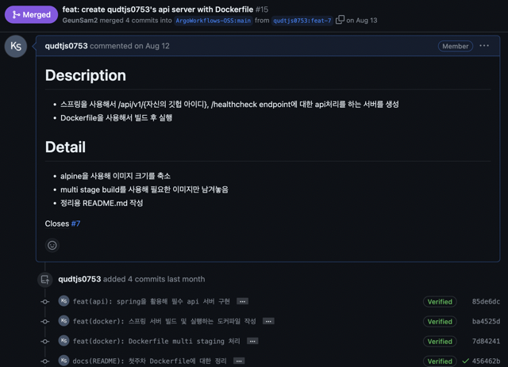
        
      - After the lab, my mentor walked me through [Overlay FS](https://ykarma1996.tistory.com/192) one by one, showing me how the images are created. This was really informative...
    - Learning the basics of Kubernetes
      - Before contributing, I took the time to study the basics of Kubernetes.
        - [개인 공부자료](https://www.notion.so/bf8924a756b34bacb82d7051a05f1168?pvs=21)
    - Argo workflows
      - template and [self-study](https://www.notion.so/e4d8e9e18f154a2181135b3e1b6b2d45?v=599976df8f114b5bb48943bdeef08360&pvs=4).
      - Mentee Hakjun showed me the [pipeline for deploying on GCP using ArgoCD and Argo Workflows](https://junkmm.tistory.com/28).

  - Participation in OSS meetup activities
    - Mentors and mentees gave presentations on various topics. It was a good time to hear what problems they are facing in the real world besides contributing and how they solved them.
  - Participating in the hackathon
    - Mentee Sungrak helped me a lot. He shared the issues he thought were okay and always encouraged me to challenge myself.
      
    - He recommended the issue `#11609` [Compile expr in config](https://github.com/argoproj/argo-workflows/issues/11609), so I tried it.
    - I spent some time analyzing the issue by [teaching myself Golang](https://www.notion.so/491f51f4142244ca875708c5556c58a2?pvs=21).
    - It was a good time to become more familiar with golang.

</details>

#### **🌵 Participation Review**

- **Participant Review**
  - As a junior developer, this activity is not just for contributing, it's a great way to see what developers are thinking about and how they grow.
  - I got so much help and I'm always grateful. It was a great time to meet so many nice people.
  - I'm glad I took the first step in getting acquainted with containers.
- **Future plans**.
  - I will continue to be interested in and contribute to all open source projects that I use in my development.
  - I will apply Argo workflows to real projects and find ways to contribute more!

### 2. 강시온

#### **🌿 Personal Activity Report**

<details>
<summary>Collapse/Expand</summary>

abcd

</details>

#### **🌵 Participation Review**

abcd

### 3. 권영길

#### **🌿 Personal Activity Report**

<details>
<summary>Collapse/Expand</summary>

abcd

</details>

#### **🌵 Participation Review**

abcd

### 4. 김수빈

#### **🌿 Personal Activity Report**

<details>
<summary>Collapse/Expand</summary>

abcd

</details>

#### **🌵 Participation Review**

abcd

### 5. 김학준

#### **🌿 Personal Activity Report**

<details>
<summary>Collapse/Expand</summary>

abcd

</details>

#### **🌵 Participation Review**

abcd

### 6. 박진수

#### **🌿 Personal Activity Report**

<details>
<summary>Collapse/Expand</summary>

abcd

</details>

#### **🌵 Participation Review**

abcd

### 7. 서청운

#### **🌿 Personal Activity Report**

<details>
<summary>Collapse/Expand</summary>

abcd

</details>

#### **🌵 Participation Review**

abcd

### 8. 송혜민

#### **🌿 Personal Activity Report**

<details>
<summary>Collapse/Expand</summary>

---

> ** Contribution Activities **

---

** Mutex check happens after memoization cache check and lock info missing from UI `Bug Fix` **

[Issue #11219](https://github.com/argoproj/argo-workflows/issues/11219)  
[PR #11456 - Merged/Included in 3.4.10 release](https://github.com/argoproj/argo-workflows/pull/11456)

I managed to modify Argo Workflow to simultaneously utilize the Synchronization and Cache functionalities.

This bug manifested when using both the Synchronization and Memoize keywords in Argo Workflow, causing it not to operate correctly.

The expected behavior was for the Mutex Synchronization to function first followed by the cache, however, after Synchronization occurred, the cache failed to operate.

For instance, when there are `job-1` and `job-2`, if `job-1` operates first due to Mutex Synchronization and writes to the cache, `job-2` ** should pass without operating, courtesy of the shared cache.**

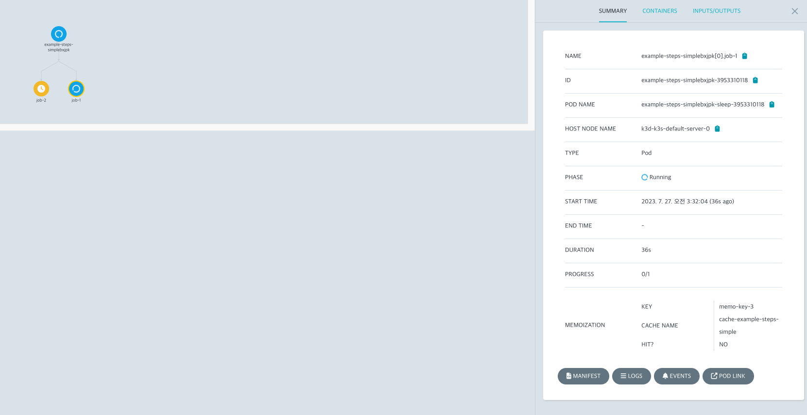

I was able to fix this by adjusting the sequence of Synchronization and Cache.

While the fix was not complicated, modifying the `operation.go`, one of the intricate files, allowed me to explore various features of Argo Workflow with many reviews.

---

** Parent level memoization is broken `Bug Fix` **

[Issue #11612](https://github.com/argoproj/argo-workflows/issues/11612)  
[PR #11623 - Merged/Included in 3.4.11 release](https://github.com/argoproj/argo-workflows/pull/11623)

A new bug arose from the above fix. When using the Memo function in child components rather than at the Template level in Argo Workflow, a bug was reported that caused infinite pending.

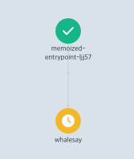

I realized that there were unaddressed cases in the tests added in the previous PR. After identifying the cause of the error, I quickly patched it. I included four tests in the PR to detect such exceptions in the future.

---

** UI: workflowDrawer's information link is not correctly working `Bug Fix` **

[Issue #11494](https://github.com/argoproj/argo-workflows/issues/11494)  
[PR #11495 - Merged/Included in 3.4.10 release](https://github.com/argoproj/argo-workflows/pull/11495)

I fixed an issue where the Information icon link was broken when expanding a workflow on the Argo Workflow dashboard.


I introduced code to prevent incorrect event propagation caused by nested `<a>` tags. This correction ensured that clicking on the icon now directs users to the correct documentation.

---

** Search by name for WorkflowTemplates in UI `Feature Enhancement` **

[Issue #11004](https://github.com/argoproj/argo-workflows/issues/11004)  
[PR #11684 - Merged/Included in 3.4.10 release](https://github.com/argoproj/argo-workflows/pull/11684)

This was a collaborative effort with two other contributors.

A helpful feature that allows templates in Argo Workflow to function through name patterns was missing.


We developed an additional feature that lets users search for templates not just by Yaml labels, but also by names.
`The LIKE search, not just precise naming, will prove useful in the future.` Plans are underway to extend this search and pagination functionality to other pages, making this a particularly meaningful PR.

---

** Add more readable Argo CLI installation guide into github documentation `Documentation Contribution` **

[Issue #11750](https://github.com/argoproj/argo-workflows/issues/11750)  
[PR #11751 - Merged](https://github.com/argoproj/argo-workflows/pull/11751)

This contribution pertains to the documentation of the Argo CLI, the command-line interface used with Argo Workflows.

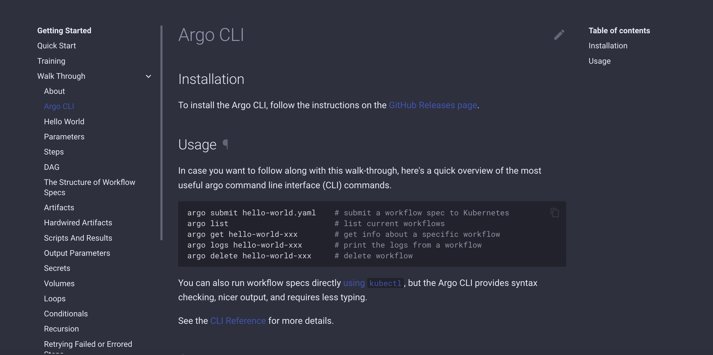

The current Argo CLI GitHub documentation lacked installation procedures, making it challenging for first-time users to determine how to install the Argo CLI. Initially, users had to directly navigate to the Release Note or the Quick Start page.  
By adding an Installation section to the Argo CLI page alongside the existing Usage details, I aimed to enhance user convenience.

---

** Workflow templating is skipped when whitespace is added to template parameters `Bug Fix` **

[Issue #11767](https://github.com/argoproj/argo-workflows/issues/11767)  
[PR #11781 - Merged](https://github.com/argoproj/argo-workflows/pull/11781)

In Argo Workflow, when authoring a workflow template, the placeholder in the form `{{parameter}}` did not undergo validation when spaces were added, such as `{{ parameter }}`.  
The root cause was the internal validation code not trimming spaces before and after the parameter. By adding the trim function to remove spaces, I resolved this issue. This contribution also rectified other placeholder content that previously bypassed validation.

---

> ** Development Activities **

---

** Contributing to the Argo Workflow OSS Common Repo **

[PR #22 - Merged](https://github.com/ArgoWorkflows-OSS/argoworkflows-oss.github.io/pull/22)

I undertook a preliminary exercise for multiple people to contribute to the Argo Workflow. We simultaneously modified new and existing documents with other participants, learning the importance of Git commands and the process of rebasing.

---

** Creating a Web Server with Dockerfile **

[PR #6 - Merged](https://github.com/ArgoWorkflows-OSS/container-playground/pull/6)

This exercise was about creating a Dockerfile that communicates with a local 8080 server and makes it accessible via localhost:8080.  
We simply crafted a Python server using Flask, and through the Dockerfile, we set up the environment, initiated the server, and connected the port, making the server accessible externally via Docker commands.

---

</details>

#### **🌵 Participation Review**

- Post-Participation Review
  - While I had participated in the open-source contribution academy before, I was especially satisfied with the program, members, and content of this academy.
  - It's not easy to understand the source code and start contributing in a short time, but it was an astonishing experience to be able to start contributing, even if it was a minor contribution.
  - I deeply felt that the concentrated care from the mentor and the passion of other participants were genuinely helpful.
  - Starting alone, I might have quickly given up and forgotten the content, but the experience was so different when progressing with others.
- Future Plans
  - I plan to continue contributing to Argo Workflow and may even start contributing to other open-source projects.
  - Especially now that I have learned how to approach and start with an open source I am interested in, I believe it will be a bit smoother as long as I have the passion.
  - I will actively promote the fun of contributing to open source to others and confidently recommend it.

### 9. 안다혜

#### **🌿 Personal Activity Report**

<details>
<summary>Collapse/Expand</summary>

abcd

</details>

#### **🌵 Participation Review**

abcd

### 10. 안지완

#### **🌿 Personal Activity Report**

<details>
<summary>Collapse/Expand</summary>

abcd

</details>

#### **🌵 Participation Review**

abcd

### 11. 유윤우

#### **🌿 Personal Activity Report**

<details>
<summary>Collapse/Expand</summary>

**1. Create a beginner's dockerfile**
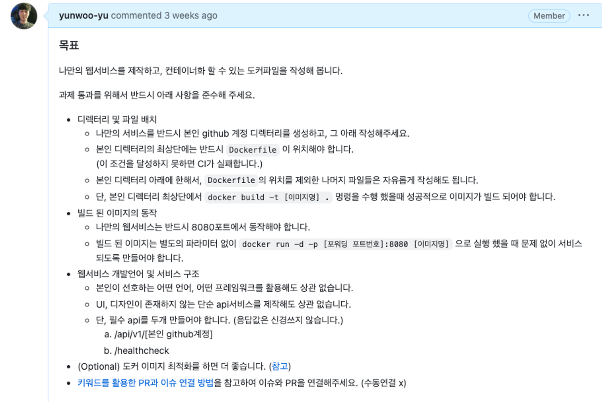

- Create your own web service, build an image via dockerfile, and run a container.
- Build your service using a framework and language of your choice, I used Nest.js.

**2. Learn the Nest.js framework**

- [Nest.js Learning Repository](https://github.com/yunwoo-yu/nest-board-app)
- Since I only knew the front end, I quickly learned to create a simple API service using the

**3. PR after creating the dockerfile**


- I created a docker file to build the image, verified that the service is working, and raised a PR, but the build test of the github action fails.
- Remove the --production option and it passes the test, but the image is not optimised. Ask your mentor for advice

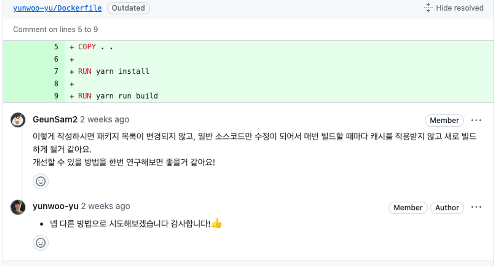

- Start troubleshooting based on your mentor's feedback

**4. Trouble Shooting**


- I tried to install node_modules for production only to reduce the size when creating images with dokerfile, but it didn't pass the github action.
- After a lot of shovelling, I realised that a module called nest-cli is required for nest build, but it was in the devdependency, so I changed it and it worked. (My mentor gave me a hint, but I didn't understand and shovelled it in)
- The reason I was confused was that I had nest-cli installed globally on my MacBook.

**5. Open source contributor activity**
**[UI: The position sticky on the workflow toolbar is not working]**

- Fixed a bug where the position of the toolbar when selecting a checkbox in the workflows-list was not fixed at the top.
- [Read the issue](https://github.com/argoproj/argo-workflows/issues/11442)
- [Read the PR](https://github.com/argoproj/argo-workflows/pull/11444)

[before]
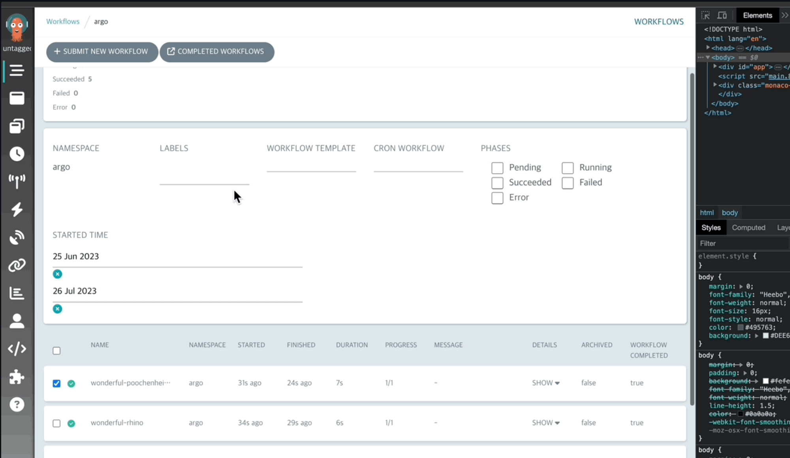

- The top toolbar was not visible when checkboxes were selected and scrolling.
- Fixed an issue with the existing `position : sticky` not being applied by changing it to `position : fixed`.

[after]


- After checking a checkbox, you can pin the toolbar to the top of the scroll to fire events for that list without having to scroll further.

**[UI - show history about completed runs in each cron workflow]**

- Work with a good improvement found by a Uijeong Issue to add a list to the `cron-workflows-detail` component to view the history of a given workflow.
- [Read the issue](https://github.com/argoproj/argo-workflows/issues/11706)
- [Read the PR](https://github.com/argoproj/argo-workflows/pull/11811)

[before]


- There was nothing on the existing `cron-workflows-detail` page, but the

[after]
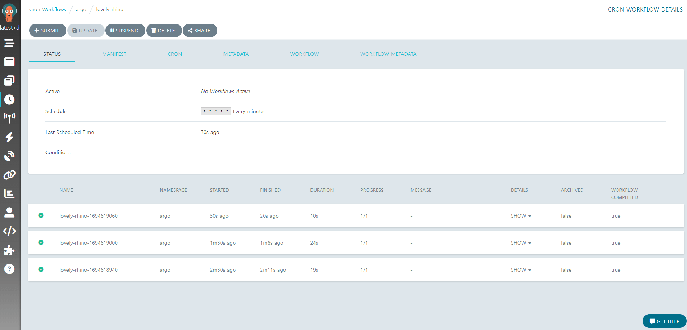


- Added a history `workflows` to the corresponding `cron-workflows` and an example of when there is no history.
- This PR is still under verification

</details>

#### **🌵 Participation Review**

It was a great experience.

Unfortunately, when I got a job, I became busy and lacked knowledge of server and DevOps, so I didn't participate in many contributor activities or offline gatherings.

However, I will not give up and try to contribute more to argoWorkflow by doing more front-end contributions and studying server side as well!

Thank you for making such a good activity and thank you to the mentors and mentees for helping me grow step by step even though I'm a beginner 👍

### 12. 이병곤

#### **🌿 Personal Activity Report**

<details>
<summary>Collapse/Expand</summary>

abcd

</details>

#### **🌵 Participation Review**

abcd

### 13. 이의주

#### **🌿 Personal Activity Report**

<details>
<summary>Collapse/Expand</summary>
lint test
**1. how to use Git & Commit, PR rules**

    - Tasked with mastering basic Git usage and sending strict commits and pull requests for contributions.
    - In the official Argo Workflow project, it was helpful to use the **Issue Template** and send a PR for the issue you want to contribute to, and it was also an opportunity to learn about the existence of the Issue Template.
    - It was an opportunity to indirectly experience the elements essential for future contributions.
        - [PR naming convention](https://flank.github.io/flank/pr_titles/)
        - [DCO Bot Check](https://github.com/apps/dco)
        - [GPG Commit](https://www.44bits.io/ko/post/add-signing-key-to-git-commit-by-gpg)
        - [Commit Message convention](https://www.conventionalcommits.org/en/v1.0.0/)
        - [Link issues and PR](https://docs.github.com/ko/issues/tracking-your-work-with-issues/linking-a-pull-request-to-an-issue#linking-a-pull-request-to-an-issue-using-a-keyword)
     - Issue creation - Member profile update - PR - Review - Merge process

         

**2. Participate in a special beginner class** - **[Repository for beginner special class missions(container-playground)](https://github.com/ArgoWorkflows-OSS/container-playground)** - The purpose was to help people who are unfamiliar with Docker or Kubernetes or who are new to it.

         
    - Learn about the need for Docker Image optimization while performing tasks presented by a mentor
        - Since it is a process of stacking certain packages and static files by layer from the From clause, we realized that optimization is essential because the Docker image can become heavy and have a negative impact on performance improvement.

    - Mission
        ```
       ❗️objective❗️

        Create your own web service and write a Docker file that can be containerized.

        To pass the assignment, please be sure to follow the instructions below.

        • Directory and file placement
            • Be sure to create your own github account directory for your own service and write it there.
            • The `Dockerfile` must be located at the top of your directory. (If this condition is not achieved, CI will fail.)
            • As long as it is under your own directory, you can freely write the rest of the files except for the location of `Dockerfile`.
            • However, the image must be built successfully when you execute the command `docker build -t [image name] .` at the top of your directory.
        • Behavior of built images
            • Your web service must operate on port 8080.
            • The built image must be serviced without problems when run with `docker run -d -p [forwarding port number]:8080 [image name]` without any additional parameters.
        • Web service development language and service structure
            • It doesn’t matter which language or framework you prefer.
            • It doesn't matter if you create a simple API service with no UI or design.
            • However, you must create two required APIs. (I don't care about the response value.)
                1. /api/v1/[your github account]
                2. /healthcheck
        • (Optional) It would be better to optimize the Docker image.([참고](https://thearchivelog.dev/article/optimize-docker-image/))
        • [How to link PR and issues using keywords](https://docs.github.com/ko/issues/tracking-your-work-with-issues/linking-a-pull-request-to-an-issue#linking-a-pull-request-to-an Please refer to -issue-using-a-keyword) to connect the issue and PR. (Manual connection x)

       ❗️Note❗️

        •It would be a good idea to refer to the documents below to understand Docker concepts and write a Dockerfile.

            • [Official documentation for creating a Dockerfile](https://docs.docker.com/engine/reference/builder/)
            • [How to use Docker for beginners](https://mysetting.io/slides/xxj85vnvey) (Content related to Docker Toolbox has been deprecated)

        •To raise PR and merge, please refer to the points below.

            • Since you do not have permission to create or push branches in the repo, you must fork and then work on it.
            • Please refer to [PR's naming convention](https://flank.github.io/flank/pr_titles/).
            • [DCO](https://github.com/apps/dco) Please commit while referring to the conditions for passing the bot's check.
            • Please understand how to commit using [GPG](https://www.44bits.io/ko/post/add-signing-key-to-git-commit-by-gpg) and create a signed commit.
            • It would be good if [Commit Message Convention](https://www.conventionalcommits.org/en/v1.0.0/) could also be applied. Even if you don't have to follow it, please avoid making commit messages that are too meaningless. (Optional)```

    - Having previous experience with the Python-based Django framework, I wrote a Docker file that creates a Django REST API.
    - I sent out a PR, but was pointed out a **security issue** or an error in **unnecessary package import syntax**.

        
        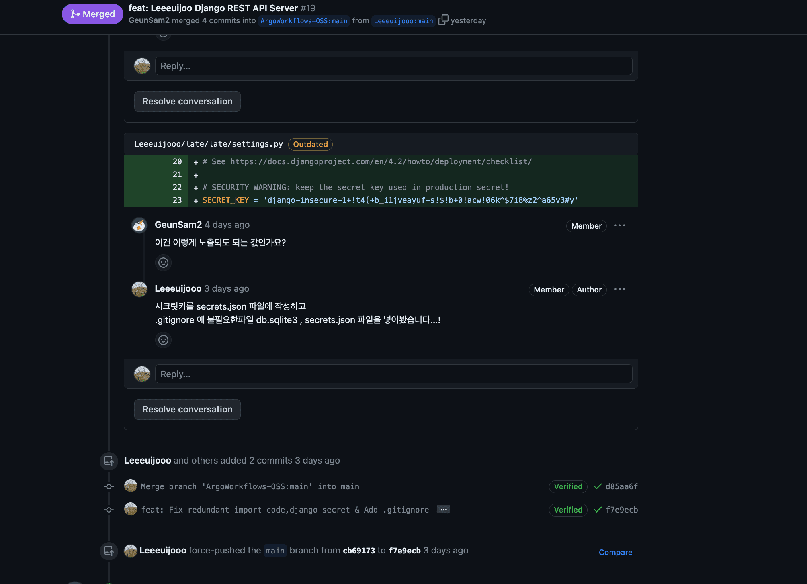

    - This is the first time I learned that **SECRET_KEY** is exposed in the settings.py code of the Django project, and I will take the time to think about how to solve this security issue.
        - We created a .json file containing the secret key and proceeded to refer to the json file in settings.py.
        - Since the secret.json file cannot be uploaded to Commit, I learned how to ignore the json file through **.gitignore**, and was able to ignore unnecessary files created after executing certain commands such as dbsqlite3.
        - It was an experience that made me realize that several considerations are needed to upload locally developed results to a Git project.

**3. Argo Workflow Contributor**

- While looking into Argo Workflow, I came across the Argo Workflow Slack channel marked **Deprecated** in the **Argo Workflow - Contact - Help** field.

- I thought it was a minor **UI Issue**, but I thought it was an opportunity to check what language the UI is displayed in and how it was developed, so I raised an issue and submitted a PR.

        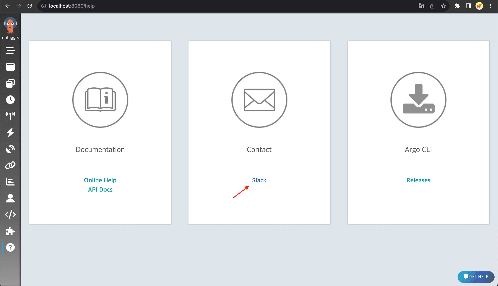

  - Created **Issue**

    **[UI: non-existent Slack Workspace link on help page Issue](https://github.com/argoproj/argo-workflows/issues/11615)**

    

    - When I created an issue, the Maintainer of the Argo project quickly left a comment.

    - I randomly tried to fix it with the CNCF Argo Channel link, but I received a comment from the maintainer asking me to update it with a different link.

  - Created **PR**

    **[fix: deprecated Link(Help-Contact) Issue](https://github.com/argoproj/argo-workflows/pull/11627)**

    

    - Argo Workflow had a UI based on React, and the directories were arranged by component, making it easy to analyze the code.

    - I didn't pass the DCO bot test because I accidentally omitted the Signed-off option during Commit

      - but I learned about the ability to revert previous commits (**Rebase**) or merge multiple unnecessary commits into one (**Squash**) in GIt. And I returned the previous commit and committed it with `git commit -S -s -m "Commit Message"`.

    - I looked up what the comment ‘LGTM’ meant, and on Google, I used the tag LGTM to express my opinion. 'Looks Good To Me'. In other words, it was a rewarding experience because it meant it looked good.

    - The process of finding bugs or modifying the UI is important, but I think the most important thing is the process of performing contributions according to the rules set by the Argo Workflow ecosystem.

**4. Participating in Argo Workflow Hackerton (Argo workflow - Hackathon held within the OSSCA team)**

- **Pull Request(Merged) :** **[feat: Search by name for WorkflowTemplates in UI](https://github.com/argoproj/argo-workflows/pull/11684)**

- **Issue :** **[Search by name for WorkflowTemplates in UI](https://github.com/argoproj/argo-workflows/issues/11004)**

- Issue Hackathon activity period

  - 1st Hackathon (Hackathon Group C) : 23.08.16 - 23.08.20
  - 2st Hackathon (Hackathon Group C) : 23.08.20 - 23.08.27

        
        

    - Issue content

      - When there are a large number of templates in a cluster, it is good to search by name, but scrolling through all the templates is always inconvenient due to the lack of a search function.
      - It was thought that the Argo Workflow UI needed a function to filter the results of workflow templates by name, so the issue was adopted as a result of a group meeting.

    - Role
      - Front-End
        - Creating a search field (Bar) in Argo workflow Template UI
        - Analyze .get logic to analyze where the Name Pattern (Like search) is sent
        - Modify workflow-template-filter.tsx and workflow-template-list.tsx in the workflow-template component directory.
    - Meeting details

      - The meeting is held through the Slack hackathon channel, where opinions and information are shared every day.
      - 1st Meeting details

      ```
      1. name search function (backend)

          • WorkflowTemplate page
          • Add name search (LIKE search)
          • ClusterWorkflowTemplate page
          • Add name search (LIKE search)
          • CronWorkflow page
          • Add name search (LIKE search)


      2. name search function (frontend)

          • WorkflowTemplate page
          • Add name search ui
          • ClusterWorkflowTemplate page
          • Add search sidebar (name, label)
          • CronWorkflow page
          • Add name search ui

      3. pagenation (frontend)

          • WorkflowTemplate page
          • pagination based on name
          • ClusterWorkflowTemplate page
          • Add pagination
          • CronWorkflow page
          • Add pagination

      4. Write test code

          - name search (LIKE search)
          - Need more analysis on what test code should be written
      ```

      - 2nd discussion content

        - 1st offline meeting

          

      ```
      1. Co-commit method

          •  Clone the repository https://github.com/ArgoWorkflows-OSS/argo-workflows locally.
          • We create a branch in the repository for our team to work on. (`master` vs `release-3.4.10`)
          • Work on the functions you are responsible for in the corresponding branch of the repository. (Commit by carefully following the commit rules for raising PR.)
          • When everyone's work is completed, 1 out of 3 people will send out a PR according to the PR template.
          • All 3 people can be contributors

      2. Since it is a hackathon and there is a set period, we decided to first implement the workflow-template name filter, which we think is the main one among workflow-template, cluster-workflow, and cron-workflow, send a PR, and move on once the maintainer merges it.

          • Roles for each part

          • Back-End

              • workflow_template_server.go
                  • Name filtering and pagination recalculation

          • Front-End :

              • workfflow-template-filter.tsx
                  • Add Name search UI
                  • Receiving and filtering the Name argument
              • workflow-template-list.tsx
                  • Add Name state
                  • Pass name to userEffect list
              • workflow-template.tsx, Utils.tsx
                  • Passing the Name argument
      ```

      - 3rd discussion details

        - 2nd offline meeting

          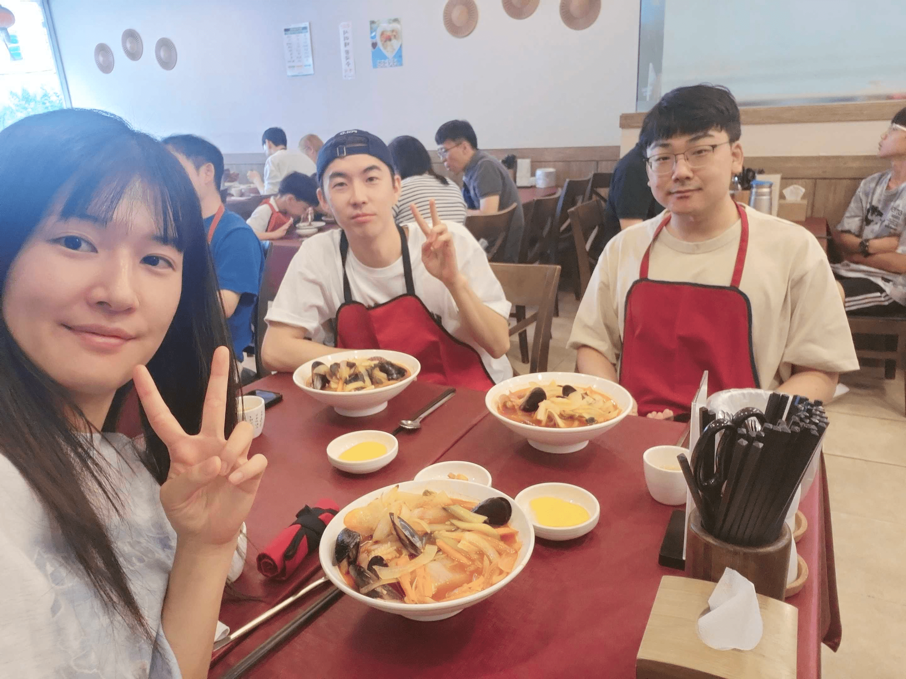

        ```
           1. Offline Meeting Meeting Contents

               • An opinion that even cases where there is no namespace should be included in the filter. (Insufficient grounds to say to eliminate namespace - Other sites (Kubernetes Dashboard, OpenShift, Argo CD, etc.) also provide namespace without namespace)
               • Thoughts on whether it is possible to import and apply the logic used in continue and whether continue can be maintained as is even with custom results.
               • After analyzing the continue logic until Wednesday night, if it is concluded that pagination using continue is not possible, upload a question in the issue comment.
               • Front-end pagination (data is not reloaded, the method used in argocd) vs. server-side pagination (pagination after checking the entire list each time, will the load be okay?)
               • If server-side caching is implemented, is there a place to store it?
           2. I decided to do a full K8s search by applying only the namespace and label every time I turned the page.

           3. Additional logic implemented in offset-based pagination method
               • The part that didn't work
                   • If you perform a filtered search after clicking the next page button, no data appears even if there are search results.
                   • If you increase the number of pagination after clicking the next page button, the search results do not display properly.
               • What changed
                   • As the continue value is updated on the server, when increasing the number of pages or applying filtering, there is a problem with pagination based on the continue value already set on the server.
                   • A method of changing the continue value to be passed from the front was adopted ( When increasing the number of pages or applying filtering, set continue back to 0)


           4. Pagination Test
               • workflow_template_server_test.go passed
               • (14 workflow templates registered)
               • Normal : UI workflow template first page
               • Normal : when workflow template page limit is 5, 10, 50
               • Workflow template page Add workflow template on page 1 and move to page 2
               • Workflow template page Delete the workflow template from page 1 and move to page 2
               • Test the above with `name pattern` filtering search
               • Search without name pattern and then re-search by adding name pattern
               • After searching including the name pattern, deleting the name pattern and searching again

           5. Create PR
        ```

      - Like filter (Name Pattern) implementation

        - ex) Workflow-template starting with sp can be searched

          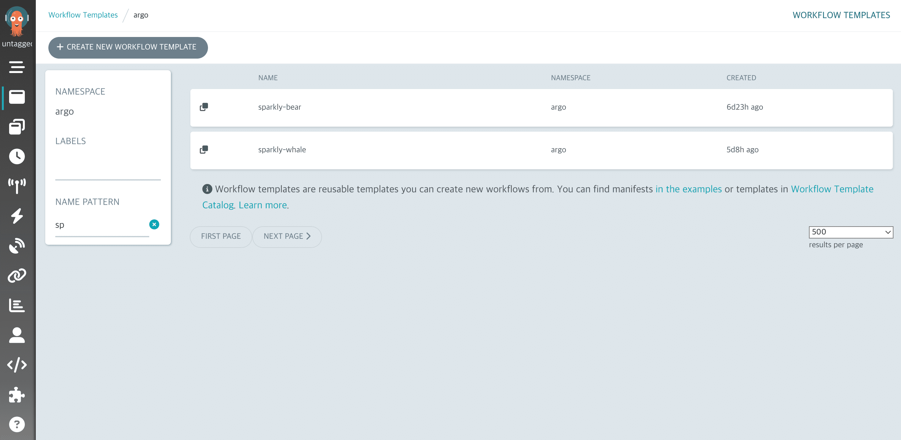

      - Result

              

        - The implementation was a success, and we plan to modify the previously discussed cluster-template and cron-template components.

**5. Learning outside of contribution activities** - Completion of Google Kubernetes Study Jam training - **[Badge](https://www.cloudskillsboost.google/public_profiles/7f855d64-3f2e-432a-9763-fde644b6af4b)** - Architecting with Google Kubernetes Engine: Foundations
Earned 7월 18, 2023 EDT - Architecting with Google Kubernetes Engine: Workloads
Earned 7월 26, 2023 EDT - Architecting with Google Kubernetes Engine: Production
Earned 8월 4, 2023 EDT

    - The organized contents are recorded on a personal blog (velog)
        **[euijoo's Velog GCP Series](https://velog.io/@euijoo3233/series/GCP)**

</details>

#### **🌵 Participation Review**

- **Post-Participation Review**

  - Before the Academy, I only had knowledge of Argo CD, but afterward, I was able to research and analyze Argo Workflow projects and reach a level where I could think about how to utilize its powerful functions.
  - When making my first contribution, I created an issue, communicated with the maintainers, modified the requested items, and created a PR, so I quickly received comments and achieved the result of merging.
  - It may be a minor issue, but it was an experience that made me feel that a holistic analysis of the part I wanted to contribute was necessary.
  - Not only this, it was an opportunity to analyze how the Argo workflow interacts internally by conducting an issue hackathon within the team, analyzing not only the UI, i.e. the front part, but also the logic of the back end part.
  - Our group's body was a big issue, so we were able to reach our goal by holding online as well as offline meetings accordingly, and since the two members were working in the field, they kindly explained difficult parts, so it was a useful experience.
  - I have a desire to continue communicating with the hackathon team members or the entire team.

- **Future plans**
  - Since the OSSCA period has not yet ended, we plan to continue exploring issues (Cluster-workflow-template, Cron-workflow, etc.), discover typos or translation errors in the Argo Workflow document, and continue to submit PRs.
  - In addition, after the OSSCA period ends, we plan to portfolioize the contents that have been organized so far.
  - As a toy project, we plan to complete data ETL work using Argo Workflow, which is currently in progress.
  - If I get a job, I hope to create many insights by introducing many of Argo Workflow's functions into my field.

### 14. 전의정

#### **🌿 Personal Activity Report**

<details>
<summary>Collapse/Expand</summary>

abcd

</details>

#### **🌵 Participation Review**

abcd

### 15. 정성락

#### **🌿 Personal Activity Report**

<details>
<summary>Collapse/Expand</summary>

abcd

</details>

#### **🌵 Participation Review**

abcd

### 16. 채문영

#### **🌿 Personal Activity Report**

<details>
<summary>Collapse/Expand</summary>

abcd

</details>

#### **🌵 Participation Review**

abcd

### 17. 최수녕

#### **🌿 Personal Activity Report**

<details>
<summary>Collapse/Expand</summary>

**1. Cron workflow can not apply volumeClaimTemplates config from argo controller config map (workflowDefaults)**

[Issue #11344](https://github.com/argoproj/argo-workflows/issues/11344)  
[PR #11662](https://github.com/argoproj/argo-workflows/pull/11662)

> Issue Analysis

To understand this issue, I first needed to grasp what [Default Workflows](https://argoproj.github.io/argo-workflows/default-workflow-specs) are.

I learned that the `workflowDefaults` field in the `argo workflows controller configmap` allows you to set default values for workflows. Additionally, I discovered that if a workflow already has values for this field, those values take precedence.

For example, after configuring the `configmap` as follows, when you create a Workflow,

```yaml
# This file describes the config settings available in the workflow controller configmap
apiVersion: v1
kind: ConfigMap
metadata:
  name: workflow-controller-configmap
data:
  # Default values that will apply to all Workflows from this controller, unless overridden on the Workflow-level
  workflowDefaults: |
    metadata:
      annotations:
        argo: workflows
      labels:
        foo: bar
    spec:
      ttlStrategy:
        secondsAfterSuccess: 5
      parallelism: 3
```

it will be automatically created with the values set in the `workflowDefaults` field, like this:

```yaml
apiVersion: argoproj.io/v1alpha1
kind: Workflow
metadata:
  generateName: gc-ttl-
  annotations:
    argo: workflows
  labels:
    foo: bar
spec:
  ttlStrategy:
    secondsAfterSuccess: 5 # Time to live after workflow is successful
  parallelism: 3
```

The issue was related to an error occurring when adding the `volumeClaimTemplates` value to `workflowDefaults`, causing errors when creating `CronWorkflows` or `Workflows`.

The error message indicated, `does not contain declared merge key: name.`

Upon checking the code, it was found that the error occurred in the `StrategicMergePatch` function, which is related to Kubernetes' `patch` strategy.

```go
VolumeClaimTemplates []apiv1.PersistentVolumeClaim `json:"volumeClaimTemplates,omitempty" patchStrategy:"merge" patchMergeKey:"name" protobuf:"bytes,6,opt,name=volumeClaimTemplates"`
```

The issue arose from the fact that the `VolumeClaimTemplates` type defined in `Workflows` used name as the `patchMergeKey`.

However, upon inspecting the `PersistentVolumeClaim` type below, it was found that `name` was not present. In other words, the problem occurred because a value was defined as the `patchMergeKey` that was not part of the structure.

```go
type PersistentVolumeClaim struct {
	metav1.TypeMeta `json:",inline"`
	// Standard object's metadata.
	// More info: https://git.k8s.io/community/contributors/devel/sig-architecture/api-conventions.md#metadata
	// +optional
	metav1.ObjectMeta `json:"metadata,omitempty" protobuf:"bytes,1,opt,name=metadata"`

	// spec defines the desired characteristics of a volume requested by a pod author.
	// More info: https://kubernetes.io/docs/concepts/storage/persistent-volumes#persistentvolumeclaims
	// +optional
	Spec PersistentVolumeClaimSpec `json:"spec,omitempty" protobuf:"bytes,2,opt,name=spec"`

	// status represents the current information/status of a persistent volume claim.
	// Read-only.
	// More info: https://kubernetes.io/docs/concepts/storage/persistent-volumes#persistentvolumeclaims
	// +optional
	Status PersistentVolumeClaimStatus `json:"status,omitempty" protobuf:"bytes,3,opt,name=status"`
}
```

> Issue Resolution

I removed the `patchMergeKey` from `VolumeClaimTemplates`.

However, the reason `patchMergeKey` was added to `VolumeClaimTemplates` was to maintain consistency with conventions used for `Volumes`.

Since this issue is related to policies, it indeed requires further discussion.

This was my first PR to the ArgoWorkflows project, and it's great that i was able to identify the cause of an issue that was causing inconvenience for many people.

**2. Search by name for WorkflowTemplates in UI**

[Issue #11004](https://github.com/argoproj/argo-workflows/issues/11004)  
[PR #11684](https://github.com/argoproj/argo-workflows/pull/11684)

> Issue Analysis

This issue was worked on by a team of three people.


`WorkflowTemplates` do not have a search function based on 'name', so to find a specific `WorkflowTemplates`, you could only search based on `label`.

So, many users were feeling inconvenienced, and it was an issue related to 'feature improvement' that they would like to provide a function to search based on 'name'.

> Issue Resolution

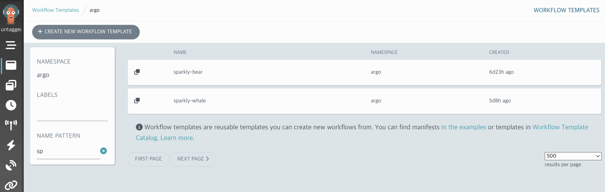

We added additional logic to filter the results of WorkflowTemplates retrieved through the Kubernetes API based on their 'name', successfully implementing this feature.

However, there was one issue.

Existing pagination was implemented using Kubernetes' own `continue` value, so if Kubernetes results were custom manipulated like this, Kubernetes pagination could not be used.

We had a lot of concerns about how to solve this, but We solved the problem by applying logic to implement cursor pagination using Kubernetes' `resourceVersion`.

It was so fun to be able to discuss it with others instead of alone.

I also felt good about providing some really needed functionality to the ArgoWorkflows project.

**3. A problem that is not initialized when changing the number of page limits**

[Issue #11702](https://github.com/argoproj/argo-workflows/issues/11702)  
[PR #11703](https://github.com/argoproj/argo-workflows/pull/11703)

> Issue Analysis

While resolving the `Search by name for WorkflowTemplates in UI` issue, i discovered a new pagination bug.

When changing the number of pages, the `continue` value used for pagination was not initialized in the UI, so the data was not displayed properly.

> Issue Resolution

I was able to solve the problem by simply modifying the logic to initialize `offset` when a change in page number is detected in the UI code.

It was only a one-line code change, but this one line solved a problem that was quite inconvenient.

**4. Pagination may not work correctly for archived workflows**

> Issue Analysis

[Issue #11715](https://github.com/argoproj/argo-workflows/issues/11715)  
[PR #11761](https://github.com/argoproj/argo-workflows/pull/11761)

This issue was directly communicated to us by Maintainer @terrytangyuan through Slack.


It felt like I was contacted by my favorite celebrity and I was so happy that I almost flew away. I suppressed my happy and excited heart and analyzed the issue.

`Workflows` and `ArchivedWorkflows` were previously separated into different pages, but starting from the `master` version, `Workflows` and `ArchivedWorkflows` are combined into one page, and the logic has been modified to show `ArchivedWorkflows` together if they exist.

However, when `Workflows` and `ArchivedWorkflows` were merged into one, a problem occurred with pagination.

The two resources also used completely different pagination. `Workflows` was using the `continue` value, which is Kubernetes' own pagination, and `ArchivedWorkflows` used its own database, so it was using the database to perform pagination using the `offset` method.

However, while passing the `continue` value used in `Workflows` to `ArchivedWorkflows` as is, a problem occurred where `ArchivedWorkflows` was not searched at all.

> Issue Resolution

I was able to resolve the issue by referring to the pagination logic that was implemented while resolving the `Search by name for WorkflowTemplates in UI` issue.

Since the two resources have no choice but to use different methods of pagination, rather than using pagination before merging the two resources, use a method of first searching the entire resource and merging the two resources and finally applying the pagination logic. I did it.

I was able to solve the problem of `ArchivedWorkflows` not being searched, but fetching and merging the entire list every time the page is changed is a performance concern, so i'm thinking about a way to test performance.

I plan to switch to front-end pagination if performance testing indicates that it's not working well.

It was great to be able to solve a critical issue, and I felt proud and fun because I felt like I was contributing properly to the ArgoWorkflows project as a contributor.

**5. Relocation of Commit Guidelines Information in the Documentation**

[Issue #11700](https://github.com/argoproj/argo-workflows/issues/11700)  
[PR #11701](https://github.com/argoproj/argo-workflows/pull/11701)

> Issue Analysis

The ArgoWorkflows project has a README document for developers attempting to contribute.

However, it does not mention specific guidelines for commits.

@GeunSam2 mentor mentioned that it was inconvenient when initially attempted to contribute and had difficulty finding commit guidelines.

> Issue Resolution


Upon hearing this feedback, I made a modification to the contribution README by adding a link to commit guidelines.

This change aims to make it easier for developers who want to contribute to ArgoWorkflows.

In this PR, a maintainer provided a code suggestion, which was intriguing and enjoyable for me as I was encountering the code suggestion feature for the first time.

</details>

#### **🌵 Participation Review**

If someone were to ask me what I did best this year, I would confidently say that it was my participation in the ArgoWorkflows project contribution activities.

Meeting various developers in the same field, forming a sense of empathy, and engaging in discussions with them was truly enjoyable. Hearing stories about different companies was also quite interesting.

During our weekly meetings, it wasn't just about working together; our mentors always conducted insightful seminars. Sundays became genuinely enjoyable, and time flew by.

Meeting such capable mentors was a delight. I received advice on the concerns I had as a junior developer, my future direction, and how to study effectively as a developer, which made me happy.

I always wanted to try contributing, but I was afraid to tackle such a big project. However, facing these challenges with such great mentees and mentors made my fears disappear.

Submitting numerous PRs and communicating with maintainers was also a lot of fun, and it was really satisfying to see my code being incorporated.

Thanks to this experience, I gained the confidence to contribute not only to ArgoWorkflows but also to other projects.

I have no intention of stopping my contributions after this period ends. I plan to continue contributing to ArgoWorkflows while looking for opportunities to contribute to Kubernetes and Argo CD projects used by my company.
