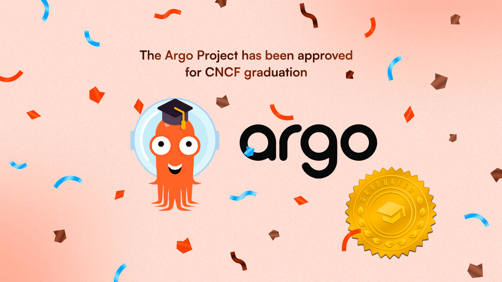
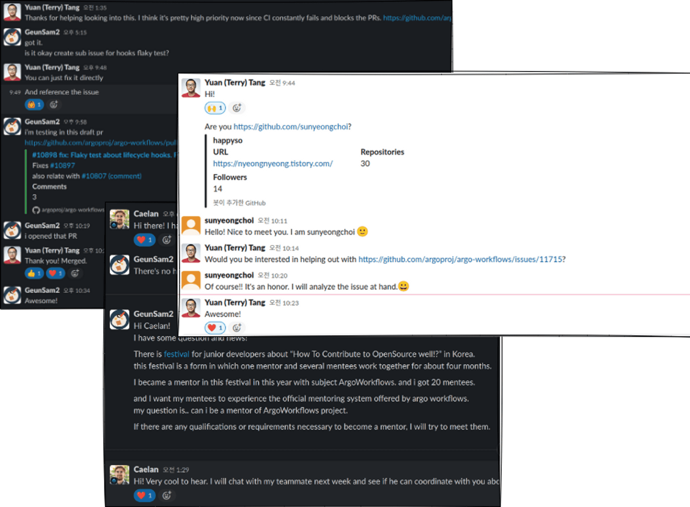
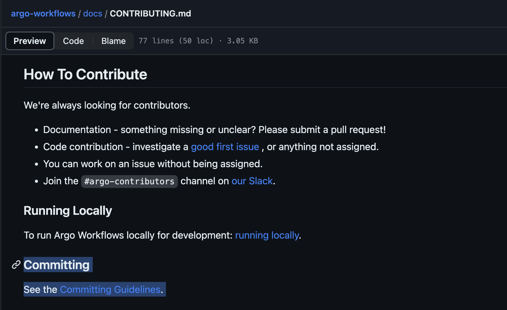

## ☑️ Meet Our Team

The ArgoWorkflows OSS 2023 team consisted of one mentor and 17 mentees, for a total of 18 people working as a team.

The team was organized with the help of the [Open Source Contribution Academy](https://www.contribution.ac/2023-ossca), an awesome event that **brings together junior and senior developers** who may feel intimidated by open source to contribute, and was active for about **4 months from July to October 2023.**

Starting from our humble beginnings with Git to becoming accomplished open source contributors.

Here's a look at what our team accomplished.

## ☑️ What is ArgoWorkflows


Argo Workflows is a container-based workflow engine, an open source project that allows you to run parallel jobs on Kubernetes. Each workflow step is defined as a container, and multi-step workflows can be modeled as a series of tasks, or dependencies between tasks can be executed using a Directed Acyclic Graph (DAG).

In short, Argo Workflows makes it faster and easier to perform tasks in the form of simple workflows, as well as complex tasks for machine learning or data processing, on Kubernetes.



Argo Workflows is a graduated project of the Cloud Native Computing Foundation (CNCF).

To become a graduated project, you must pass all of the tests that the CNCF conducts to meet their rigorous standards. This means that being recognized as a graduated project means that Argo meets the highest standards for clear governance and committer processes, healthy growth, and security and compliance adherence. Because of the rigorous standards, only about 13% of projects registered with the CNCF succeed in graduating.

In fact, it took the Argo project over 7000 contributors, over 11,000 PRs, and over 370,000 contributions over a period of about 5 years to be recognized as a graduating project.

Not only that, but the Argo project is still a very active and up-to-date open source project with over 2300 companies contributing to the code and over 8300 people contributing to the code.

This makes Argo Workflows the most recognized workflow engine in the cloud native community.

Many organizations around the world have officially adopted and use Argo Workflows. This is a strong proof that Argo Workflows can solve the problems of real workloads even in the largest enterprises.

Some of the leading companies using Argo Workflows include.


... and over 200 other global companies

Some alternative tools to Argo Workflows include Apache Airflow, Tekton, and Prefect.

Argo Workflows is a Kubernetes-native engine that makes it easy to orchestrate container-based workflows and manage resources. This is one of the key differences compared to similar tool Apache Airflow, which is a standalone application and does not inherently utilize the capabilities of Kubernetes. As a result, resource management and scalability can be more challenging with Airflow than with Argo Workflows.

Also, because Argo Workflows runs each workflow step as an independent container, it can perform a variety of tasks, such as CI/CD as well as data pipelines. This is possible by leveraging the power of Docker and Kubernetes, which allows you to run anything without restrictions.


## ☑️ Key Accomplishments

### UI/UX improvements

The Argo Workflows project is actively contributing to the topic, with UI/UX improvements as the main keyword for contributions, a separate project page, and issue tracking.


Our team has also made many UI improvements along the lines of these project goals.

> Key improvements

- Workflows search functionality
- Improvements to the summary view of cronworkflows
- Improvements to DataPciker
- Sticky option in workflows control panel
- label highlighting in workflows list
- Various other bug fixes


### Improving core functionality

As members began to gain experience contributing, their understanding of the project grew, and as they gained confidence, they were increasingly able to contribute not only to UI/UX improvements, but also to the core functionality of the workflow engine.

[What’s new in Argo Workflows v3.5](https://blog.argoproj.io/whats-new-in-argo-workflows-v3-5-f260e8603ca6)

The core logic of the workflow engine is installed as a CRD in Kubernetes and has a significant impact on the behavior and performance of a Kubernetes cluster, making it a very high level contribution that requires a high level of implementation and active participation in testing and policy discussions with maintainers.

Despite the challenges, our team was able to make key contributions to the Argo Workflows 3.5 release, and our contributions to very important features such as Template Spec, Authentication, and Controller were mentioned on the Argo official blog.


After the release of Argo Workflows 3.5, contributors continue to contribute to the CI and test environments for DX improvements, new features in the Nix, Controller, and Template specifications, and more challenging contributions such as updating the Go Lang version, and they are making meaningful contributions to the next release to make Argo Workflows an even better tool.

### Close communication with the maintainer group

Our team was very fortunate that the Argo Workflows project got a new leader in May of this year, Yuan Tang, and the breath of contributions across the project really accelerated.

Normally, in a large project like this, it would take quite a long time for reviews to take place, making it difficult to get a lot of contributions, but thanks to the talented project head and his team, all of the ArgoWorkflows team members who participated in this competition learned a lot, experienced a lot, and grew through a lot of contributions in a short time.



As I've gotten closer to contributing to the core features of the workflow engine, there have been situations where I've been able to communicate and interact with maintainers on CNCF Slack beyond the PR page.

Through these discussions, I've been able to determine policies for handling logic in the project to resolve issues, and have been assigned other related issues to work on, giving me valuable experience in being a true part of an open source project.

Here are some of the contributions my team made during the project.

## ☑️ Detail of Contributions

### 1. 강병선

#### **🌿 Personal Activity Report**

<details>
<summary>Collapse/Expand</summary>

abcd

</details>

#### **🌵 Participation Review**

abcd

### 2. 강시온

#### **🌿 Personal Activity Report**

<details>
<summary>Collapse/Expand</summary>

abcd

</details>

#### **🌵 Participation Review**

abcd

### 3. 권영길

#### **🌿 Personal Activity Report**

<details>
<summary>Collapse/Expand</summary>

abcd

</details>

#### **🌵 Participation Review**

abcd

### 4. 김수빈

#### **🌿 Personal Activity Report**

<details>
<summary>Collapse/Expand</summary>

abcd

</details>

#### **🌵 Participation Review**

abcd

### 5. 김학준

#### **🌿 Personal Activity Report**

<details>
<summary>Collapse/Expand</summary>

abcd

</details>

#### **🌵 Participation Review**

abcd

### 6. 박진수

#### **🌿 Personal Activity Report**

<details>
<summary>Collapse/Expand</summary>

abcd

</details>

#### **🌵 Participation Review**

abcd

### 7. 서청운

#### **🌿 Personal Activity Report**

<details>
<summary>Collapse/Expand</summary>

abcd

</details>

#### **🌵 Participation Review**

abcd

### 8. 송혜민

#### **🌿 Personal Activity Report**

<details>
<summary>Collapse/Expand</summary>

abcd

</details>

#### **🌵 Participation Review**

abcd

### 9. 안다혜

#### **🌿 Personal Activity Report**

<details>
<summary>Collapse/Expand</summary>

abcd

</details>

#### **🌵 Participation Review**

abcd

### 10. 안지완

#### **🌿 Personal Activity Report**

<details>
<summary>Collapse/Expand</summary>

abcd

</details>

#### **🌵 Participation Review**

abcd

### 11. 유윤우

#### **🌿 Personal Activity Report**

<details>
<summary>Collapse/Expand</summary>

abcd

</details>

#### **🌵 Participation Review**

abcd

### 12. 이병곤

#### **🌿 Personal Activity Report**

<details>
<summary>Collapse/Expand</summary>

abcd

</details>

#### **🌵 Participation Review**

abcd

### 13. 이의주

#### **🌿 Personal Activity Report**

<details>
<summary>Collapse/Expand</summary>

abcd

</details>

#### **🌵 Participation Review**

abcd

### 14. 전의정

#### **🌿 Personal Activity Report**

<details>
<summary>Collapse/Expand</summary>

abcd

</details>

#### **🌵 Participation Review**

abcd

### 15. 정성락

#### **🌿 Personal Activity Report**

<details>
<summary>Collapse/Expand</summary>

abcd

</details>

#### **🌵 Participation Review**

abcd

### 16. 채문영

#### **🌿 Personal Activity Report**

<details>
<summary>Collapse/Expand</summary>

abcd

</details>

#### **🌵 Participation Review**

abcd

### 17. 최수녕

#### **🌿 Personal Activity Report**

<details>
<summary>Collapse/Expand</summary>

**1. Cron workflow can not apply volumeClaimTemplates config from argo controller config map (workflowDefaults)**

[Issue #11344](https://github.com/argoproj/argo-workflows/issues/11344)  
[PR #11662](https://github.com/argoproj/argo-workflows/pull/11662)

> Issue Analysis

To understand this issue, I first needed to grasp what [Default Workflows](https://argoproj.github.io/argo-workflows/default-workflow-specs) are.

I learned that the `workflowDefaults` field in the `argo workflows controller configmap` allows you to set default values for workflows. Additionally, I discovered that if a workflow already has values for this field, those values take precedence.

For example, after configuring the `configmap` as follows, when you create a Workflow, 

```yaml
# This file describes the config settings available in the workflow controller configmap
apiVersion: v1
kind: ConfigMap
metadata:
  name: workflow-controller-configmap
data:
  # Default values that will apply to all Workflows from this controller, unless overridden on the Workflow-level
  workflowDefaults: |
    metadata:
      annotations:
        argo: workflows
      labels:
        foo: bar
    spec:
      ttlStrategy:
        secondsAfterSuccess: 5
      parallelism: 3
```
it will be automatically created with the values set in the `workflowDefaults` field, like this:
```yaml
apiVersion: argoproj.io/v1alpha1
kind: Workflow
metadata:
  generateName: gc-ttl-
  annotations:
    argo: workflows
  labels:
    foo: bar
spec:
  ttlStrategy:
    secondsAfterSuccess: 5     # Time to live after workflow is successful
  parallelism: 3
```

The issue was related to an error occurring when adding the `volumeClaimTemplates` value to `workflowDefaults`, causing errors when creating `CronWorkflows` or `Workflows`.

The error message indicated, `does not contain declared merge key: name.`

Upon checking the code, it was found that the error occurred in the `StrategicMergePatch` function, which is related to Kubernetes' `patch` strategy.

```go
VolumeClaimTemplates []apiv1.PersistentVolumeClaim `json:"volumeClaimTemplates,omitempty" patchStrategy:"merge" patchMergeKey:"name" protobuf:"bytes,6,opt,name=volumeClaimTemplates"`
```

The issue arose from the fact that the `VolumeClaimTemplates` type defined in `Workflows` used name as the `patchMergeKey`.

However, upon inspecting the `PersistentVolumeClaim` type below, it was found that `name` was not present. In other words, the problem occurred because a value was defined as the `patchMergeKey` that was not part of the structure.

```go
type PersistentVolumeClaim struct {
	metav1.TypeMeta `json:",inline"`
	// Standard object's metadata.
	// More info: https://git.k8s.io/community/contributors/devel/sig-architecture/api-conventions.md#metadata
	// +optional
	metav1.ObjectMeta `json:"metadata,omitempty" protobuf:"bytes,1,opt,name=metadata"`

	// spec defines the desired characteristics of a volume requested by a pod author.
	// More info: https://kubernetes.io/docs/concepts/storage/persistent-volumes#persistentvolumeclaims
	// +optional
	Spec PersistentVolumeClaimSpec `json:"spec,omitempty" protobuf:"bytes,2,opt,name=spec"`

	// status represents the current information/status of a persistent volume claim.
	// Read-only.
	// More info: https://kubernetes.io/docs/concepts/storage/persistent-volumes#persistentvolumeclaims
	// +optional
	Status PersistentVolumeClaimStatus `json:"status,omitempty" protobuf:"bytes,3,opt,name=status"`
}
```

> Issue Resolution

I removed the `patchMergeKey` from `VolumeClaimTemplates`.

However, the reason `patchMergeKey` was added to `VolumeClaimTemplates` was to maintain consistency with conventions used for `Volumes`.

Since this issue is related to policies, it indeed requires further discussion.

This was my first PR to the ArgoWorkflows project, and it's great that i was able to identify the cause of an issue that was causing inconvenience for many people.


**2. Search by name for WorkflowTemplates in UI**

[Issue #11004](https://github.com/argoproj/argo-workflows/issues/11004)  
[PR #11684](https://github.com/argoproj/argo-workflows/pull/11684)

> Issue Analysis

This issue was worked on by a team of three people.


`WorkflowTemplates` do not have a search function based on 'name', so to find a specific `WorkflowTemplates`, you could only search based on `label`.

So, many users were feeling inconvenienced, and it was an issue related to 'feature improvement' that they would like to provide a function to search based on 'name'.

> Issue Resolution


We added additional logic to filter the results of WorkflowTemplates retrieved through the Kubernetes API based on their 'name', successfully implementing this feature.

However, there was one issue.

Existing pagination was implemented using Kubernetes' own `continue` value, so if Kubernetes results were custom manipulated like this, Kubernetes pagination could not be used.

We had a lot of concerns about how to solve this, but We solved the problem by applying logic to implement cursor pagination using Kubernetes' `resourceVersion`.

It was so fun to be able to discuss it with others instead of alone.

I also felt good about providing some really needed functionality to the ArgoWorkflows project.


**3. A problem that is not initialized when changing the number of page limits**

[Issue #11702](https://github.com/argoproj/argo-workflows/issues/11702)  
[PR #11703](https://github.com/argoproj/argo-workflows/pull/11703)

> Issue Analysis

While resolving the `Search by name for WorkflowTemplates in UI` issue, i discovered a new pagination bug.

When changing the number of pages, the `continue` value used for pagination was not initialized in the UI, so the data was not displayed properly.

> Issue Resolution

I was able to solve the problem by simply modifying the logic to initialize `offset` when a change in page number is detected in the UI code.

It was only a one-line code change, but this one line solved a problem that was quite inconvenient.


**4. Pagination may not work correctly for archived workflows**

> Issue Analysis

[Issue #11715](https://github.com/argoproj/argo-workflows/issues/11715)  
[PR #11761](https://github.com/argoproj/argo-workflows/pull/11761)

This issue was directly communicated to us by Maintainer @terrytangyuan through Slack.


It felt like I was contacted by my favorite celebrity and I was so happy that I almost flew away. I suppressed my happy and excited heart and analyzed the issue.

`Workflows` and `ArchivedWorkflows` were previously separated into different pages, but starting from the `master` version, `Workflows` and `ArchivedWorkflows` are combined into one page, and the logic has been modified to show `ArchivedWorkflows` together if they exist.

However, when `Workflows` and `ArchivedWorkflows` were merged into one, a problem occurred with pagination.

The two resources also used completely different pagination. `Workflows` was using the `continue` value, which is Kubernetes' own pagination, and `ArchivedWorkflows` used its own database, so it was using the database to perform pagination using the `offset` method.

However, while passing the `continue` value used in `Workflows` to `ArchivedWorkflows` as is, a problem occurred where `ArchivedWorkflows` was not searched at all.

> Issue Resolution

I was able to resolve the issue by referring to the pagination logic that was implemented while resolving the `Search by name for WorkflowTemplates in UI` issue.

Since the two resources have no choice but to use different methods of pagination, rather than using pagination before merging the two resources, use a method of first searching the entire resource and merging the two resources and finally applying the pagination logic. I did it.

I was able to solve the problem of `ArchivedWorkflows` not being searched, but fetching and merging the entire list every time the page is changed is a performance concern, so i'm thinking about a way to test performance.

I plan to switch to front-end pagination if performance testing indicates that it's not working well.

It was great to be able to solve a critical issue, and I felt proud and fun because I felt like I was contributing properly to the ArgoWorkflows project as a contributor.

**5. Relocation of Commit Guidelines Information in the Documentation**

[Issue #11700](https://github.com/argoproj/argo-workflows/issues/11700)  
[PR #11701](https://github.com/argoproj/argo-workflows/pull/11701)

> Issue Analysis

The ArgoWorkflows project has a README document for developers attempting to contribute.

However, it does not mention specific guidelines for commits.

@GeunSam2 mentor mentioned that it was inconvenient when initially attempted to contribute and had difficulty finding commit guidelines.

> Issue Resolution



Upon hearing this feedback, I made a modification to the contribution README by adding a link to commit guidelines.

This change aims to make it easier for developers who want to contribute to ArgoWorkflows.

In this PR, a maintainer provided a code suggestion, which was intriguing and enjoyable for me as I was encountering the code suggestion feature for the first time.

</details>

#### **🌵 Participation Review**

If someone were to ask me what I did best this year, I would confidently say that it was my participation in the ArgoWorkflows project contribution activities.

Meeting various developers in the same field, forming a sense of empathy, and engaging in discussions with them was truly enjoyable. Hearing stories about different companies was also quite interesting.

During our weekly meetings, it wasn't just about working together; our mentors always conducted insightful seminars. Sundays became genuinely enjoyable, and time flew by.

Meeting such capable mentors was a delight. I received advice on the concerns I had as a junior developer, my future direction, and how to study effectively as a developer, which made me happy.

I always wanted to try contributing, but I was afraid to tackle such a big project. However, facing these challenges with such great mentees and mentors made my fears disappear.

Submitting numerous PRs and communicating with maintainers was also a lot of fun, and it was really satisfying to see my code being incorporated.

Thanks to this experience, I gained the confidence to contribute not only to ArgoWorkflows but also to other projects.

I have no intention of stopping my contributions after this period ends. I plan to continue contributing to ArgoWorkflows while looking for opportunities to contribute to Kubernetes and Argo CD projects used by my company.