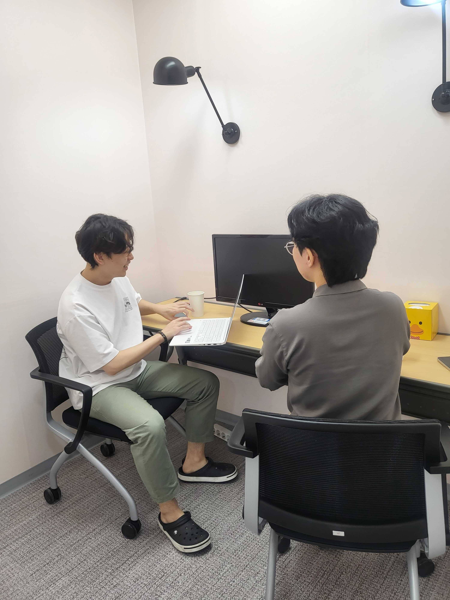
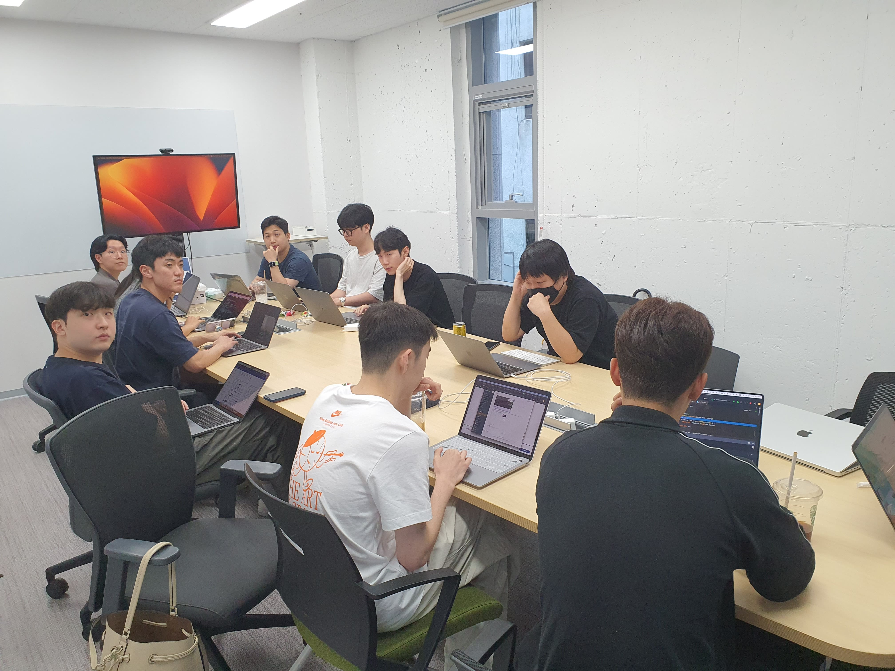

# [07/15] 오픈소스 컨트리뷰션 아카데미 회의록

- 일시 : 2023년 07월 15일 일요일
- 장소 : OpenUP (Creative Ground)

### ☑️ 참석자

염근철, 강병선, 권영길, 김수빈, 김원식, 김학준, 박진수, 서청운, 송혜민, 안다혜, 안지완, 유윤우, 이병곤, 이의주, 전의정, 정성락, 조국희, 채문영, 최수녕

---

### ☑️ 회의 내용

- 당근마켓에서 ArgoWorkflows 도입한 사례 발표
- 개발환경 세팅 방법 공유
- 멘토 멘티 1on1 상담 진행

---

### ☑️ 기념사진

