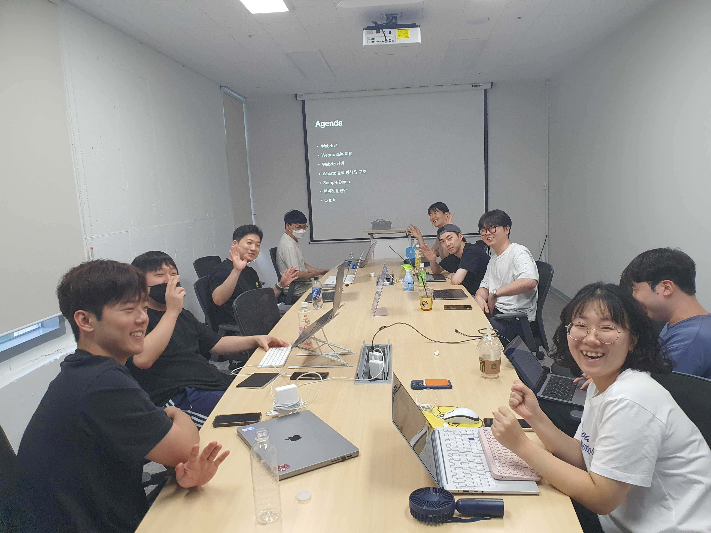
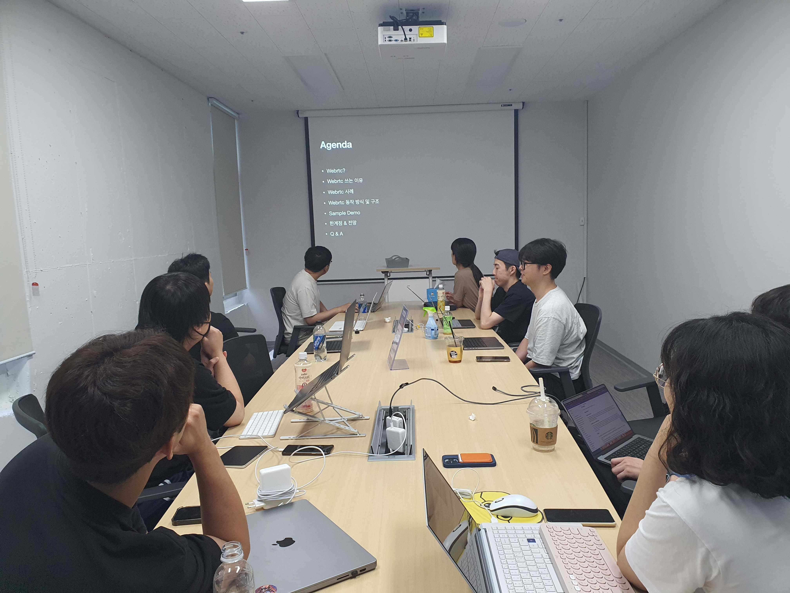
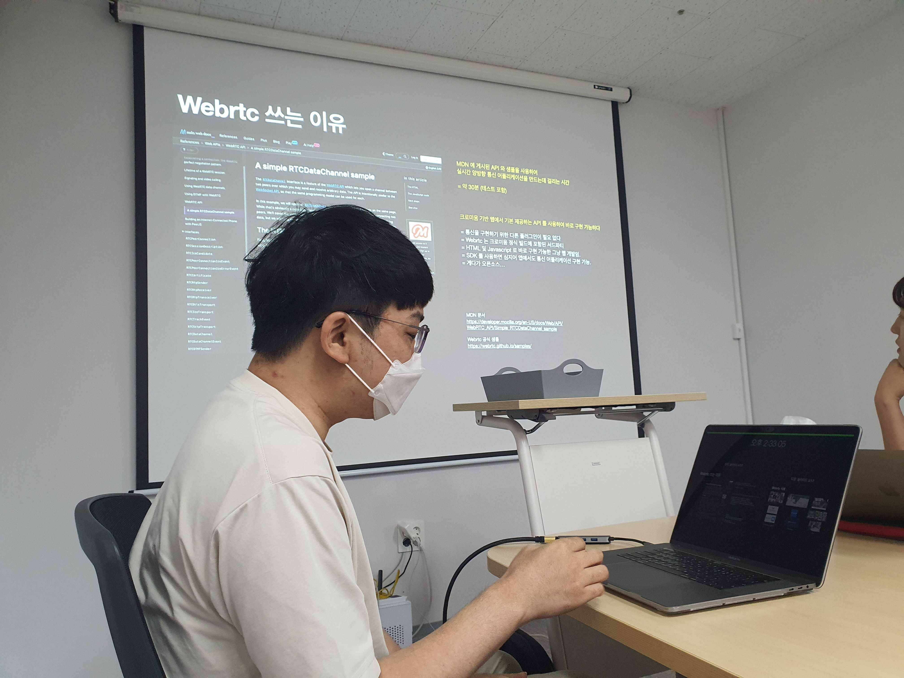
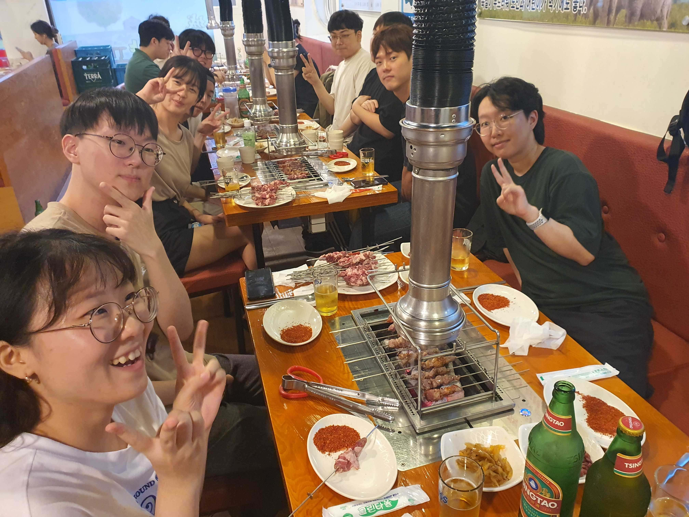

# [07/30] 오픈소스 컨트리뷰션 아카데미 회의록

- 일시 : 2023년 07월 30일 일요일
- 장소 : OpenUP GROUND3

### ☑️ 참석자

염근철, 송혜민, 전의정, 정성락, 박진수, 안다혜, 김학준, 이의주, 최수녕, 서청운, 권영길, 김수빈

---

### ☑️ 회의 내용

- 개별 관심 이슈 공유
- 개별 기여 완료한 PR 공유
- 개별 관심 기술 공유
- 멘토 멘티 1on1 상담
- 실시간 통신을 위한 WebRtc의 개념 및 활용사례 발표(송혜민)
- Argo Workflows와 keyclock 연동방법 발표(최수녕)
- 챌린지스 수료 기념 회식

---

### ☑️ 기념사진

