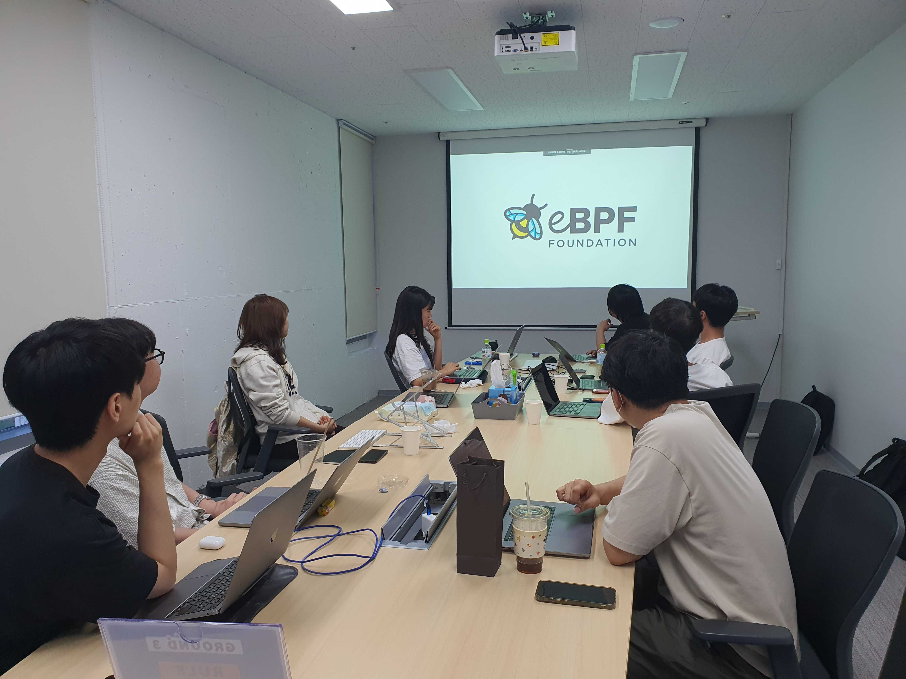

# [08/06] 오픈소스 컨트리뷰션 아카데미 회의록

- 일시 : 2023년 08월 06일 일요일
- 장소 : OpenUP GROUND3

### ☑️ 참석자

염근철, 송혜민, 전의정, 정성락, 김학준, 이의주, 최수녕, 서청운, 채문영, 강병선, 안지완, 강시온

---

### ☑️ 회의 내용

- 개별 관심 이슈 공유
- 개별 기여 완료한 PR 공유
- 개별 관심 기술 공유
- 멘토 멘티 1on1 상담
- argo event와 workflow, cd 연동 발표(김학준)
- eBPF의 개념, 필터 개발 방법, 활용사례 발표(정성락)

---

### ☑️ 기념사진

