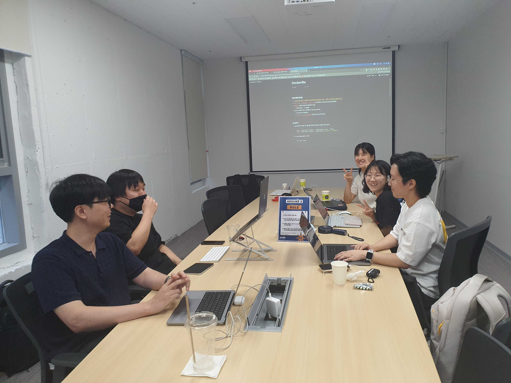
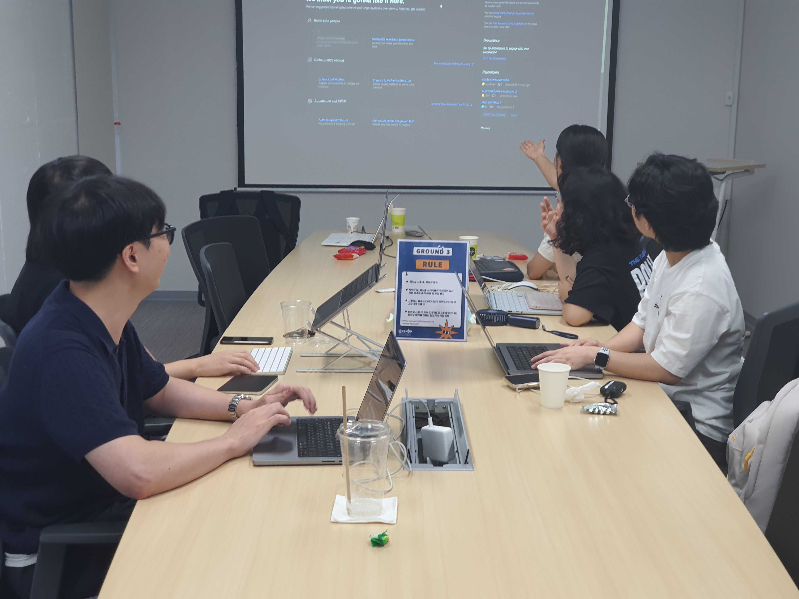

# [08/13] 오픈소스 컨트리뷰션 아카데미 회의록

- 일시 : 2023년 08월 13일 일요일
- 장소 : OpenUP GROUND3

### ☑️ 참석자

염근철, 안다혜, 최수녕, 김학준, 강병선, 전의정, 정성락, 서청운, 박진수

---

### ☑️ 회의 내용

- 개별 관심 이슈 공유
- 개별 기여 완료한 PR 공유
- 개별 관심 기술 공유
- 멘토 멘티 1on1 상담
- 컨테이너의 역사와 도커 없이 컨테이너 만들기 발표(염근철)
- 이슈 해커톤 계획 수립

---

### ☑️ 기념사진

