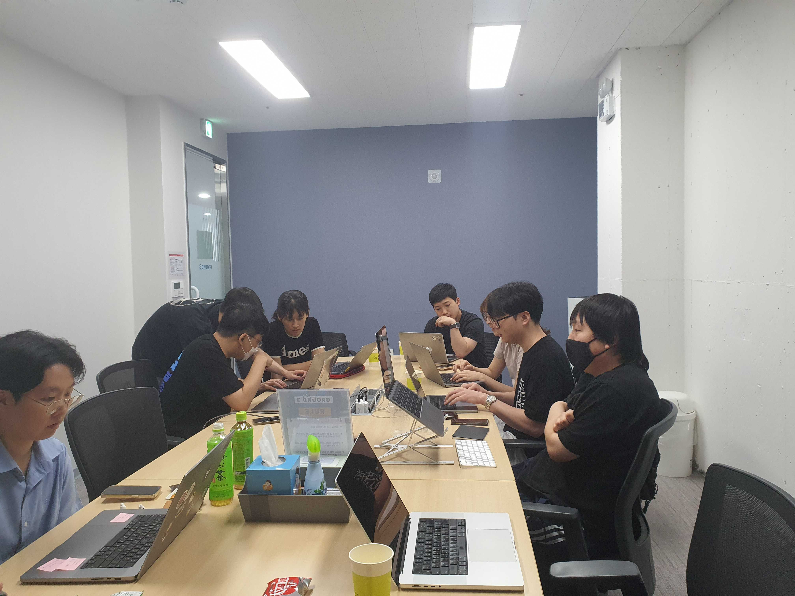
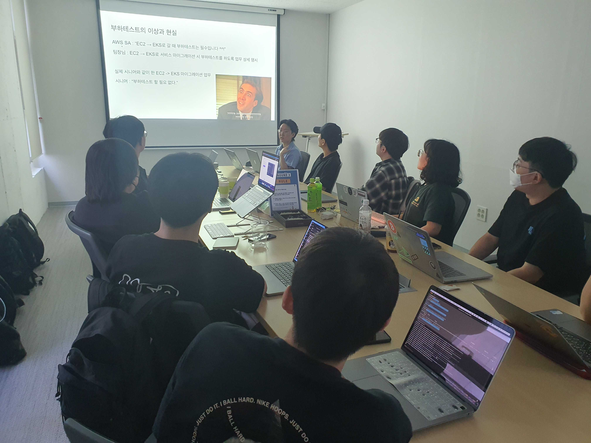
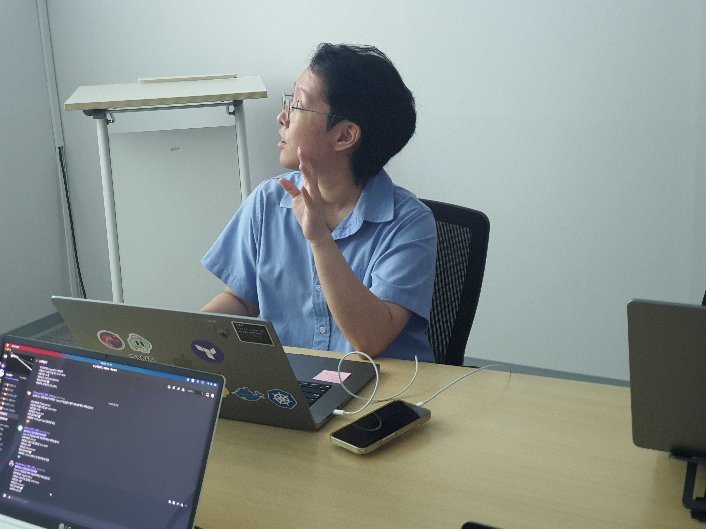
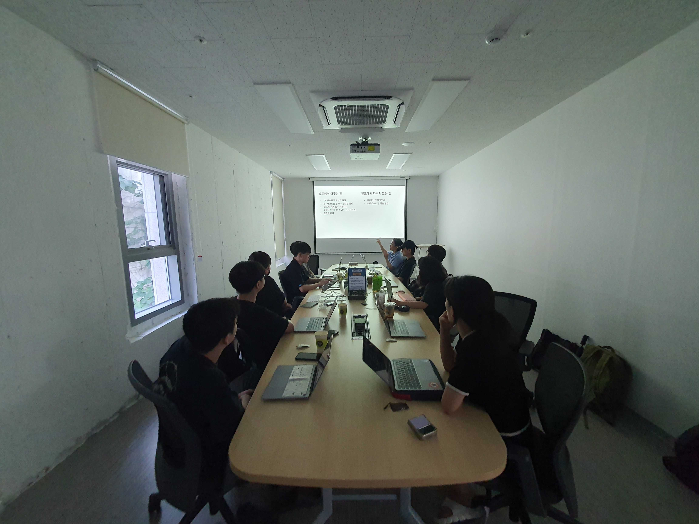

# [08/20] 오픈소스 컨트리뷰션 아카데미 회의록

- 일시 : 2023년 08월 20일 일요일
- 장소 : OpenUP GROUND3

### ☑️ 참석자

염근철, 송혜민, 전의정, 정성락, 안다혜, 김학준, 이의주, 최수녕, 서청운, 권영길, 김수빈, 채문영, 안지완

---

### ☑️ 회의 내용

- 개별 관심 이슈 공유
- 개별 기여 완료한 PR 공유
- 개별 관심 기술 공유
- 멘토 멘티 1on1 상담
- 개발자가 스스로 부하테스트 할 수 있는 플랫폼 구축기 & K6 부하테스트 PoC 발표(안다혜)
- 이슈해커톤 a,b,c조 진행 공유

---

### ☑️ 기념사진

