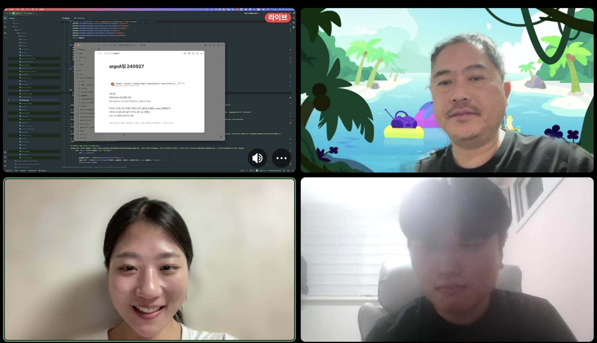

# [09/27] 조별 모임 3차 회의록

- 일시 : 2024년 09월 27일 금요일
- 장소 : 온라인

### ☑️ 참석자

김유진, 이설희, 정찬영

---

### ☑️ 회의 내용

▶️ 진행 상황 공유

    - 이슈 헌팅 상황 공유 (이설희)

▶️ 과제 진행 방식 논의

    - context 브랜치에서 개인 작업별로 브랜치를 분기하여 작업한다.
    - 수시로 PR 올리면서 작업 방식 확인하는 방식으로 진행한다.
    - Context 관련 작업 뼈대 구성 담당 (정찬영)

▶️ 개발 관련 지식 공유

    - Cloud Native Korea Community day 세션 내용 공유 (김유진)

---

### ☑️ 기념사진

