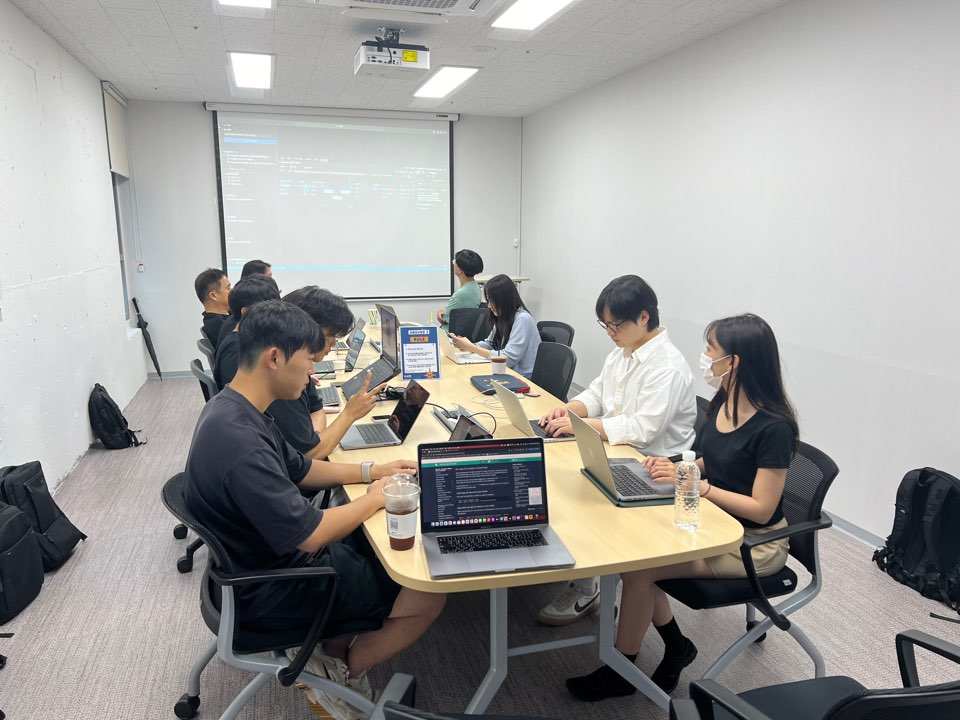

# [07/21] 오픈소스 컨트리뷰션 아카데미 회의록

- 일시 : 2024년 07월 21일 일요일
- 장소 : OpenUP (Ground 3)

### ☑️ 참석자

정성락, 최수녕, 송혜민, 고현수, 이건호, 최필환, 김유진, 강명구, 권민혁, 김현우, 강대훈, 김기해, 조하은, 김민수, 박준석, 이설희, 정찬영, 허인주, 서지민, 정현지

---

### ☑️ 활동 내용

- Git 을 활용한 Pull Request 사전과제 점검 및 트러블 슈팅
- 개발환경 세팅 방법 공유 https://github.com/Argo-OSS/beginner-guide/blob/main/argocd/01-getting-start.md
- 처음 시도해볼만한 ArgoCD 이슈 소개 (고현수, 이건호)
- 멘토 멘티 1on1 상담 진행

---

### ☑️ 활동 사진




---

### ☑️ 과제

```
[Git 연습 관제 - repo에 자기소개 PR 올리기]
- 사용 레포: https://github.com/Argo-OSS/argo-oss.github.io
1. 해당 repo에 멤버 프로필 업데이트 template를 이용한 이슈 생성
2. 각자 github 계정으로 해당 repo fork 진행
3. 형식에 맞춰 코드 작성 및 PR 제출, 이슈와 연결
4. 제출한 PR에 Conflict가 발생한다면 이를 해결
```
