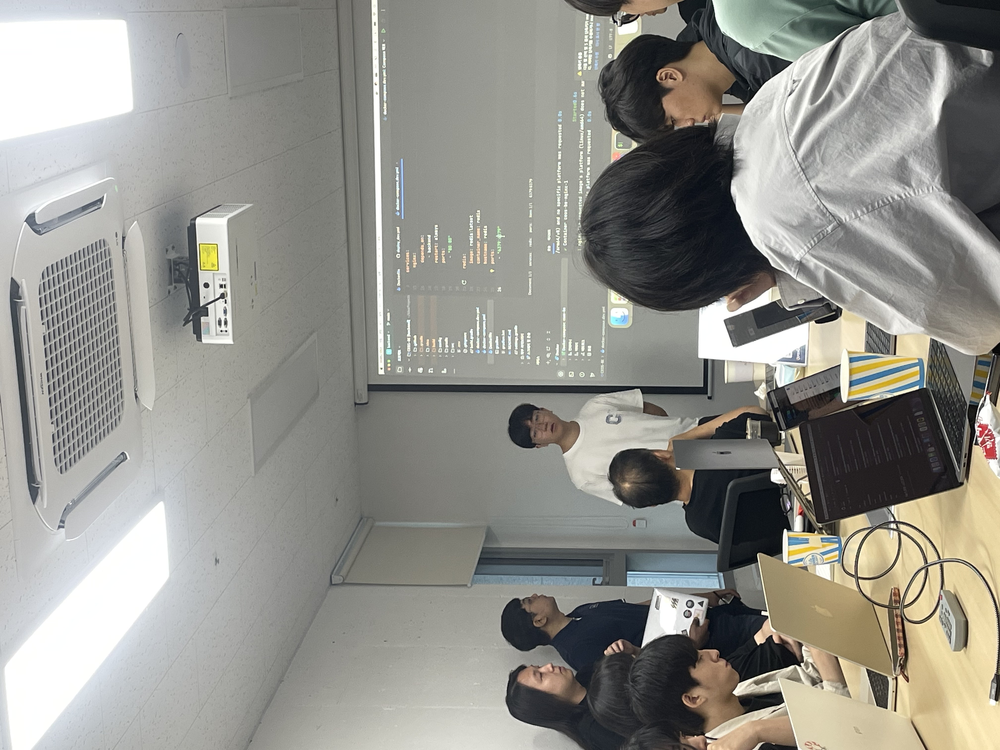
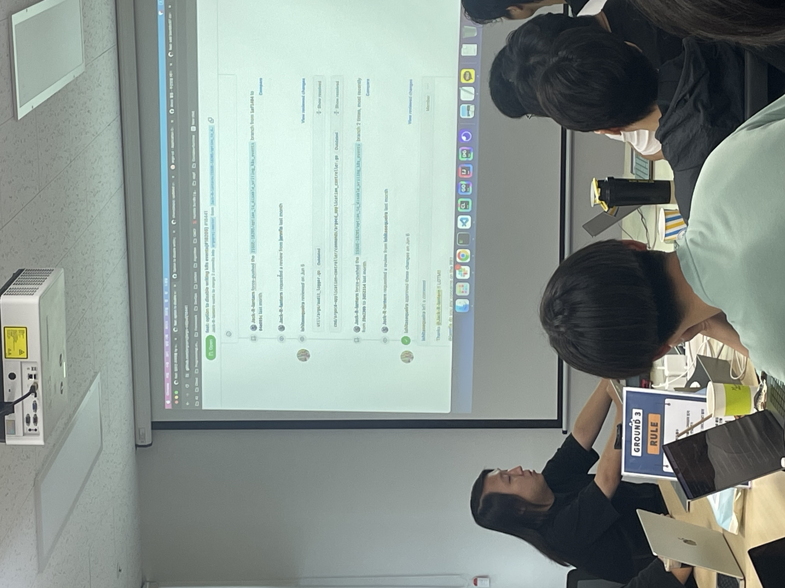
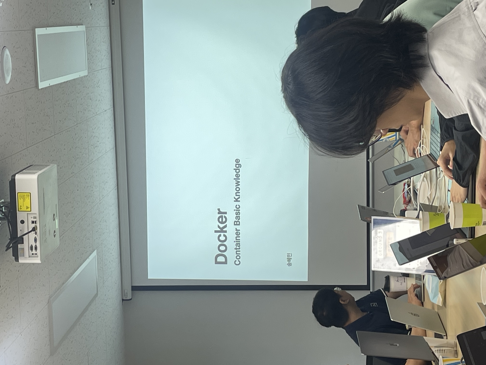

# [07/27] 오픈소스 컨트리뷰션 아카데미 회의록

- 일시 : 2024년 07월 27일 토요일
- 장소 : OpenUP (Ground 3)

### ☑️ 참석자

정성락, 최수녕, 송혜민, 강대훈, 이건호, 최필환, 김유진, 강명구, 권민혁, 김현우, 김기해, 조하은, 김민수, 박준석, 이설희, 정찬영, 허인주, 정현지, 서지민, 이호수, 정은지

---

### ☑️ 활동 내용

- 각 멘토 Argo 프로젝트에서 기여했던 경험 공유
- 컨테이너 세미나 (송혜민)
- Helm 세미나 (최수녕) https://nyeongnyeong.tistory.com/258
- Helm 과제 각 개별 리뷰 (정성락)
- 각 멘티 이슈 탐색 지속

---

### ☑️ 활동 사진





### ☑️ 과제

```
- 사용 레포 : https://github.com/Argo-OSS/container-playground
1. issue를 발생하고 제출한 PR과 이슈를 연결해서 진행
2. issue 템플릿에 작성된 설명에 따라 간단한 애플리케이션을 만들고 Dockerfile 작성
3. Dockerfile을 통해 만든 Container Image를 issue 템플릿의 설명에 따라 Helm Chart 작성
```
