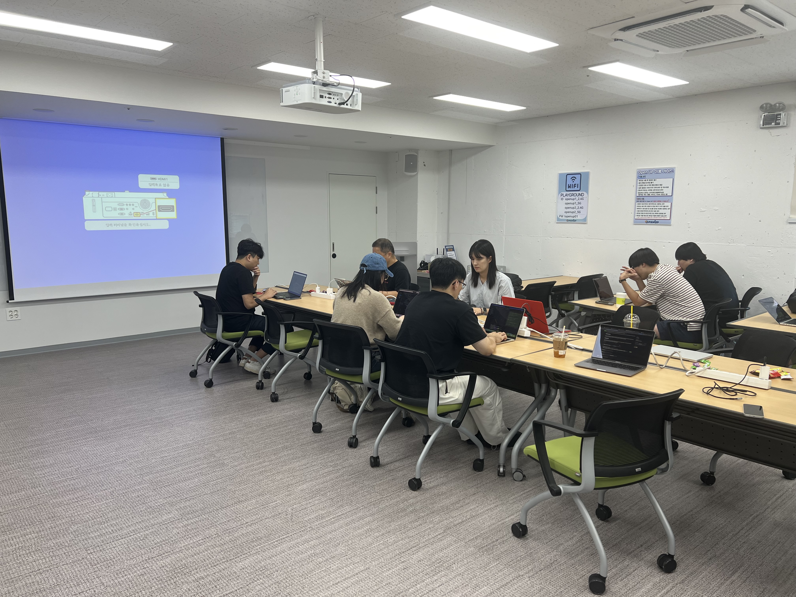
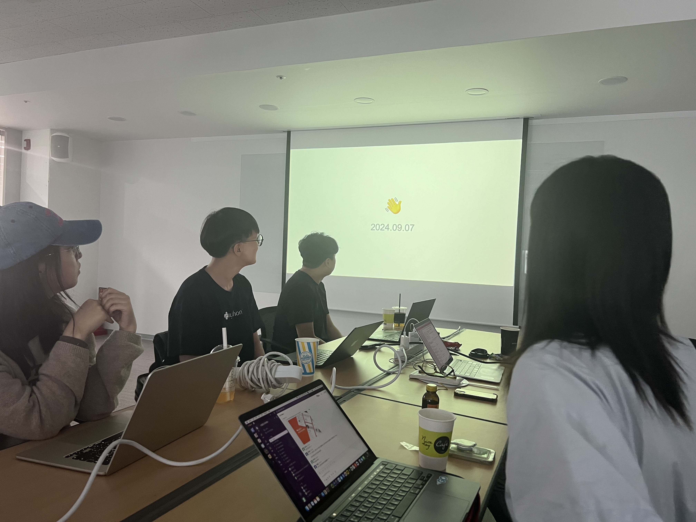
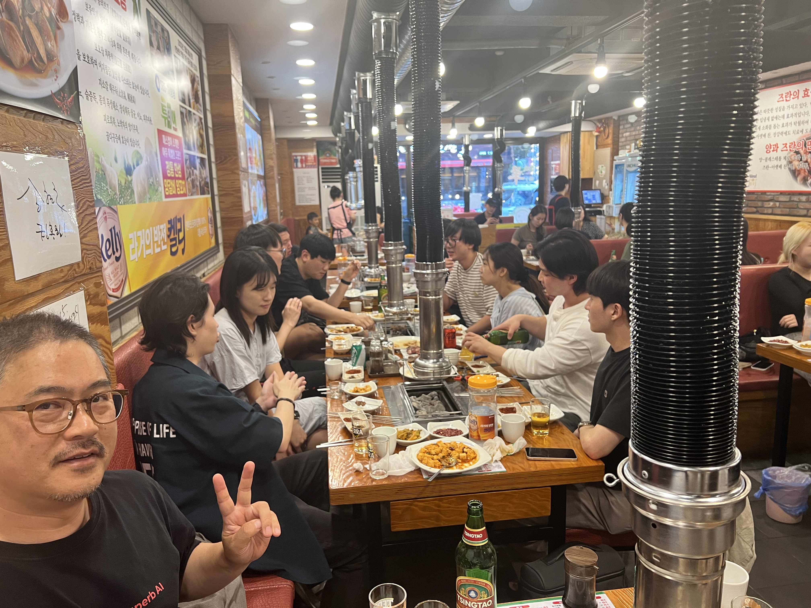

# [09/07] 오픈소스 컨트리뷰션 아카데미 회의록

- 일시 : 2024년 09월 7일 토요일
- 장소 : OpenUP (PlayGround)

### ☑️ 참석자

정성락, 최수녕, 송혜민, 강대훈, 고현수, 이건호, 최필환, 김유진, 강명구, 권민혁, 김현우, 강대훈, 김기해, 조하은, 김민수, 박준석, 이설희, 정찬영, 허인주, 서지민, 이호수, 정은지

---

### ☑️ 회의 내용

- 작년 Argo CD 멘토, 멘티분 초청 강의 (염근철 님, 이수빈 님)
- 오픈소스 기여의 효능
- Argo Workflows 환경 세팅 방법 (최수녕 님) https://happyso.notion.site/ArgoWorkflows-Local-Setting-874e0114e22042d48f1f5164296083fb?pvs=4
- Go 언어 세미나 (최수녕 님) https://docs.google.com/presentation/d/17eF80Kigu34vNcZG1NUhmOT5WX0Rruv_/edit#slide=id.p1

---

### ☑️ 기념사진

