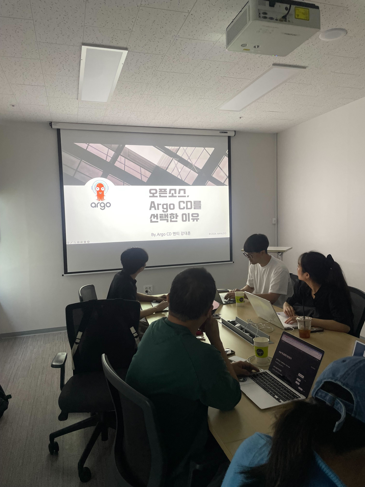
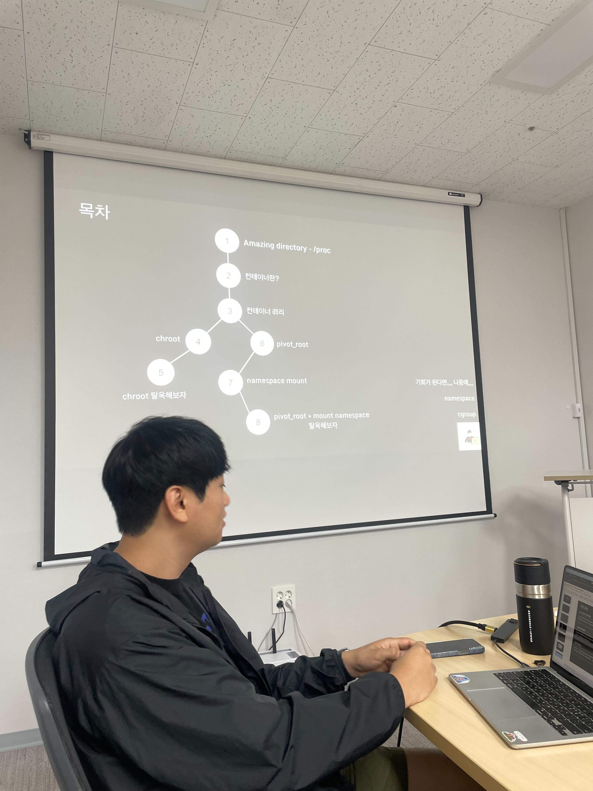
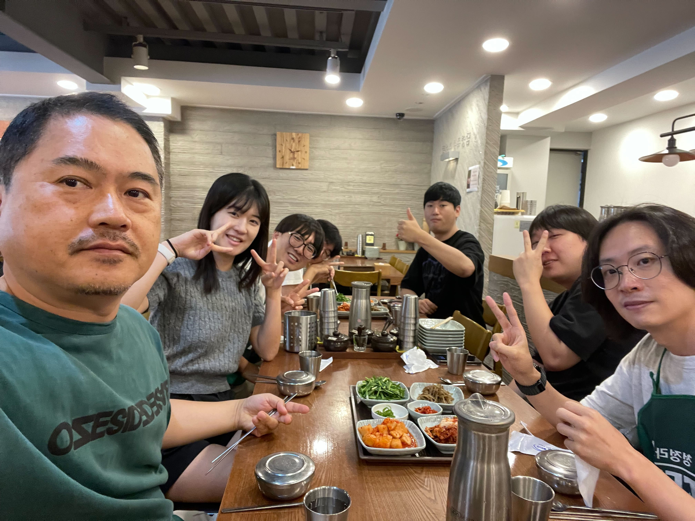

# [09/14] 오픈소스 컨트리뷰션 아카데미 회의록

- 일시 : 2024년 09월 14일 토요일
- 장소 : OpenUP (Ground 3)

### ☑️ 참석자

정성락, 최수녕, 강대훈, 고현수, 이건호, 최필환, 김유진, 강명구, 권민혁, 김현우, 강대훈, 김기해, 조하은, 김민수, 박준석, 이설희, 정찬영, 허인주, 서지민, 이호수, 정은지

---

### ☑️ 회의 내용

- 자유주제 세미나 (강대훈 님) - 학부생의 오픈소스를 시작한 계기
- 컨테이너 격리 실습 (이호수 님) https://leehosu.tistory.com/entry/KANS-%EC%BB%A8%ED%85%8C%EC%9D%B4%EB%84%88-%EA%B2%A9%EB%A6%AC-1-chroot-pivotroot-mount-namespace
- 저녁으로 간단한 맥주 모임!

---

### ☑️ 기념사진

