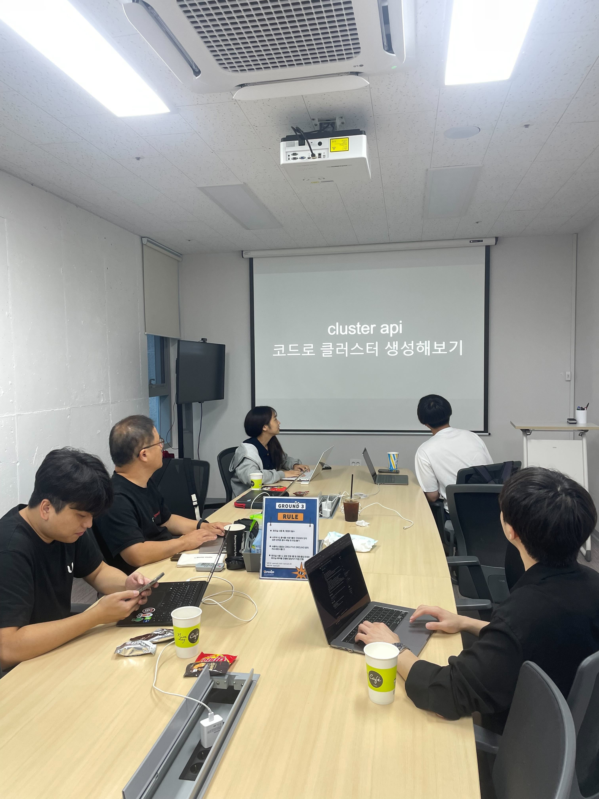
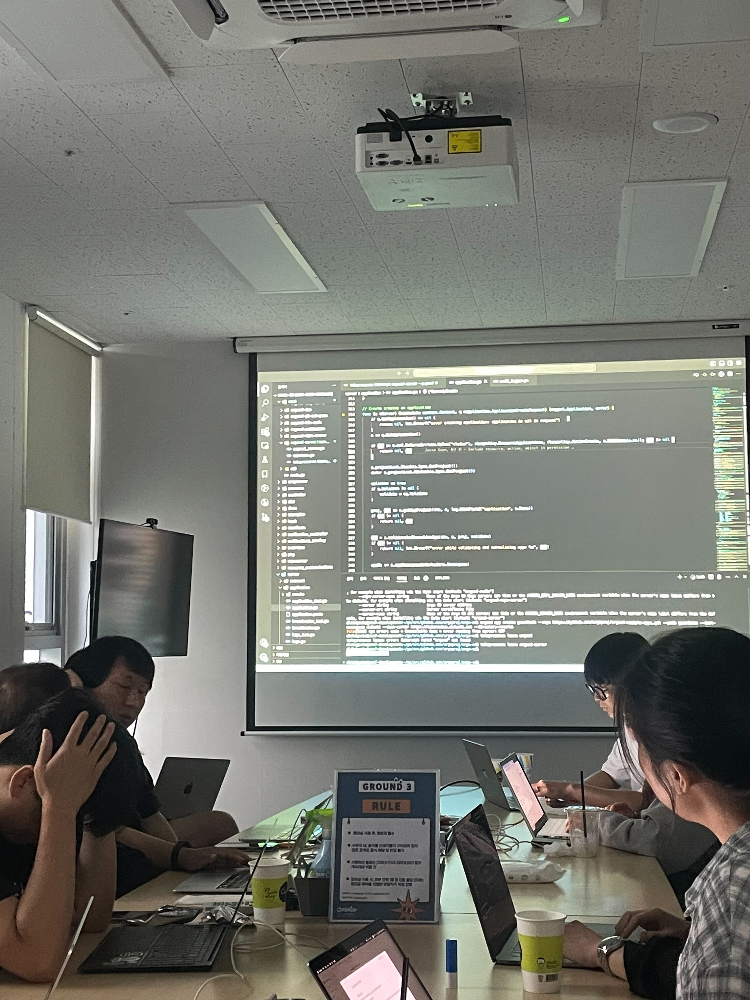
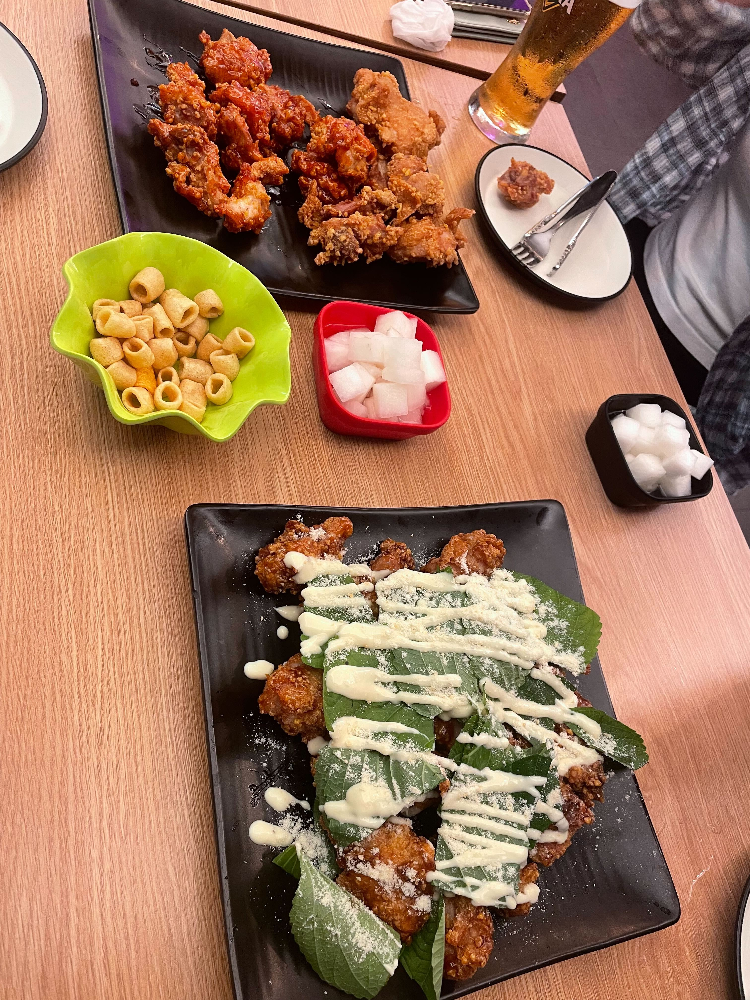

# [09/21] 오픈소스 컨트리뷰션 아카데미 회의록

- 일시 : 2024년 09월 21일 토요일
- 장소 : OpenUP (Ground 3)

### ☑️ 참석자

정성락, 최수녕, 강대훈, 이건호, 김유진, 김현우, 조하은, 이설희, 정찬영, 정은지

---

### ☑️ 활동 내용

- ClusterAPI를 활용한 쿠버네티스 클러스터 구성 (조하은 님)
- telepresence 적용 실습 (정성락 님)
- 팀플레이 진행상황 간단 공유
- 저녁 간단한 치맥 모임!

---

### ☑️ 활동 사진

