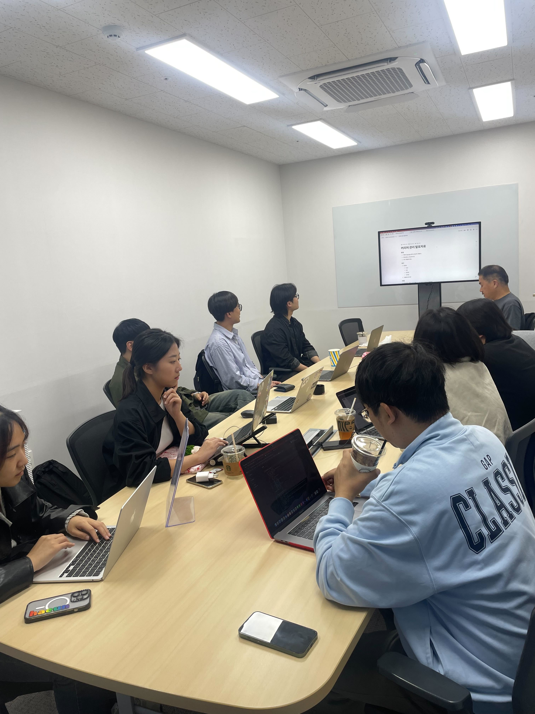
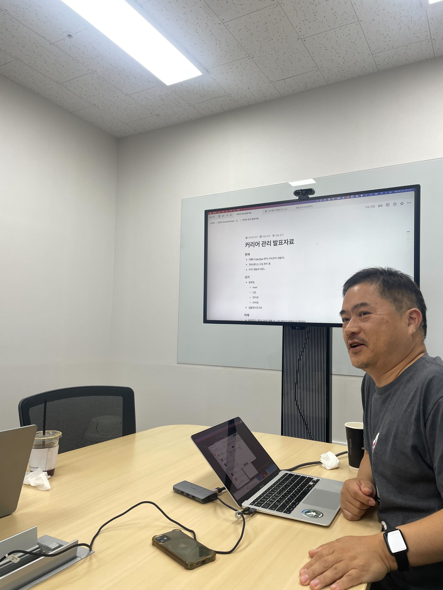
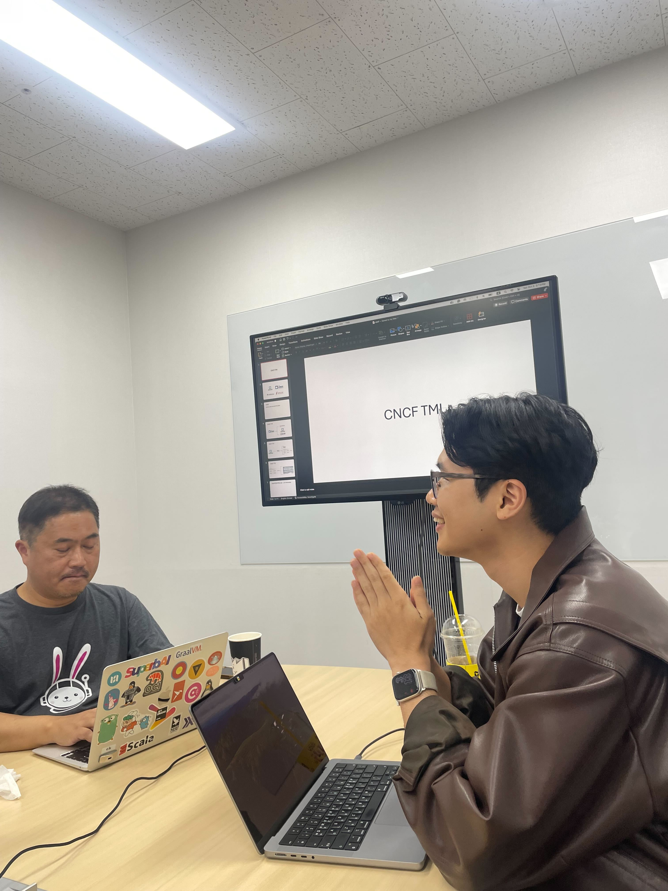
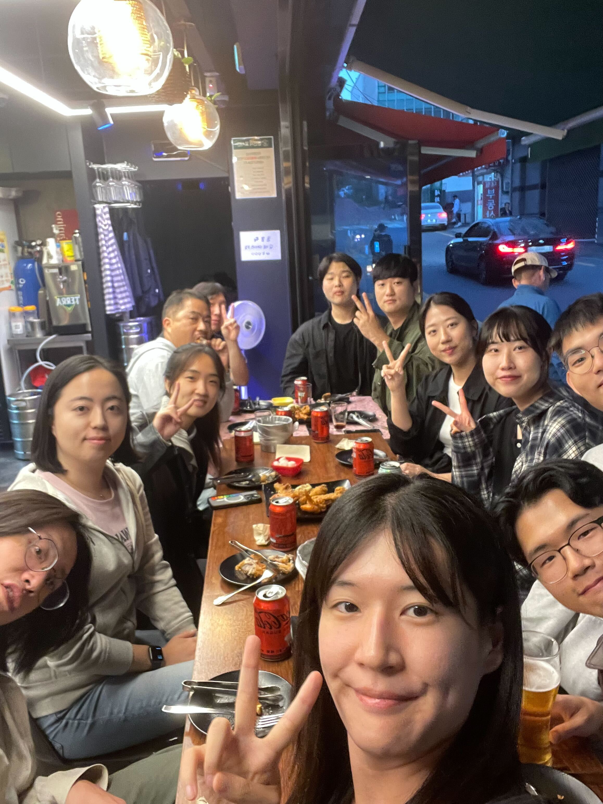

# [10/05] 오픈소스 컨트리뷰션 아카데미 회의록

- 일시 : 2024년 10월 5일 토요일
- 장소 : OpenUP (Ground 2)

### ☑️ 참석자

정성락, 최수녕, 송혜민, 강대훈, 이건호, 김유진, 김현우, 조하은, 이설희, 정찬영, 정은지

---

### ☑️ 활동 내용

- 커리어/인생 이야기 (김유진 님) https://k70.notion.site/10e488c197c3802fbd08d3013ecdd6c6?pvs=4
- Litmus Chaos 및 CNCF 소개 (Litmus Chaos 박남규 멘토님)
- Litmus Chaos 팀과 저녁식사 및 친목 다지기

---

### ☑️ 활동 사진

