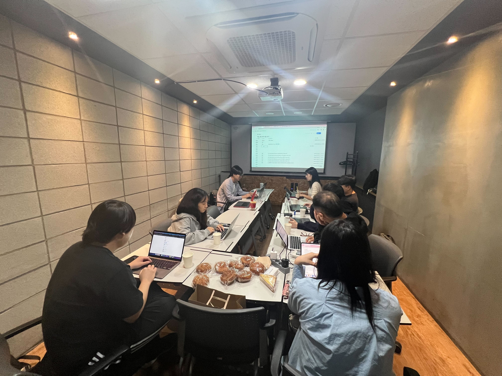
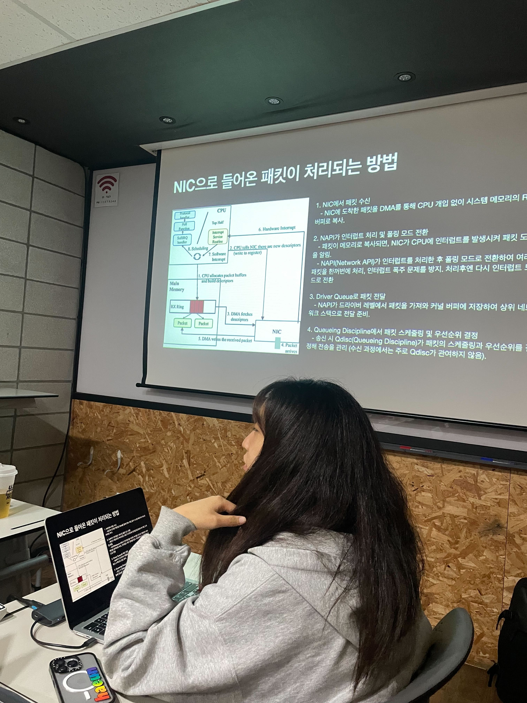
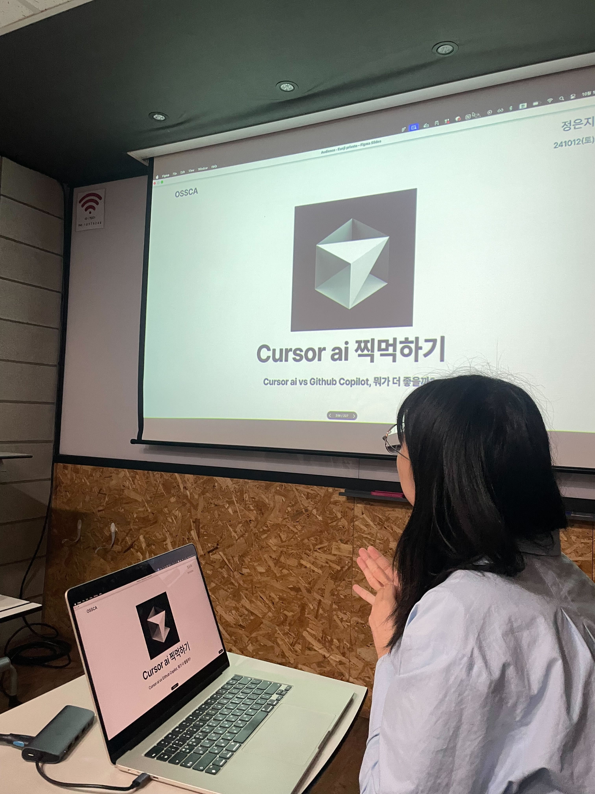
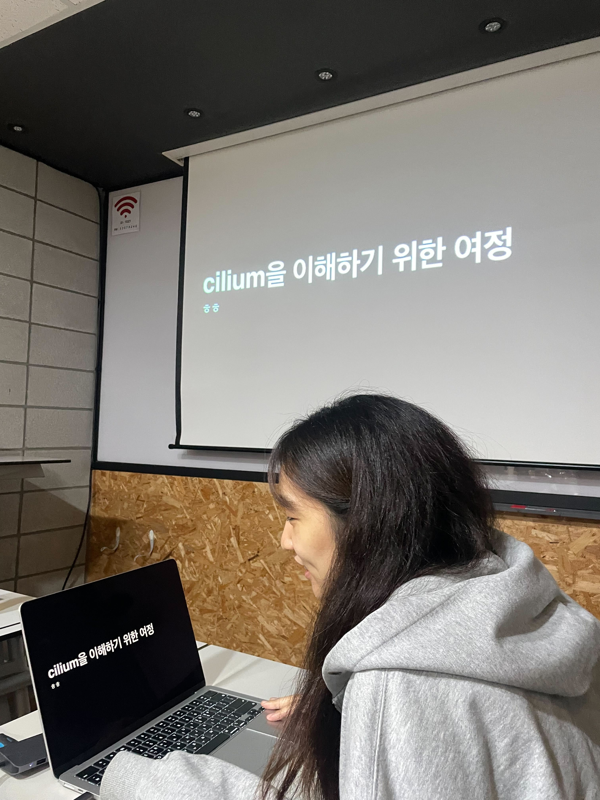
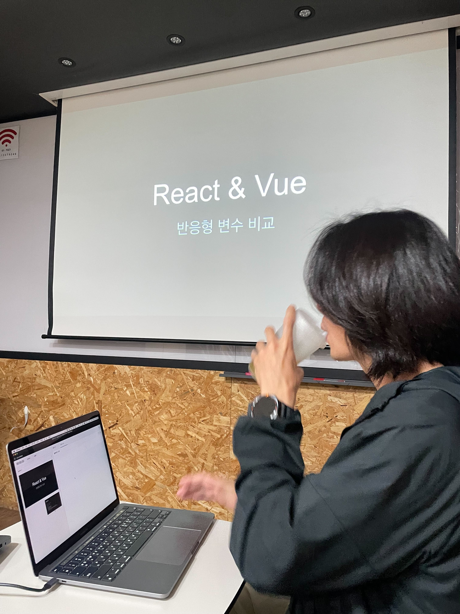

# [10/12] 오픈소스 컨트리뷰션 아카데미 회의록

- 일시 : 2024년 10월 12일 토요일
- 장소 : Toz 양재역점 (세미나실 A)

### ☑️ 참석자

정성락, 최수녕, 송혜민, 강대훈, 이건호, 김유진, 김현우, 조하은, 정찬영, 정은지, 강명구

---

### ☑️ 활동 내용

- React vs Vue 반응형 비교 (강명구 님)
- Cilium & 회사에서 직접 격은 커널 트러블슈팅 & XDP 세미나 (조하은 님)
- Cursor AI 찍먹하기 (정은지 님)
- 멘토 최종보고서 작성 및 피드백

---

### ☑️ 활동 사진

