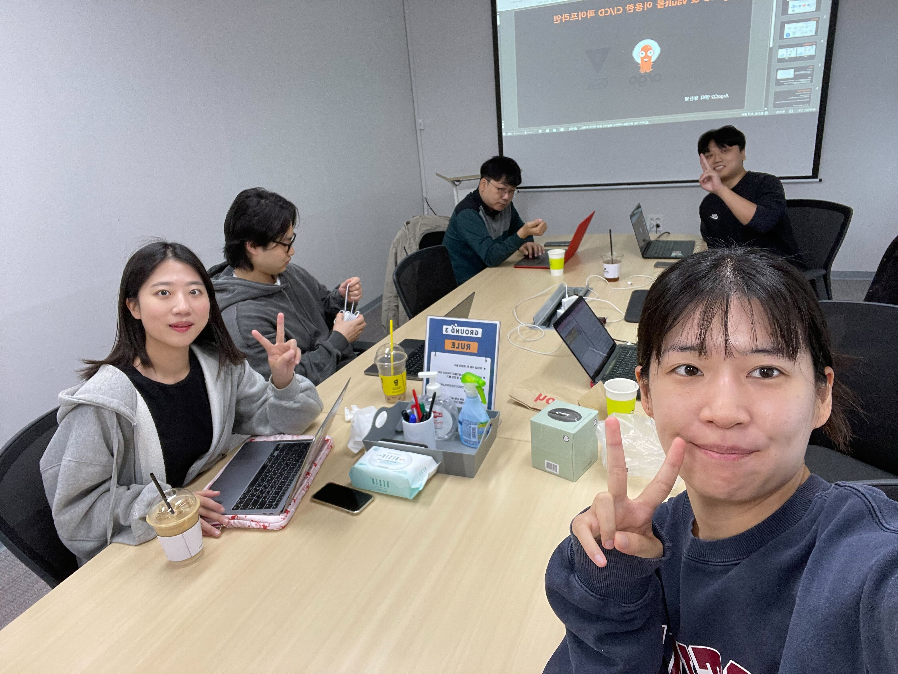
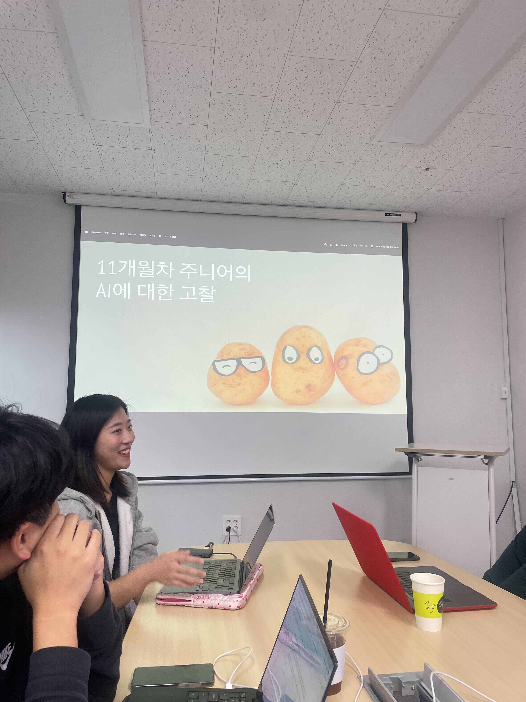
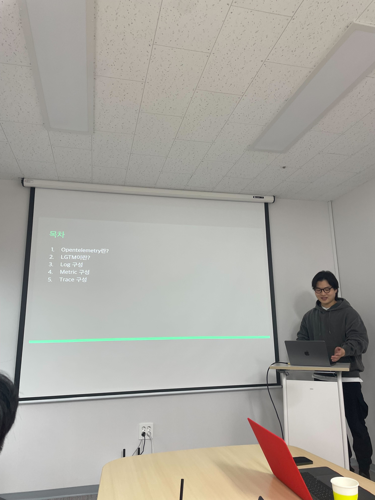
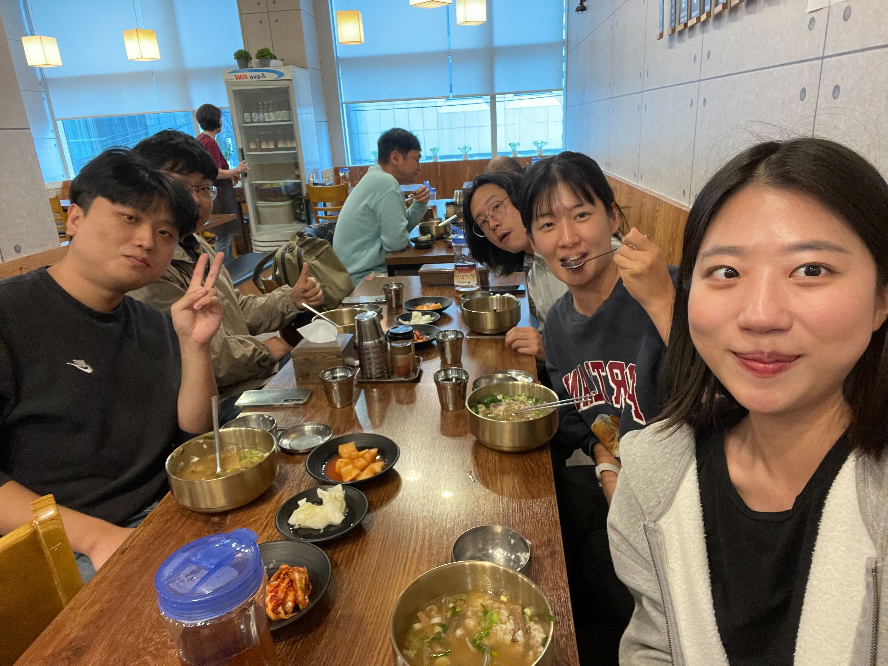

# [10/12] 오픈소스 컨트리뷰션 아카데미 회의록

- 일시 : 2024년 10월 20일 일요일
- 장소 : OpenUP (Ground 3)

### ☑️ 참석자

최수녕, 송혜민, 박준석, 정찬영, 이설희, 강명구

---

### ☑️ 활동 내용

- ArgoCD와 Vault 함께 사용하기 (정찬영 님) https://docs.google.com/presentation/d/10Ap66RTgvFknWI9t362mP0NXhcAVZ7tS/edit?usp=sharing&ouid=114987155022528047743&rtpof=true&sd=true
- OTel과 LGTM POC 공유 (박준석 님) https://docs.google.com/presentation/d/1vbL2LudD2FTpqsHd3UY2tEBWEMX2_FhyVMN9D891U9Q/edit?usp=sharing
- 11개월차 주니어의 AI에 대한 고찰 (이설희 님) https://docs.google.com/presentation/d/16Vy8y0ogBglHz2QHsUBDPwESMQDqSEqkaUrHdgnlo0A/edit?usp=sharing
- 모의 면접 준비
- 간단한 점심식사!!

---

### ☑️ 활동 사진

